# 🚀 Upgrade with GitHub Copilot Modernization

The Caldova Retail storefront runs on .NET Framework 4.8 — a platform that is out of active development, tied to Windows, and closed off from most modern Azure hosting. Before anything else can be modernized, it has to move onto current .NET.

In this module you'll use **GitHub Copilot Modernization** to make that move. Rather than working through breaking changes by hand, you'll direct an AI agent that assesses the codebase, produces a plan you can review and edit, and then executes it task by task — validating with a real build at each stage.

> 🧭 New to GitHub Copilot Chat? [Copilot Essentials](../../docs/copilot-essentials.md) is a short reference on modes, models, context, cost, and course-correcting.

## 💼 Business case

Caldova Retail's goal is not .NET 10 — it's an Azure PaaS service (App Service, Container Apps, or AKS), with Entra ID and Key Vault handling identity and secrets. None of that is open to a .NET Framework 4.8 app. It only runs on Windows Server, it can't be practically containerized, and pieces like Forms Authentication and `Web.config` have no modern equivalent to wire up. Lifting it to an Azure VM as-is would just move the same constraints into someone else's datacenter. The framework upgrade is what makes every other modernization option possible, which is why it comes first.

## 📋 What You'll Do

- 🔎 Assess a legacy codebase with the GitHub Copilot upgrade agent
- 🔄 Migrate the storefront from .NET Framework 4.8 to .NET 10
- 📋 Review the generated upgrade plan and hold it to scope
- ✅ Verify the application still behaves exactly as it did before

> 💡 **SCOPE**
>
> This module changes the **framework only**. The database stays on SQL Server and the UI stays on MVC — the data tier and the front end are modernized in later modules. Keeping the scope tight is what makes the upgrade verifiable: if the app behaves the same afterwards, the framework change is sound.

## 🔍 Prerequisites

Skillable will already have these installed for you, but for reference this is what is needed. The module is done entirely in **Visual Studio Code**:

| Requirement | Why you need it |
| --- | --- |
| [Visual Studio Code](https://code.visualstudio.com/) | The editor used for every step in this module |
| [.NET 10 SDK](https://dotnet.microsoft.com/download/dotnet/10.0) | The target framework for the upgrade |
| [GitHub Copilot](https://marketplace.visualstudio.com/items?itemName=GitHub.copilot) and [GitHub Copilot Chat](https://marketplace.visualstudio.com/items?itemName=GitHub.copilot-chat) | Agent mode, which drives the upgrade |
| [GitHub Copilot upgrade](https://marketplace.visualstudio.com/items?itemName=ms-dotnettools.upgrade-agent) (`ms-dotnettools.upgrade-agent`) | Adds the `@upgrade` agent that performs the modernization |

Building and running the **original** .NET Framework 4.8 storefront, which you do at the start of the module, also needs:

| Requirement | Why you need it |
| --- | --- |
| [Build Tools for Visual Studio 2022](https://visualstudio.microsoft.com/downloads/#build-tools-for-visual-studio-2022) | MSBuild with .NET Framework 4.8 targeting — the full IDE is not needed |
| [IIS Express](https://learn.microsoft.com/en-us/iis/extensions/introduction-to-iis-express/iis-express-overview) 10.x | Hosts the legacy app locally. **Not** included with Build Tools — install it separately |
| `nuget.exe` | Restores `packages.config` dependencies, which `dotnet restore` cannot handle |

The [IIS Express extension for VS Code](https://marketplace.visualstudio.com/items?itemName=warren-buckley.iis-express) is optional but recommended — it starts and stops the server from the Command Palette instead of making you invoke `iisexpress.exe` by hand.

> 💡 **TIP**
>
> Confirm the SDK is visible to VS Code by opening the integrated terminal (`` Ctrl+` ``) and running `dotnet --list-sdks`. You should see a `10.x` entry.

## 🚨 Important note

> The upgrade agent creates branches and git commits as it works, so run this module against **your own copy** of the app rather than the workshop repository. From a terminal:
>
> ```powershell
> # Copy the storefront out of the workshop repo, excluding build output
> robocopy <repo>\src\app-modernization\caldova-retail-web-app <your-folder> /E /XD bin obj .vs
>
> cd <your-folder>
> git init -b main
>
> # The rule that normally hides this file lives outside the folder you just copied
> "connectionStrings.config" | Set-Content .gitignore
>
> git add -A
> git commit -m "Baseline: Caldova retail storefront on .NET Framework 4.8"
> ```

## ▶️ Run the app before you change it

First, give the app its database password. `Web.config` pulls the connection string from `connectionStrings.config`, which is kept out of the repository on purpose — so you get a template instead and fill it in yourself:

```powershell
cd <your-folder>\src\eShopLite.StoreFx
Copy-Item connectionStrings.config.example connectionStrings.config
```

Open the new file and replace `REPLACE_ME` with the SQL password from your instructor. Leave the server, database, and user exactly as they are.

Do not skip this. `Web.config` references the file with `configSource`, so a missing `connectionStrings.config` is a configuration error at startup — the app will not serve a single page, and the error will not obviously point at the password.

Now ask Copilot Chat to build and launch the legacy app for you:

```plaintext
This is a .NET Framework 4.8 ASP.NET MVC app using packages.config. Restore its packages with nuget.exe, build the solution with MSBuild, and launch it locally with IIS Express. Tell me the URL when it is running.
```

Once it loads, walk the app and record what you see. For a small baseline, confirm:

- [ ] The product catalog loads, with images
- [ ] Sign-in works for both accounts — credentials are in [Demo logins](../../docs/logins.md)
- [ ] Adding an item to the cart persists across page loads

If the build fails with a missing `csc.exe`, see [Handling Common Issues](#-handling-common-issues) below.

Now that you have seen how the app looks and behaves on .NET Framework 4.8, you have the baseline everything that follows is measured against. Time to modernize it.

## 🤖 How GitHub Copilot Modernization Works

GitHub Copilot Modernization works through a three-stage workflow: **Assessment → Planning → Execution**.

- **Assessment:** Copilot analyzes your project structure, dependencies, and code patterns to identify upgrade requirements and potential breaking changes
- **Planning:** The tool generates a detailed upgrade plan document based on assessment findings
- **Execution:** You review the plan, add custom requirements, and Copilot performs the automated upgrade

We're going to upgrade our application to achieve one goal: **move the storefront from .NET Framework 4.8 to .NET 10**, with its existing behavior intact.

## 🔎 Optional: run an application assessment first

Module 1 assessed the **infrastructure** with Azure Migrate — servers, sizing, and dependencies. The modernization extension assesses the **application code**, which is the other half of the picture. Azure Migrate can tell you a server is ready to move; the application assessment tells you whether the code should move as-is or be upgraded first.

You can run one at any time, without committing to an upgrade.

**1. Open the modernization extension.** Click the **GitHub Copilot app modernization** icon in the Activity Bar down the left-hand side of VS Code.


**2. Click Start Assessment.**

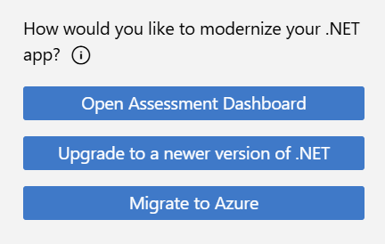

**3. Choose Recommended Assessment.** You are offered a Recommended or a Custom assessment. For this lab, we will proceed with Recommended. You would use Custom Assessment if you want a full analysis of the source code, including architecture, API contracts, and data models — that takes considerably longer than issue-only analysis.

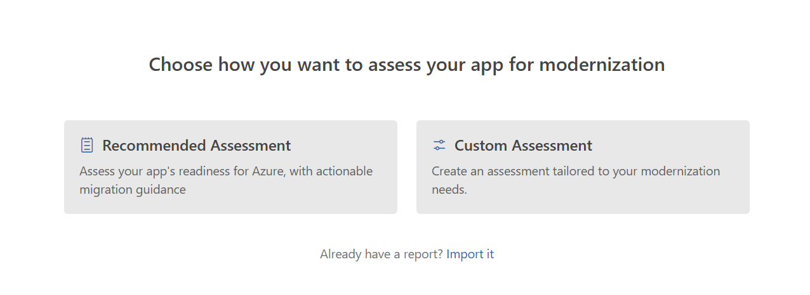

**4. Leave the default target as Cloud Readiness.** This measures how ready the app is for Azure. The extension writes a prompt into the chat, which dispatches subagents to analyze the project. Expect it to run for a couple of minutes.

**5. Read the results.** Cloud readiness issues are grouped into **Mandatory**, **Potential**, and **Optional**. The summary estimates the effort to reach the highlighted target Azure service (Azure App Service, Azure Container Apps, or Azure Kubernetes Service) by grouping it into T-shirt sizes, and correctly identifies the app as running on .NET Framework 4.8.

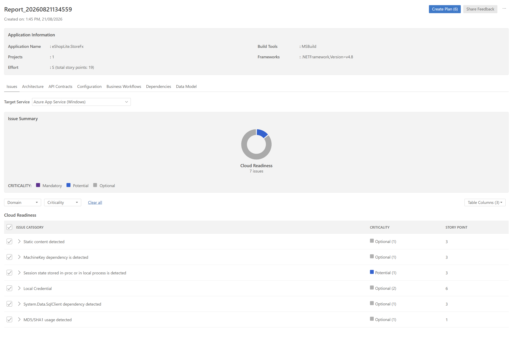

Expand any issue to see what the extension found and the guidance it recommends — the affected code, why it matters for the target service, and what a fix would involve. This is where the assessment earns its keep: the counts tell you the size of the job, but the expanded detail is what you would walk a customer through.

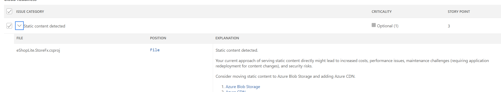

In the top right corner of the assessment there is an option to **Create Plan**, which would generate a plan to remediate the issues it found. We are skipping that here — the framework upgrade comes first, and these findings could change once the app is on .NET 10. For this module the assessment is just a read on the app.

> 💡 **TIP**
>
> You do not have to keep the assessment open to keep it. Reopen the extension from the Activity Bar and choose **Open Assessment Dashboard** — every assessment you have run is listed there, so you can refer back to this one later.

---

## 🚀 Upgrading to .NET 10

The rest of this module is the upgrade itself, in five steps.

## 1️⃣ Initiate the Upgrade

1. Open the GitHub Copilot modernization extension
2. Select "Upgrade to a newer version of .NET"

   

3. Copilot chat should open with the **Upgrade** agent already selected. If the Upgrade agent is not selected please select the agent picker, and navigate to the "Upgrade" one. Unlike the general agents, which work from model memory and improvise, the Upgrade agent runs a structured, tool-verified migration workflow — loading current tested scenario instructions, using real compiler and dependency analysis to find breaking changes, and validating each task with a build before moving on.

    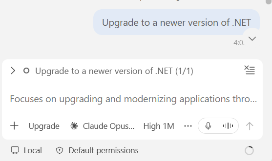

   > 💡 **PICKING A MODEL**
   >
   > **The default is fine for this lab.** If you do change it, prefer a reasoning model over a `mini`, `fast`, or `lite` variant — see [Copilot Essentials](../../docs/copilot-essentials.md).

4. A modal will load that offers options on the upgrade. You can see it already detected the app is running on .NET Framework 4.8 and has pulled out the solution file. Select the following options:

   - Target Framework: .NET 10
   - Flow Mode: Guided. It stops after assessment and again after planning, so you can inspect what the agent found and redirect it before a line of code changes — which is what you want while you are still learning the tool. It is also the right choice in an unfamiliar or high-risk codebase, or when you are sitting with a customer who wants to approve each stage. Automatic runs end-to-end, pausing only when blocked; reach for it once the tool is familiar and the work is low-risk.
   - Create working branch: Check the box. This is important so that the modernized code lives on a new branch you can rollback from.
   - Branch name: upgrade-net10
   - Commit strategy: Commit after each task

   Press 'Confirm' at the end to kick off the upgrade with these parameters.

   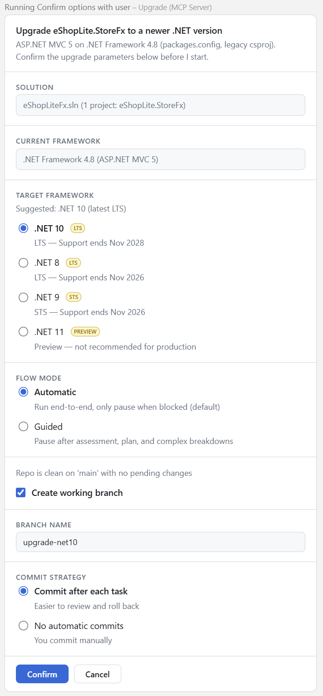

   The modal should appear with a confirmation.

   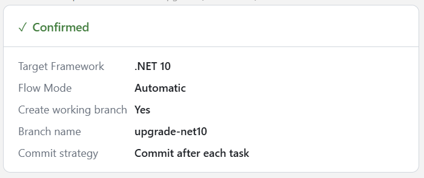

> ‼️ **IMPORTANT**
>
> The agent runs many tool calls. If VS Code prompts you to approve each one, choose the option to allow them for the rest of the session — otherwise the upgrade stalls waiting on you. With customers, it is best to review each of these calls to make sure they feel comfortable with them.

## 2️⃣ Initial Assessment

Once the scenario starts, the agent runs the assessment before it plans or changes anything. You don't drive this stage — it runs on its own — but what it produces is what you review next.

### Dashboard initialization

You will see the scenario has been initialized and shows links to Dashboard and Activity. Open the dashboard link.

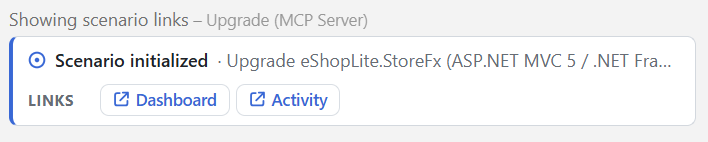

You can see the dashboard is on the "Assess" phase. Observe the other aspects of the dashboard. Throughout this module, it will move between phases until the .NET Framework has been fully updated. It is a great reference to keep track of the upgrade progress.

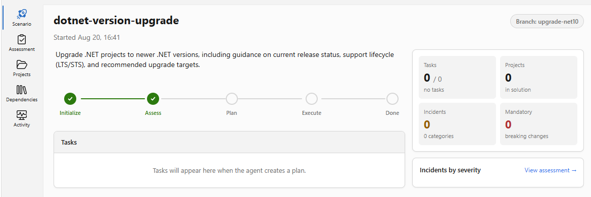

> 💡 **NOTE**
>
> During the upgrade, Copilot may ask permission to read files outside your workspace. This is safe to approve — it's loading markdown guidance files from the Upgrade MCP Server into context so it can produce a structured assessment.

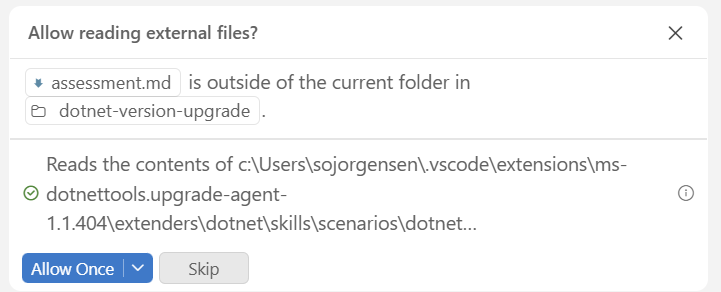

### What the agent examines

- **Project structure** — Solution layout, project kind and format (classic vs. SDK-style), interdependencies, and current target framework
- **NuGet packages** — Every referenced package classified as compatible, incompatible, or upgrade-recommended against .NET 10
- **API usage patterns** — Deprecated .NET Framework APIs, categorized as binary incompatible, source incompatible, or behavioral change
- **Framework dependencies** — Framework-bound technologies with no direct .NET 10 equivalent, chiefly ASP.NET Framework (`System.Web`), plus a suggested migration path for each
- **Binding redirects** — Assembly version conflicts that cause runtime failures if left unresolved
- **Effort and risk** — Estimated lines of code to modify, a difficulty rating per project, and whether behavior-locking tests should be added before starting

### Where the assessment is written

The agent saves its findings into a workflow folder in your repository rather than leaving them in the chat:

```text
.github/upgrades/scenarios/dotnet-version-upgrade/assessment.md
```

You should see an "Assessment complete" modal linking to the assessment as well:

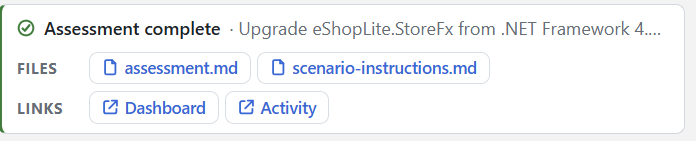

Open that file and read it. The report is long — these four sections carry the decisions.

| Section | What to look for | Why it matters |
|---|---|---|
| **Package Compatibility** | Anything marked ⚠️ incompatible | A package with no .NET 10 successor has to be replaced or removed. This is the only category that can block the upgrade outright. |
| **Technologies and Features** | Which technology dominates the issue count | This tells you what kind of migration you're doing. In our run roughly 99% of issues were `System.Web` — that makes this an ASP.NET Core port, not a framework retarget. |
| **Binding Redirect Configuration** | The 🔴 Mandatory count | These fail at runtime, not build time — the app compiles cleanly, then errors on the first request. |
| **Projects Compatibility** | Difficulty, estimated LOC, and the 🧪 test flag | Sets expectations for scope, and tells you whether to write behavior-locking tests before changing anything. |

> 💡 **NOTE**
>
> The figures quoted here and below — issue counts, percentages, estimated lines of code — are examples from one run against this storefront. **Your numbers could differ.** The assessment is produced by an agent analyzing your workspace at that moment, so counts can shift with package versions, SDK versions, and the tool's own updates. Read them as an indication of shape and scale, not as values to match.

The layout is the same for every .NET upgrade assessment, but sections only appear when there is something to report. In your own projects, a missing section means nothing was found — not that something went wrong.

## 3️⃣ Review and Shape the Plan

### Confirm Upgrade Options

First, it will show the upgrade options modal. Examine the options.

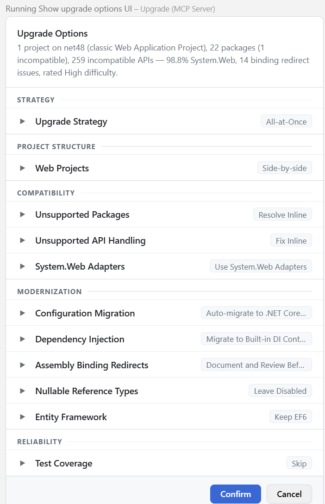

From the dropdown, change project structure for Web projects from Side-by-Side to All-at-Once. This changes the code rewrites from incremental side-by-side to a single pass.

**Side-by-side** stands up a *new* ASP.NET Core project next to the existing Framework one and moves pages across a few at a time, with the old app still serving traffic behind a proxy. That is the right answer for a large production site that cannot go dark — but it means running two projects, a routing shim, and a half-migrated app for the length of the project.

**All-at-once** replaces the web project in a single pass. The tool's own guidance recommends it when the web surface is small (roughly ten controllers or fewer) and some downtime is acceptable — and the storefront has exactly four controllers. For our workshop purposes, this will be clearer and faster.

Keep the defaults otherwise. We will opt out of test coverage for the sake of time. It does provide the option to generate UTs to validate functionality before and after.

Hit confirm.

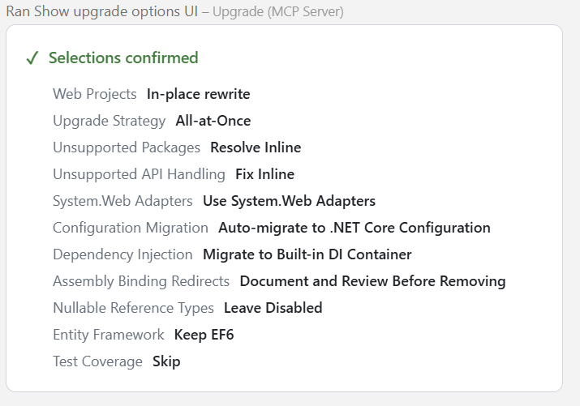

Once the strategy is confirmed, the plan takes place.

> 💡 **NOTE**
>
> Keep approving external file reads from the MCP Server context, if prompted. These reference documents ensure the plan is crafted in a structured manner.

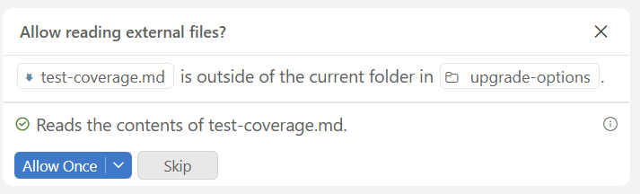

### Review the Generated Plan

Once the plan ready modal appears, click into the `plan.md` file.

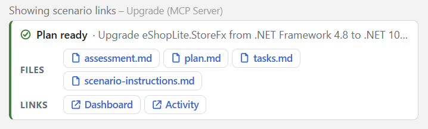

Both artifacts are written into the workflow folder in your repository:

```text
.github/upgrades/scenarios/dotnet-version-upgrade/plan.md
.github/upgrades/scenarios/dotnet-version-upgrade/tasks.md
```

**1. Open `plan.md` and review it carefully.**

It lists the package updates, breaking changes, and migration path the agent intends to follow, along with the tasks it plans to take. This file is the **source of truth for the upgrade strategy** — to change the approach, simply edit, add, or remove content in the markdown.

> 💡 **NOTE**
>
> Because we chose **Guided** flow mode, the agent stops here and waits for you before it changes any code. This is the moment to edit `plan.md` — whatever you leave in it is what gets executed. In **Automatic** mode the agent would carry straight on without asking.

**2. Open `tasks.md`.**

Like the dashboard, this file dynamically checks off boxes as each task completes. The agent decides how to break up the work, so **your task list may not match this one exactly** — names, counts, and ordering can all shift between runs. A representative breakdown looks like this:

| Task | What it does |
|---|---|
| `01-prerequisites` | Confirms the .NET 10 SDK and records current working behavior as a manual acceptance checklist. No tests are generated. |
| `02-project-system-conversion` | Classic WAP → SDK-style `Microsoft.NET.Sdk.Web`, `packages.config` → `PackageReference`. Drops around 9 framework-provided packages and 12 binding redirects. **The code will not compile after this task — that is by design.** |
| `03-aspnet-core-migration` | The real work. `Global.asax` → `Program.cs`, Autofac → built-in DI, Forms Auth → cookie auth, `Web.config` → `appsettings.json`, static files → `wwwroot`. In our run this was roughly 259 API fixes across 12 files. |
| `04-final-validation` | Runs `dotnet run` and verifies products load from SQL Server, sign-in works for both accounts, the cart persists, and orders write back. |

What should hold steady is the **shape**: establish prerequisites, convert the project system, port the application code, then validate. If your run produces six tasks instead of four, that is the agent splitting the same work differently — not a sign anything is wrong.

## 4️⃣ Monitor the Upgrade Process

Once you approve the plan, the tool begins the upgrade. In Guided mode nothing is executed until you do, so take the time to read `plan.md` first. During this phase:

- Files will be modified incrementally
- Git commits will be created for each major change
- Progress will be displayed in the chat interface and on the modernization dashboard

Keep the dashboard or tasks.md file open.

As the tool works through each task, monitor the chat box to observe the agent's behavior. You can see how it is going about changes and what files it is altering. The Copilot Chat is also available to help you understand the changes being made and to provide context on any issues that arise.

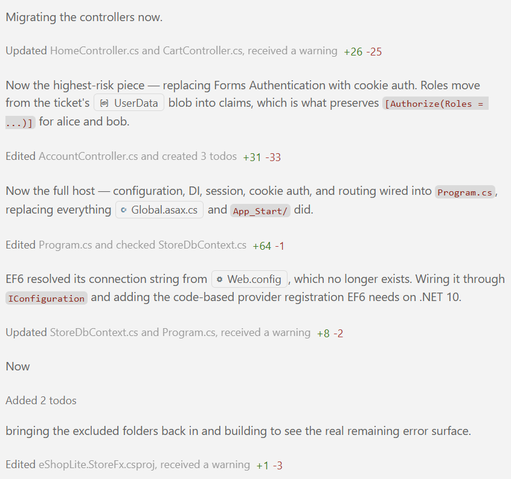

Useful things to ask while it runs:

```plaintext
Explain what you just changed in this task and why.
```

```plaintext
What was the .NET Framework way of doing this, and what replaces it in .NET 10?
```

```plaintext
Why is this task taking a while?
```

Check the activity tab of the dashboard. It records the timeline, log, and commits of the upgrade. You can see it shows the steps the agent is taking, such as rebuilding the app after changing a file.

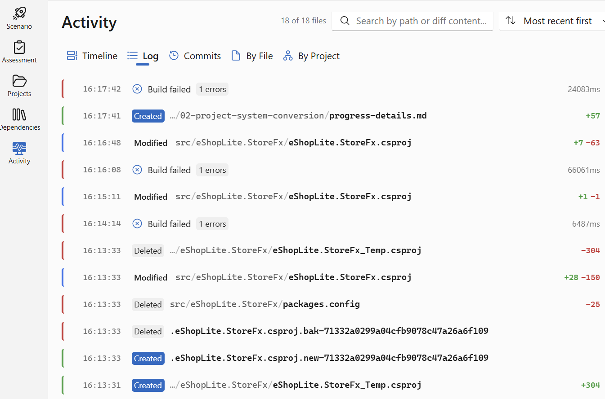

> 💡 **TIPS**
>
> - The agent runs a lot of commands. Rather than approving each one individually, choose the option to allow all commands for the rest of the session.
> - Sometimes the dashboard gets stuck. It reflects state the agent reports rather than polling the repo, so it can lag behind the real work. Check the chat and the Source Control view before assuming anything has actually stalled — if commits are still landing, the upgrade is fine and only the display is behind.
> - If the agent gets stuck (no new chat output and no tasks being checked off) tell it to continue in the chat.

## 5️⃣ Finalize the Migration

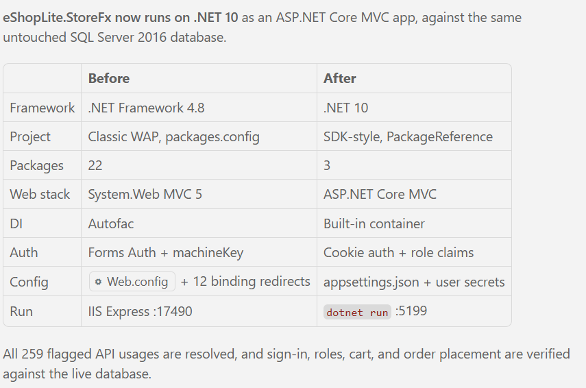

When the final validation task completes, ask the agent to start the app and check it for you:

```plaintext
Run the application and confirm it works end to end. Check that the product catalog loads with images, sign-in works for both accounts, the cart persists across page loads, and placing an order writes back to SQL Server. Tell me about anything that behaves differently than it did before the upgrade.
```

The agent will build the project, start it, and report what it finds. Open the URL yourself as well and walk the same paths you used before the upgrade:

- The product catalog loads, with images
- Sign-in works for both accounts
- Adding to the cart persists across page loads
- Placing an order writes back to SQL Server

Notice what you are checking for: **nothing has changed**. The storefront should look and behave exactly as it did on .NET Framework. That is the whole point of holding the database and the UI constant — any visible difference is a regression, not a feature, and you can attribute it to the framework move rather than wondering which of three migrations caused it.

If something is off, the [troubleshooting steps](#-handling-common-issues) below cover the common cases.

### ✅ Final check

- ✅ Running on .NET 10
- ✅ Building on the SDK-style project system, with `PackageReference` instead of `packages.config`
- ✅ Reading configuration through the modern configuration system instead of `web.config`
- ✅ Starting with `dotnet run` — no IIS Express
- ✅ Serving the **same MVC pages** against the **same SQL Server database** as before

🎉 **Congratulations — your storefront is running on .NET 10.**

A .NET Framework 4.8 application that needed IIS Express, `packages.config`, and `Web.config` is now a modern, SDK-style, cross-platform app that starts with `dotnet run`. It is out of the legacy support window, it can run in a Linux container, and it is finally a candidate for the Azure hosting options covered later in this bootcamp — none of which were available to it an hour ago.

## 🎯 What You've Accomplished

By using GitHub Copilot's modernization capabilities, you've:

- 🔹 Moved a .NET Framework 4.8 application onto .NET 10
- 🔹 Converted a legacy project system to SDK-style with modern package references
- 🔹 Leveraged AI to find and resolve breaking changes across the codebase
- 🔹 Kept the change reviewable by holding the data tier and UI constant

The framework upgrade alone would typically take days of manual work chasing breaking changes and package incompatibilities, but with GitHub Copilot's assistance, you've accomplished it in a fraction of the time — and with a change set small enough to actually review.

## 🔧 Handling Common Issues

### Cannot find `csc.exe` when building the original app

Before the upgrade even starts, building the .NET Framework 4.8 project can fail like this:

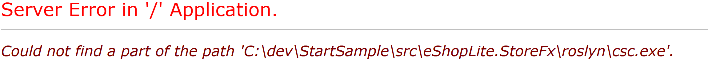

This means the `Microsoft.CodeDom.Providers.DotNetCompilerPlatform` package did not lay down `csc.exe`. VS Code has no **Package Manager Console**, so repair it from the integrated terminal (`` Ctrl+` ``) instead. Run this from the root of your copy of the app, next to `eShopLiteFx.sln`:

```powershell
nuget restore eShopLiteFx.sln
```

If the error persists, delete the package folder to force a clean reinstall, then restore again:

```powershell
Remove-Item packages/Microsoft.CodeDom.Providers.DotNetCompilerPlatform.* -Recurse -Force
nuget restore eShopLiteFx.sln
```

### Error Recovery

Sometimes the tool may encounter errors during the upgrade. When this happens:

1. If you see an error message, click on **"Resume"** - in 70% of cases, the issue resolves in subsequent iterations.
2. If the error persists, type in the chatbox:
   ```
   Fix the errors and continue with the update
   ```

3. For specific errors, analyze the error message and debug with Copilot by providing context

### Scope Creep

The agent may start converting views to Blazor or swapping the database provider on its own initiative, because those are common companions to a framework upgrade. If you see it heading that way, pull it back:

```
Stay on the framework upgrade only. Keep the existing SQL Server database and the existing MVC views. Revert any changes that convert views to Blazor or change the database provider.
```

### Static Assets and Views

The project layout changes during the upgrade, so scripts, images, and stylesheets often stop resolving even though the views themselves are unchanged. If pages render without styling, use this prompt:

```
The pages load but the scripts and stylesheets in subfolders are not resolving. Check the static file configuration and asset paths for the new project layout, and fix them step by step. Keep the existing MVC views.
```

### Database Connectivity

The database itself does not change in this module, but the *way the app reads its connection string* does — `web.config` and `connectionStrings.config` give way to the modern configuration system. If data stops loading, that migration is the first place to look:

```
The products are not loading. Check that the SQL Server connection string was carried over correctly into the new configuration system and that Entity Framework is reading it. Think and do this step by step.
```

### Runtime Error Resolution

For runtime errors:
1. Stop the running app (`Shift+F5`, or press `Ctrl+C` in the terminal running `dotnet run`)
2. Copy the error message from the **Terminal** or **Debug Console** panel
3. Paste it into the Copilot chat for analysis and resolution

## 🛠️ Advanced: teach the agent your own patterns

Everything the agent did here came from its built-in scenarios and skills — SDK-style conversion, package upgrades, API replacements. That works because those patterns are the same in every .NET app.

Your own patterns are not. If your team wraps every database call a particular way, or structures service layers to a house standard, the agent has no way to know that. You can teach it: create Markdown files under `.github/skills/` in the repository, one per pattern, and the agent picks them up as reusable instructions the same way it uses the built-in ones.

This is the difference between modernizing one app and modernizing two hundred of them. The first app is where you work out the pattern; the skills folder is how the next ninety-nine get it for free.

> 💡 **Tip**
>
> Custom skills are out of scope for this workshop, but worth knowing about. See [GitHub Copilot upgrade scenarios and skills](https://learn.microsoft.com/dotnet/core/porting/github-copilot-upgrade/scenarios-and-skills) for the documented scenarios and built-in skills.

## ➡️ What's Next

You've completed the framework upgrade using GitHub Copilot Modernization. The app runs on .NET 10 — but running on modern .NET is not the same as being ready for Azure. The code still assumes it is the only copy of itself running on a server it owns.

In the next module you'll convert the MVC pages to Blazor components, then run a cloud readiness assessment against the result and work through what it finds — and what it misses.

---
[← Previous: Assessment](../01-assesment/Readme.md) | [Next: Get the App Ready for Azure →](../03-modernize-with-ghcp/README.md)