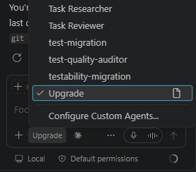
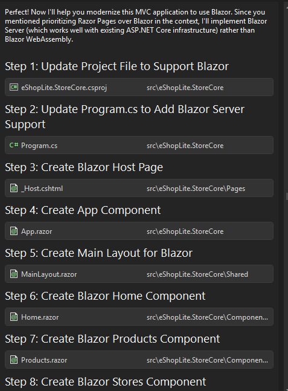
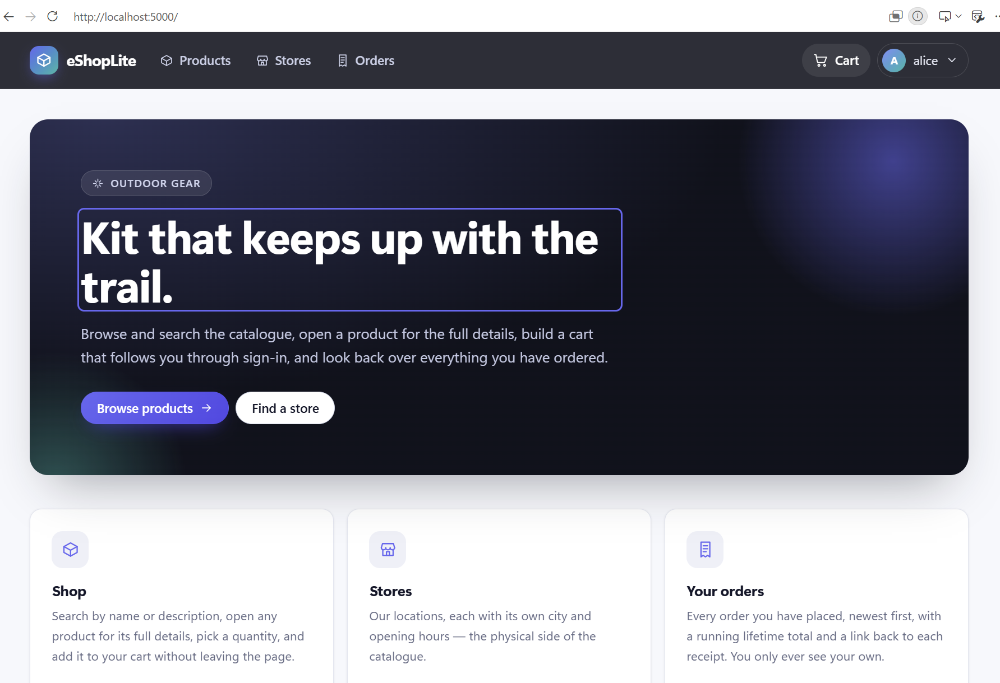
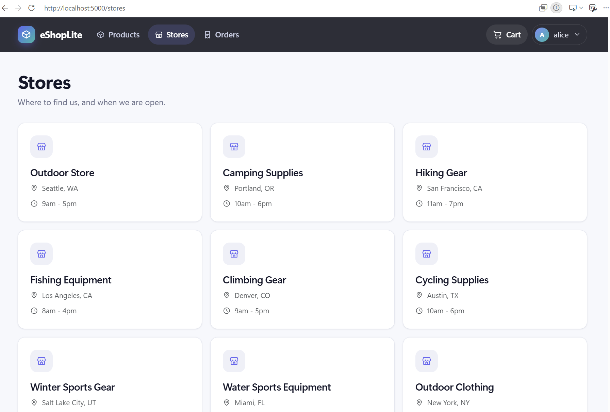
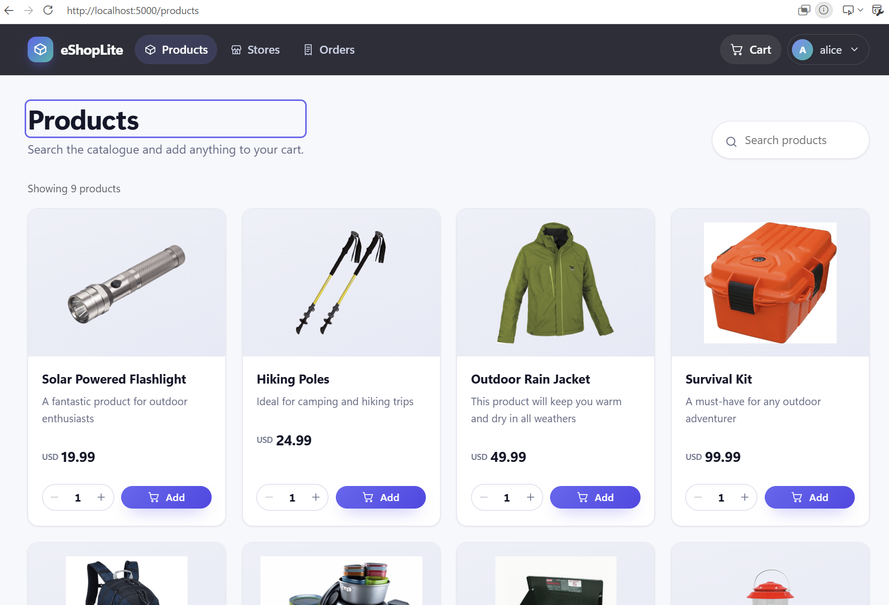
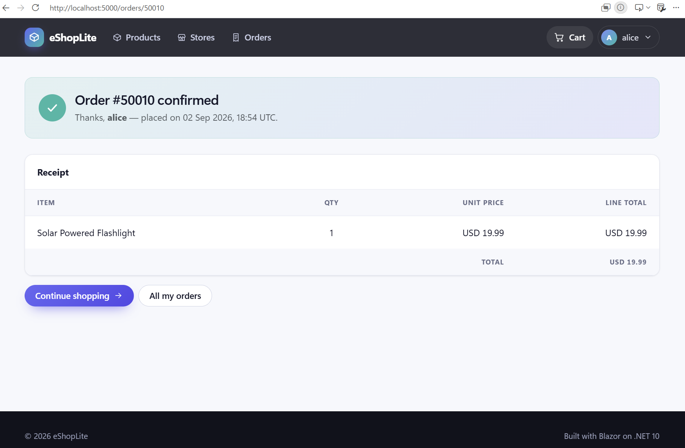
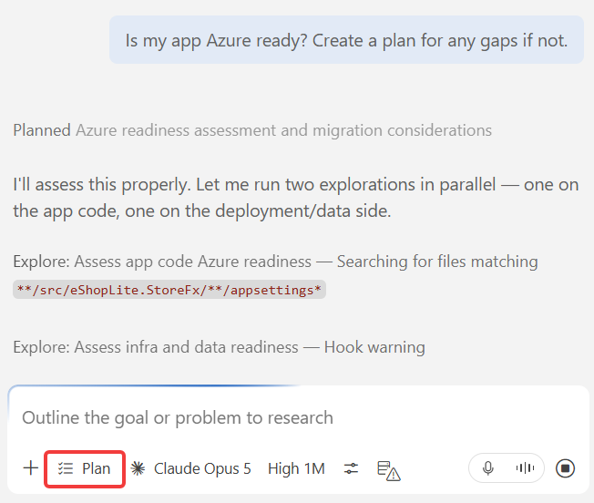
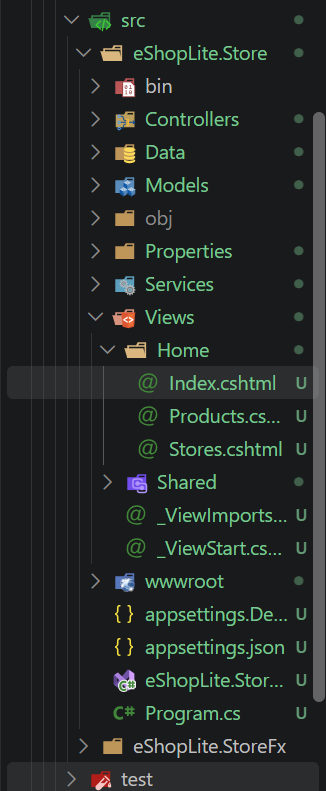

# ☁️ Get the App Ready for Azure

Module 2 got the storefront onto .NET 10. Because ASP.NET MVC 5 does not run there, that upgrade also had to move the app to dependency injection, `appsettings.json`, and the modern hosting model — whether you wanted it to or not. What it did not do is make the app ready to run **in Azure**.

In this chapter you will work in **GitHub Copilot Chat** throughout — mostly regular chat, where the job is ordinary refactoring, with the `@upgrade` agent available for the optional question that opens the module. Convert the MVC pages to Blazor components, then ask directly whether the app is ready for Azure and close the gaps that come back.

> 🧭 New to GitHub Copilot Chat? [Copilot Essentials](../../docs/copilot-essentials.md) is a short reference on modes, models, context, cost, and course-correcting.

## 📋 What you'll do

- 🚀 Convert the MVC pages to Blazor components
- ☁️ Ask whether the app is Azure ready, and fix what comes back
- 🤖 Optionally, ask the upgrade agent what modernization work is still relevant

## 🔍 Prerequisites

Before starting, ensure you have:

- Visual Studio Code installed
- The GitHub Copilot extension installed and signed in
- A GitHub Copilot subscription, paid or free
- The **GitHub Copilot upgrade** agent (`@upgrade`), installed in Module 2
- A .NET 10 SDK available for the application

### Choose your starting point

Pick whichever fits where you landed in Module 2:

**Option A — continue with your own code.** Your Module 2 output should already be running on .NET 10 and is ready for the work in this module. If that run did not finish cleanly, get the app building and running before you start — everything below assumes a working .NET 10 solution.

**Option B — start fresh from the sample.** [`sample-app/`](./sample-app/) in this folder is the Module 2 end state: the Caldova storefront already on .NET 10, still rendering through MVC, with nothing else modernized. Copy it somewhere outside this repo and one setting needs changing:

1. Copy the folder to your own working directory, then `git init` and commit a baseline.
1. Open `src/eShopLite.StoreFx/appsettings.json` and replace `REPLACE_ME` in the `StoreDbContext` connection string with the SQL password from your instructor. Everything else in the connection string is already correct.
1. Run the app and confirm the catalog loads before going further.

> 💡 Both options put you in the same place. Option B just skips re-running Module 2 if your upgrade did not finish or you want a known-good starting point.

### Verify the upgrade agent

Everything in this module runs through GitHub Copilot Chat. Confirm the agent is available before you start:

1. Open the project folder in Visual Studio Code.
1. Open the **GitHub Copilot Chat** view, send `@upgrade`, and confirm the agent responds (or select Upgrade agent from the dropdown).



## 1️⃣ Convert to Blazor pages

The storefront still renders through MVC views and controllers. They work fine on .NET 10, but they keep the front end on an older rendering model than the rest of the stack. You will convert those pages to Blazor components, and ask for a more modern look while you are at it.

With the Upgrade agent selected in the chat, use the following prompt to guide Copilot:

```plaintext
Convert the existing ASP.NET MVC pages to Blazor components in this .NET 10 application. This includes:

Identify the MVC views, controllers, models, and services involved.
Recommend whether Blazor Server interactivity or static server rendering is most appropriate for this app.
Convert all existing pages one page at a time to use Blazor (preferably Blazor Server or Blazor WebAssembly, depending on suitability).
Remove all non-Blazor pages and ensure routing is correctly configured.
Preserve layout, validation, images, and existing user-facing behavior.
Ensure all media (images, videos, etc.) are correctly referenced and rendered in the new Blazor components.
Fix issues where the page renders blank or fails to load due to routing or layout problems.
Leverage Blazor components to make it look more modern, sleek, and aesthetic.
```

> 💡 **NOTE**
>
> That last line is deliberately vague — "modern, sleek, and aesthetic" means whatever the model decides it means. Expect your result to look different from the screenshots below, and different from the person sitting next to you. That is fine. The point of this step is that you *can* modernize a UI by asking, not that everyone lands on the same UI.
>
> If you have something specific in mind, say so. Name the color palette, ask for product cards in a responsive grid, request a sticky nav bar, or paste in a screenshot of a design you like. The more specific the ask, the less the model has to invent.
>
> The same applies when something breaks. If a page renders blank, a component goes missing, or routing misbehaves, describe that specific problem in the chat and let Copilot fix it before moving on.



Copilot will convert the MVC pages to Blazor components, ensuring that all functionality is preserved and adding some new features.

This is our final page:







## 2️⃣ Build and test

If Copilot does not automatically do this verification, then:

1. Build the solution to ensure no compilation errors
1. Run the application and verify all functionality
1. Check that:
   - All pages load correctly and render as Blazor components
   - Images and static content display properly
   - Sign-in still works and the cart still holds its contents — credentials are in [Demo logins](../../docs/logins.md)
   - No MVC views or controllers are left behind in the routing
   - The application starts cleanly from the Visual Studio Code terminal



> 💡 The app does the same things it did at the end of Module 2 — that is the point. Everything so far changed *how* the app runs and renders, not *what* it does.

## 3️⃣ Get the app cloud ready

The app runs on .NET 10 and renders through Blazor, but it is not ready for the Azure components we plan to put around it — Key Vault, managed identity, a container platform in front of it. Nothing so far has touched that, because a framework upgrade has no reason to.

So ask.

1. **Ask the question in plan mode.** In Copilot Chat, switch the mode dropdown to **Plan** and send:

   ```plaintext
   Is this app Azure ready? Create a plan for any gaps if not.
   ```

   

1. **Read the plan.** Select **Open in Editor** to view it as a markdown file. It is reading your actual codebase, so what comes back is grounded rather than generic — expect concrete gaps like no HTTPS redirection, no forwarded headers, no health endpoint, and `"AllowedHosts": "*"`.

   Read what it says is *already fine* too. Clean dependency injection, configuration through `IConfiguration`, no filesystem writes, no Windows-only APIs. Knowing what you do not have to touch is what keeps a migration small enough to review.

1. **Scope it before you run it.** Two things in the plan belong to later modules, so say so explicitly rather than letting the agent do them and undoing it afterwards:

   ```plaintext
   Proceed with the Azure readiness plan. Do not create a Dockerfile or touch the database -- these changes will come later. Create a new branch for the changes and please show a summary of changes after each phase.

   Every Azure integration must be optional: read it from configuration, and when that configuration is absent, fall back to the existing local behavior so the app still builds and runs unchanged with no Azure resources provisioned. Do not
   hardcode endpoints, keys or connection strings.
   ```

   The branch matters. It gives you one clean thing to diff, review, and throw away if the run goes sideways. The "must still run locally" constraint is your acceptance test. Readiness work that only functions once Azure resources exist can't be verified in this module, since we have not provisioning Azure resources yet. A broken local run is the fastest signal that the agent overreached. Every integration it adds should read its own configuration and fall back quietly when that configuration is absent, so the app you run at the end behaves exactly like the one you ran at the start.

1. **Approve as it goes.** It will re-run the build and ask for approval to run commands. Grant them, and read the per-phase summaries as they appear instead of waiting until the end.

1. **Ask for a summary you can understand.**

   ```plaintext
   Summarize the changes you made at a high level, not file level.
   ```

1. **Build and run it one more time.** The app should still look and behave exactly as it did before the run. If there are any build or unexpected errors, tell Copilot to check that it created fallbacks for local development. It may be hitting errors on Azure resources that do not exist yet. If sign-in, the cart, or anything else looks off, tell it in the chat and let it fix it before you move on. You can also ask Copilot to do this check:

```plaintext
   Verify the changes you made actually work. Run the app and check the behavior, don't just re-read the code. For anything you can't verify without Azure resources, say so explicitly rather than assuming it works.
   ```

> 💡 Worth opening `appsettings.json` when the run finishes. Whatever the agent decided this app needs from Azure usually lands there as empty settings — a quick read tells you what the next module has to provision. Keep that list; Module 4 opens by asking you for it.

> 🎉 **That's it — the app is Azure ready.**
>
> Three modules ago this was a .NET Framework 4.8 app that only ran on Windows Server behind IIS. It now builds on .NET 10, renders through Blazor, and is wired to support Azure services. Next module you design the Azure platform those settings expect.

## 🔧 Troubleshooting common issues

### YARP errors

If you encounter YARP (Yet Another Reverse Proxy) errors during an incremental ASP.NET Framework-to-ASP.NET Core migration and this workshop application no longer needs a side-by-side proxy:

- Ask Copilot to identify where YARP is referenced.
- Ask Copilot to remove unnecessary YARP packages, configuration, and proxy startup code.
- Rebuild the solution after removal.

### Missing images or static files

If product images don't appear after modernization:

- Ask Copilot to verify that static files are under `wwwroot`.
- Confirm that `app.UseStaticFiles()` is configured.
- Check that image paths in Razor views or Blazor components match the files under `wwwroot`.



## ✅ Verification

By the end of this section, you should have:

- 🔹 Converted the MVC pages to Blazor components
- 🔹 Asked the agent directly whether the app is Azure ready
- 🔹 Closed the gaps it found, including HTTPS redirection, forwarded headers, and a health endpoint
- 🔹 Understood why in-process session state and local Data Protection keys break under scale-out
- 🔹 Kept the application buildable and its behavior unchanged throughout

> **Next module preview:** Module 4 designs the Azure foundation this app now expects — networking, managed identity, and the container platform it will run on. You plan it and generate the Bicep for it; the live environment is already provisioned for you, so your implementation stays a local artifact to review rather than something you deploy. The app itself is deployed in Module 6.

---
[← Previous: Upgrade .NET Applications](../02-upgrade-dotnet-with-ghcp/Readme.md) | [Next: Design the Azure Foundation →](../04-deploy-to-azure/README.md)