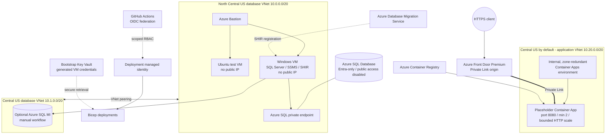

# ☁️ Lab 04: Deploy the Azure Foundation

The database exercise needs servers, private connectivity, migration services, and managed database targets before a migration can begin. In this lab, you will use GitHub Copilot to design that foundation, review the proposed architecture, and deploy it through GitHub Actions with secretless Azure authentication.

You will make real architecture decisions, but you will work inside a set of non-negotiable security and resilience requirements. A tested Bicep implementation is included so that an infrastructure issue does not prevent you from continuing to the data lab.

This lab takes approximately **90-120 minutes**. Azure SQL Managed Instance is an optional, separately triggered deployment and can take substantially longer.

> 💡 **Need an Azure-ready application?** [`sample-app/`](./sample-app/) in this folder is the Module 3 end state: the storefront on .NET 10, rendered with Blazor, reading every Azure setting from configuration, and exposing health endpoints. Use it if your own Module 3 run did not finish, or as the known-good application for Lab 06.

## 🎯 Objectives

By the end of this lab, you will be able to:

- turn a detailed workload brief into a reviewed infrastructure plan
- compare container compute options and justify Azure Container Apps for this workload
- use Azure Bastion instead of public VM management endpoints
- separate application, migration, and database network boundaries
- design bounded autoscaling and multi-region application resilience
- authenticate GitHub Actions to Azure with OpenID Connect (OIDC)
- apply managed identity and least-privilege Azure RBAC
- validate and preview Bicep before deployment
- recover from an incomplete participant implementation with the known-good files

## 🧭 Where This Fits

The earlier labs assessed and modernized the application. This lab creates the Azure platform required by [Lab 05: Modernize Data](../05-modernize-data/README.md). Application code deployment is intentionally deferred until the data work is complete.

That is why nothing you deploy here runs the storefront. A placeholder image proves the platform works on its own, so a broken application cannot disguise a broken network. The application arrives in [Lab 06](../06-deploy-code-with-github-actions/README.md).

## ✅ Prerequisites

- Visual Studio Code with GitHub Copilot
- PowerShell 7 or later
- Azure CLI, signed in with `az login`
- GitHub CLI, signed in with `gh auth login`
- an Azure subscription where you can create resource groups, managed identities, federated credentials, role assignments, and the resources in this lab
- permission to create or update GitHub environments and Actions variables in your repository
- Bicep CLI through the Azure CLI

Verify the tools:

```powershell
$PSVersionTable.PSVersion
az version
az account show --output table
az bicep version
gh auth status
gh repo view --json nameWithOwner
git status --short
```

> [!WARNING]
> This lab creates billable resources. Azure Bastion, Azure Front Door Premium, VMs, DMS, and SQL Managed Instance can be significant cost drivers. Use a lab subscription, deploy SQL MI only when required, and complete cleanup promptly.

## 🏗️ Required Final Architecture



The editable diagram source is in [target-architecture.mmd](images/target-architecture.mmd).

### Network baseline

| VNet | Region | Address space | Purpose |
| --- | --- | --- | --- |
| Primary database | North Central US | `10.0.0.0/20` | Bastion, VMs, Azure SQL private endpoint |
| Secondary database | Central US | `10.1.0.0/20` | SQL Managed Instance delegated subnet |
| Application | Central US by default | `10.20.0.0/20` | Internal, zone-redundant Container Apps environment |

The application location remains a parameter. Select a region that supports Availability Zones before deployment; Central US is the known-good default because North Central US does not support the required zonal configuration. Do not add a subnet named `default`. Give each subnet one clear purpose, verify current service delegation and minimum-size requirements, and leave growth space.

## 🤔 Why Azure Container Apps?

You should still compare the options rather than accepting a service name without analysis.

| Option | Strength | Why it is not the baseline here |
| --- | --- | --- |
| Azure Container Apps | Managed revisions, internal ingress, KEDA-based scaling, managed platform operations | **Selected baseline** |
| App Service for Containers | Familiar web hosting and deployment slots | Multi-service internal networking and revision-based container operations are less natural for this target |
| AKS | Full Kubernetes APIs, extensibility, and scheduling control | The workload has no demonstrated need for Kubernetes control-plane access, CRDs, or custom operators |

Azure Container Apps is the best fit for this exercise because it meets the container, private ingress, scaling, and revision requirements without asking a small team to operate Kubernetes. Resilience comes from a zone-redundant environment, at least two application replicas, bounded autoscaling, and Azure Front Door Premium as the private global entry point. This gives the workshop a meaningful availability design without doubling every application resource.

## 🔒 Non-Negotiable Requirements

Your plan and implementation must:

- place both VMs in the primary database VNet and assign neither a public IP
- use Azure Bastion for browser-based RDP and SSH
- place SQL MI in its own delegated subnet in the peered secondary database VNet
- disable Azure SQL public network access and use Private Link and private DNS
- use one internal, zone-redundant workload-profile Container Apps environment in a dedicated application VNet
- expose the single application origin through Front Door Premium and Private Link
- run at least two placeholder-app replicas and use a bounded HTTP scaling rule
- use a Microsoft sample image on port `8080`; do not deploy the workshop application code
- use GitHub Actions OIDC, not a client secret
- scope the deployment identity to the lab resource groups
- use managed identities and deterministic, narrowly scoped role assignments
- store generated VM credentials in Key Vault and never print or commit them
- keep SQL MI in a separate manual workflow
- parameterize names, locations, CIDRs, SKUs, capacity, and required tags

## 🧪 Challenge 1: Produce the Plan

Open Copilot Chat in **Plan** mode and submit:

```text
Analyze this repository and plan the Azure foundation for Lab 04.

Start by inventorying the application, the database lab, and any existing infrastructure.

Treat the Required Final Architecture and Non-Negotiable Requirements in
labs/04-deploy-to-azure/README.md as a minimum, not a complete design. For every
application setting that implies an Azure resource, provision that resource at a
lab-sized SKU. Report what you added, what you deliberately left out, and why.

Before proposing files:
1. Compare Azure Container Apps, App Service for Containers, and AKS.
2. Produce a CIDR and subnet table with no overlaps.
3. Produce an identity and least-privilege RBAC matrix.
4. Separate the base deployment from the optional SQL Managed Instance deployment.
5. Explain failure modes, recovery, regional routing, scaling limits, cost drivers,
   secure administration, and cleanup.
6. List assumptions and unresolved questions.

Plan participant files under infra/lab04/student/. Use Bicep or Terraform, but explain
the choice. Do not create or modify files. Stop for review.
```

Review the response. Reject a plan that:

- puts public IPs on the VMs
- enables Azure SQL public access
- uses one Container Apps environment for two regions
- calls two replicas “multi-region”
- grants Contributor at subscription scope
- uses an Azure client secret
- deploys SQL MI automatically with the base environment
- embeds credentials in parameters, outputs, logs, or repository files

## 🧪 Challenge 2: Make Defensible Choices

The architecture is constrained, but these decisions remain yours:

- Bicep or Terraform for your participant implementation
- module boundaries
- exact safe subnet sizes
- development VM and database SKUs
- maximum replica count and HTTP concurrency threshold
- naming convention and unique suffix strategy

Ask Copilot to revise the plan until every choice is explicit. Capture the approved plan before switching modes.

## 🧪 Challenge 3: Generate and Review

Switch to **Agent** mode:

```text
Implement the approved Lab 04 plan only under infra/lab04/student/.
Do not deploy resources and do not edit the known-good implementation.

Use stable resource API/provider versions, no committed secrets, Entra-only Azure SQL
authentication, internal Container Apps environments, bounded scaling, deterministic
role assignments, and parameter files with lab-sized defaults.

After generation, build or validate every entry point and show me the diff and all
remaining warnings.
```

Inspect the result:

```powershell
Get-ChildItem .\infra\lab04\student -Recurse
git diff -- .\infra\lab04\student
```

The included [student requirements](../../infra/lab04/student/README.md) provide a final review checklist.

## 🔑 Bootstrap GitHub OIDC and Key Vault

Run the bootstrap from the repository root:

```powershell
.\assets\scripts\Initialize-Lab04Repository.ps1 `
  -SubscriptionId '<your-subscription-id>' `
  -ApplicationLocation 'centralus'
```

Use another application location only after confirming that it supports Availability Zones.

The script performs privileged setup that is intentionally not hidden inside the deployment:

1. registers required providers
2. creates the lab resource groups
3. creates an RBAC-enabled bootstrap Key Vault
4. generates VM credentials and stores them without displaying them
5. creates separate user-assigned identities for infrastructure and application-code deployment
6. adds federated credentials for `lab04`, `lab04-deploy`, `lab06`, and `lab06-deploy`
7. grants the infrastructure identity Contributor and RBAC-administrator capabilities only at the lab resource-group scopes
8. grants the infrastructure workflow read access to the two Key Vault secrets
9. creates all four GitHub environments and their non-secret Actions variables

OIDC lets GitHub exchange its short-lived job token for an Azure token. There is no Azure client secret to rotate or leak. The plan job uses `lab04`; the deployment job uses `lab04-deploy`, allowing you to inspect what-if output before approving the protected deployment environment. Lab 06 uses its own identity: Bicep grants it `AcrPush` only on the registry, `Container Apps Contributor` only on the retail app, and Reader only on the Front Door profile for endpoint discovery and smoke testing.

> [!IMPORTANT]
> The person running bootstrap needs permission to create role assignments. `User Access Administrator` at the relevant scopes is the normal least-privilege administrative role for that operation.

## 🔍 Validate and Preview

Validate your participant implementation locally. For the complete Bicep recovery path:

```powershell
Get-ChildItem .\infra\lab04\complete -Filter *.bicep -Recurse |
  ForEach-Object { az bicep build --file $_.FullName --stdout | Out-Null }
```

Add required reviewers to the `lab04-deploy` environment in repository settings, then run **Lab 04 - Deploy Azure foundation** from the Actions tab. Select:

- `student` to deploy your implementation
- `complete` to use the known-good recovery implementation

The workflow authenticates with OIDC, retrieves VM credentials from Key Vault, validates Bicep, runs what-if, and deploys the base architecture. Read the what-if output before approving the protected environment deployment.

## 🛟 Recovery Path

If your generated infrastructure does not validate and the remaining lab time is limited:

1. Preserve your plan and failed validation output for the debrief.
2. Compare your design with [the complete implementation](../../infra/lab04/complete/README.md).
3. Run the base workflow with `implementation=complete`.
4. Verify the deployment and continue to Lab 05.

Using the recovery path keeps the bootcamp moving, but it does not replace explaining what failed and which architectural requirement was missed.

## 🐢 Optional SQL Managed Instance

SQL MI is not required by the current Lab 05 exercise. Deploy it only when an instructor asks you to test that target:

1. Complete the base deployment.
2. Check SQL MI regional availability, subnet requirements, and quota.
3. Run **Lab 04 - Deploy optional SQL Managed Instance** manually.
4. Review and approve its what-if output.

The workflow is deliberately not chained to the base deployment. This prevents a long-running, high-cost resource from being created accidentally.

## ✅ Verification

- [ ] Front Door reports the Private Link application origin healthy.
- [ ] The placeholder responds through the Front Door HTTPS endpoint.
- [ ] The placeholder has a minimum of two replicas and a bounded maximum.
- [ ] The Container Apps environment is internal and zone-redundant.
- [ ] Both VMs have no public IP.
- [ ] Bastion can open RDP to Windows and SSH to Ubuntu.
- [ ] The Azure SQL server has public network access disabled.
- [ ] The Azure SQL FQDN resolves to the private endpoint from the Windows VM.
- [ ] The two database VNets are peered.
- [ ] Platform logs reach the application-region Log Analytics workspace.
- [ ] GitHub Actions used OIDC and no Azure client secret exists.
- [ ] Role assignments are limited to the lab scopes.
- [ ] No credential appears in source, workflow logs, parameters, or deployment outputs.

## 🧹 Cleanup

Use the values reported by bootstrap:

```powershell
.\assets\scripts\Remove-Lab04Environment.ps1 `
  -SubscriptionId '<your-subscription-id>' `
  -Prefix 'caldova-lab04' `
  -Suffix '<six-character-suffix>'
```

The script lists and confirms each exact resource group. Do not broaden its scope or replace the names with wildcards.

Keep the environment only if you are continuing directly to [Lab 05](../05-modernize-data/README.md).

## 📖 References

- [Choose an Azure container service](https://learn.microsoft.com/azure/architecture/guide/technology-choices/compute-decision-tree)
- [Azure Container Apps networking](https://learn.microsoft.com/azure/container-apps/networking)
- [Azure Front Door with private Container Apps origins](https://learn.microsoft.com/azure/container-apps/front-door-custom-virtual-network-private-link)
- [Authenticate to Azure from GitHub Actions with OIDC](https://learn.microsoft.com/azure/developer/github/connect-from-azure-openid-connect)
- [Managed identities for Azure resources](https://learn.microsoft.com/entra/identity/managed-identities-azure-resources/overview)
- [Azure Bastion](https://learn.microsoft.com/azure/bastion/bastion-overview)
- [Azure SQL private endpoints](https://learn.microsoft.com/azure/azure-sql/database/private-endpoint-overview)

---

[← Previous: Modernize with GitHub Copilot](../03-modernize-with-ghcp/README.md) | [Next: Modernize Data →](../05-modernize-data/README.md)
