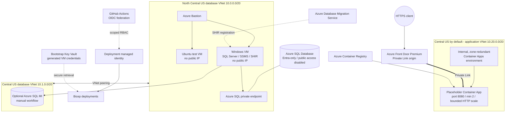

# ☁️ Lab 04: Design the Azure Foundation with GitHub Copilot

The database exercise needs servers, private connectivity, migration services, and managed database targets before a migration can begin. In this lab, you will use GitHub Copilot to plan that foundation, generate a Bicep implementation, validate it locally, and critically review the result.

You will make real architecture decisions inside a set of non-negotiable security and resilience requirements. The instructor has already provisioned the Azure environment used by the later labs, so **you will not deploy the Bicep you generate**. The goal is to practice an effective GitHub Copilot workflow while keeping architectural judgment and approval with you.

A tested Bicep implementation is included for comparison, and the instructor-preprovisioned environment keeps infrastructure provisioning time from blocking the workshop.

This lab takes approximately **90-120 minutes**.

> 💡 **Need an Azure-ready application?** [`sample-app/`](./sample-app/) in this folder is the Module 3 end state: the storefront on .NET 10, rendered with Blazor, reading every Azure setting from configuration, and exposing health endpoints. Use it if your own Module 3 run did not finish, or as the known-good application for Lab 06.

## 🎯 Objectives

By the end of this lab, you will be able to:

- turn a detailed workload brief into a reviewed infrastructure plan
- compare container compute options and justify Azure Container Apps for this workload
- use Azure Bastion instead of public VM management endpoints
- separate application, migration, and database network boundaries
- design bounded autoscaling and multi-region application resilience
- explain how GitHub Actions authenticates to Azure with OpenID Connect (OIDC)
- apply managed identity and least-privilege Azure RBAC
- guide GitHub Copilot from an approved plan to a Bicep implementation
- build and review Bicep without deploying it
- identify where lab constraints require deeper production architecture review

## 🧭 Where This Fits

The earlier labs assessed and modernized the application. This lab examines the Azure platform required by [Lab 05: Modernize Data](../05-modernize-data/README.md). The instructor-preprovisioned environment provides that platform, while your Bicep remains a local learning artifact.

The preprovisioned Container App runs a placeholder image so the platform can be verified independently of the workshop application. The application arrives in [Lab 06](../06-deploy-code-with-github-actions/README.md).

## ✅ Prerequisites

- Visual Studio Code with GitHub Copilot
- PowerShell 7 or later
- Azure CLI
- Bicep CLI through the Azure CLI
- a local clone of this repository

Verify the tools:

```powershell
$PSVersionTable.PSVersion
az version
az bicep version
git status --short
```

> [!NOTE]
> The instructor owns deployment and cleanup of the billable workshop
> environment. Do not run the Lab 04 deployment workflow or provision a second
> copy of the architecture unless your instructor explicitly directs you to do
> so.

## 🏗️ Required Final Architecture



The editable diagram source is in [target-architecture.mmd](images/target-architecture.mmd).

> [!IMPORTANT]
> **This is a workshop architecture, not a universal production reference
> architecture.** Some topology, region, SKU, service-boundary, and access
> decisions were selected to fit lab time, cost, subscription limits, and the
> learning sequence. For a production implementation, evaluate an
> [Azure landing zone](https://learn.microsoft.com/azure/cloud-adoption-framework/ready/landing-zone/)
> as the platform baseline for governance, identity, security, connectivity,
> management, and workload subscriptions. Then review the workload against the
> [Azure Well-Architected Framework](https://learn.microsoft.com/azure/well-architected/)
> and your organization's requirements. Networking and architecture decisions
> must be thoroughly reviewed for reliability, resiliency, security, cost,
> operational excellence, performance, failure modes, and recovery objectives
> before deployment.

### Network baseline

| VNet | Region | Address space | Purpose |
| --- | --- | --- | --- |
| Primary database | North Central US | `10.0.0.0/20` | Bastion, VMs, Azure SQL private endpoint |
| Secondary database | Central US | `10.1.0.0/20` | SQL Managed Instance delegated subnet |
| Application | Central US by default | `10.20.0.0/20` | Internal, zone-redundant Container Apps environment |

The application location remains a parameter. Select a region that supports Availability Zones before deployment; Central US is the known-good default because North Central US does not support the required zonal configuration. Do not add a subnet named `default`. Give each subnet one clear purpose, verify current service delegation and minimum-size requirements, and leave growth space.

## 🤔 Why Azure Container Apps?

You should still compare the options rather than accepting a service name without analysis.

| Option | Strength | Why it is not the baseline here |
| --- | --- | --- |
| Azure Container Apps | Managed revisions, internal ingress, KEDA-based scaling, managed platform operations | **Selected baseline** |
| App Service for Containers | Familiar web hosting and deployment slots | Multi-service internal networking and revision-based container operations are less natural for this target |
| AKS | Full Kubernetes APIs, extensibility, and scheduling control | The workload has no demonstrated need for Kubernetes control-plane access, CRDs, or custom operators |

Azure Container Apps is the best fit for this exercise because it meets the container, private ingress, scaling, and revision requirements without asking a small team to operate Kubernetes. Resilience comes from a zone-redundant environment, at least two application replicas, bounded autoscaling, and Azure Front Door Premium as the private global entry point. This gives the workshop a meaningful availability design without doubling every application resource.

## 🔒 Non-Negotiable Requirements

Your plan and implementation must:

- place both VMs in the primary database VNet and assign neither a public IP
- use Azure Bastion for browser-based RDP and SSH
- place SQL MI in its own delegated subnet in the peered secondary database VNet
- disable Azure SQL public network access and use Private Link and private DNS
- use one internal, zone-redundant workload-profile Container Apps environment in a dedicated application VNet
- expose the single application origin through Front Door Premium and Private Link
- run at least two placeholder-app replicas and use a bounded HTTP scaling rule
- use a Microsoft sample image on port `8080`; do not deploy the workshop application code
- use GitHub Actions OIDC, not a client secret
- scope the deployment identity to the lab resource groups
- use managed identities and deterministic, narrowly scoped role assignments
- store generated VM credentials in Key Vault and never print or commit them
- keep SQL MI in a separate manual workflow
- parameterize names, locations, CIDRs, SKUs, capacity, and required tags

## 🧪 Challenge 1: Explore Before You Plan

Start with what you carried out of Module 3. Open the `appsettings.json` from your
Azure-ready application and list every setting the agent added — Key Vault URIs,
managed identity client IDs, storage or telemetry endpoints, health check paths.
Those empty settings are the application's own statement of what it expects Azure
to provide, and they are the evidence your plan is graded against. If your Module 3
run did not finish, use [`sample-app/`](./sample-app/) and read its `appsettings.json`
instead.

Do not begin by asking Copilot to create files. First, use **Ask** mode to learn
what is already in the repository and to identify the evidence behind the
requirements.

```text
Explore this repository for Lab 04 without changing any files.

Identify:
- the application and database requirements established by earlier labs
- every existing Lab 04 Bicep entry point, module, workflow, and script
- the Azure resources implied by application configuration, including every setting
  the Module 3 readiness work added to appsettings.json
- security, identity, networking, availability, operations, and cost constraints
- assumptions or conflicts that require human review

For each conclusion, cite the repository file that supports it. Separate observed
facts from recommendations. Do not create an implementation plan yet.
```

Review the inventory. Ask follow-up questions when a conclusion is unsupported
or a repository requirement has been missed. Check the result against your own
`appsettings.json` list — a setting the app reads but the inventory does not
account for is a gap in the plan, not a detail to sort out later. This step keeps
the plan grounded in evidence instead of accepting a plausible but generic Azure
design.

## 🧪 Challenge 2: Produce and Review the Plan

Open Copilot Chat in **Plan** mode and submit:

```text
Analyze this repository and plan the Azure foundation for Lab 04.

Use the repository inventory we just reviewed.

Treat the Required Final Architecture and Non-Negotiable Requirements in
labs/04-deploy-to-azure/README.md as a minimum, not a complete design. For every
application setting that implies an Azure resource, provision that resource at a
lab-sized SKU. Report what you added, what you deliberately left out, and why.

Before proposing Bicep files:
1. Compare Azure Container Apps, App Service for Containers, and AKS.
2. Produce a CIDR and subnet table with no overlaps.
3. Produce an identity and least-privilege RBAC matrix.
4. Separate the base deployment from the optional SQL Managed Instance deployment.
5. Explain failure modes, recovery, regional routing, scaling limits, cost drivers,
   secure administration, and cleanup.
6. List assumptions and unresolved questions.

Plan only Bicep files under infra/lab04/student/. Use modules where they create clear
resource boundaries, parameterize environment-specific values, and keep secrets out
of source and parameter files. Do not create or modify files. Stop for review.
```

Do not approve the first response automatically. Reject a plan that:

- puts public IPs on the VMs
- enables Azure SQL public access
- uses one Container Apps environment for two regions
- calls two replicas “multi-region”
- grants Contributor at subscription scope
- uses an Azure client secret
- deploys SQL MI automatically with the base environment
- embeds credentials in parameters, outputs, logs, or repository files

The architecture is constrained, but these design decisions still require an
explicit rationale:

- module boundaries
- exact safe subnet sizes
- development VM and database SKUs
- maximum replica count and HTTP concurrency threshold
- naming convention and unique suffix strategy

Use focused follow-up prompts instead of asking Copilot to "make it better":

```text
Revise the plan with a decision record for every unresolved item. For each decision,
show the selected option, alternatives considered, evidence, tradeoffs, and the
condition that would cause us to revisit it. Do not implement anything.
```

```text
Review this plan as a skeptical Azure architect. Identify gaps against the Required
Final Architecture, Non-Negotiable Requirements, Azure Well-Architected pillars, and
the workshop architecture callout. Pay particular attention to network paths, DNS,
failure domains, recovery objectives, least privilege, secret handling, and bounded
scaling. Do not revise the plan until I approve the findings.
```

Resolve the findings and capture the approved plan before switching modes. Human
approval is the gate between planning and generation.

## 🧪 Challenge 3: Generate the Bicep

Switch to **Agent** mode:

```text
Implement the approved Lab 04 plan only under infra/lab04/student/.
Generate Bicep only. Do not deploy resources, run deployment scripts, modify workflows,
or edit infra/lab04/complete/.

Use current stable resource API versions, no committed secrets, Entra-only Azure SQL
authentication, internal Container Apps environments, bounded scaling, deterministic
role assignments, and parameter files with lab-sized defaults.

Follow the approved module boundaries and entry-point contracts. After generation,
build every Bicep entry point and show me the diff, validation output, and all
remaining warnings. Stop before making any unplanned correction.
```

Inspect the result:

```powershell
Get-ChildItem .\infra\lab04\student -Recurse
git diff -- .\infra\lab04\student
Get-ChildItem .\infra\lab04\student -Filter *.bicep -Recurse |
  ForEach-Object { az bicep build --file $_.FullName --stdout | Out-Null }
```

Building checks Bicep syntax, types, and compile-time rules. It does **not** prove
that resource names are available, quotas are sufficient, policies allow the
configuration, or deployment and runtime behavior will succeed.

The included [student requirements](../../infra/lab04/student/README.md) provide
an implementation checklist.

## 🧪 Challenge 4: Run the Human Review

Ask Copilot for a review before asking it to fix anything:

```text
Review my generated files under infra/lab04/student/ against the approved plan,
the Required Final Architecture, the Non-Negotiable Requirements, and
infra/lab04/student/README.md.

Report findings first, ordered by severity. Cite the affected file and explain the
deployment or runtime consequence. Check Bicep correctness, dependency ordering,
network and private DNS paths, least-privilege RBAC, secret exposure, availability,
bounded scaling, parameterization, and deterministic naming. Do not edit files.
```

Investigate each finding, approve the corrections you agree with, and ask Copilot
to implement only those corrections. Rebuild all generated Bicep after each
approved review batch and inspect the diff again.

Finally, compare your approach with
[the complete implementation](../../infra/lab04/complete/README.md). Differences
are discussion points, not automatic defects. Be prepared to explain:

- which requirements both implementations satisfy
- where module boundaries or parameter choices differ
- which design you would take to a formal architecture review
- what evidence is still missing before a production deployment

## 🏫 About the Preprovisioned Environment

Before the workshop, the instructor uses the tested Bicep implementation to
provision the shared Lab 04 foundation, including resource groups, Key Vault,
generated VM credentials, deployment identities, and scoped role assignments.

GitHub OIDC federation is repository-specific because each federated credential
includes the GitHub repository and environment in its subject. The instructor
or repository administrator completes that final binding for `lab06` and
`lab06-deploy` at the beginning of Lab 06. It authorizes application delivery
to the existing platform; it is not used to deploy your Lab 04 Bicep.

Participants do not run the full Lab 04 infrastructure bootstrap, deploy their
generated Bicep, trigger the Lab 04 infrastructure workflow, or clean up the
shared environment. Your local implementation is intentionally kept separate
from the environment used in later labs.

OIDC allows GitHub to exchange a short-lived job token for an Azure token, so no
Azure client secret is stored. The preprovisioned Lab 06 identity receives only
`AcrPush` on the registry, `Container Apps Contributor` on the retail app, and
Reader on the Front Door profile for endpoint discovery and smoke testing.

## 🐢 Predeployed SQL Managed Instance

The instructor deployment uses SQL MI by default and requests the Freemium
General Purpose v2 offer first. If the subscription or region cannot use the
free offer, the instructor can select the paid `Regular` pricing model without
an additional confirmation prompt.

Participants do not deploy Bicep. To allow only your current public IPv4:

```powershell
az login
.\assets\scripts\Enable-Lab04SqlMiPublicAccess.ps1 `
  -SubscriptionId '<subscription-id>'
```

The script asks before detecting your address, then creates or updates one
inbound NSG rule named for your Entra object ID and scoped to your `/32` on TCP
3342. Multiple participants do not overwrite each other. Rerun it if your
public IP changes. Your instructor must grant Network Contributor on only the
SQL MI NSG. Connect to the endpoint reported by the script using Microsoft
Entra authentication. SQL authentication is disabled.

## ✅ Review Checklist

- [ ] Every generated Bicep file builds locally without errors.
- [ ] The implementation matches the approved plan or records an approved deviation.
- [ ] Front Door uses Private Link to reach one internal Container Apps origin.
- [ ] The placeholder has a minimum of two replicas and a bounded maximum.
- [ ] The Container Apps environment is internal and zone-redundant.
- [ ] Both VMs have no public IP and use Bastion for management.
- [ ] Azure SQL public network access is disabled and private DNS is linked correctly.
- [ ] SQL MI access is isolated from the base deployment and uses Microsoft Entra authentication.
- [ ] Database and application network paths are explicit, nonoverlapping, and justified.
- [ ] GitHub Actions uses OIDC and no Azure client secret exists.
- [ ] Role assignments use deterministic IDs and the narrowest practical scopes.
- [ ] No credential appears in source, workflows, parameters, logs, or outputs.
- [ ] Reliability, resiliency, security, operations, cost, and performance assumptions are documented for further review.
- [ ] Static validation is not presented as proof of deployment or production readiness.

## 📖 References

- [What is an Azure landing zone?](https://learn.microsoft.com/azure/cloud-adoption-framework/ready/landing-zone/)
- [Azure Well-Architected Framework](https://learn.microsoft.com/azure/well-architected/)
- [Choose an Azure container service](https://learn.microsoft.com/azure/architecture/guide/technology-choices/compute-decision-tree)
- [Azure Container Apps networking](https://learn.microsoft.com/azure/container-apps/networking)
- [Azure Front Door with private Container Apps origins](https://learn.microsoft.com/azure/container-apps/front-door-custom-virtual-network-private-link)
- [Authenticate to Azure from GitHub Actions with OIDC](https://learn.microsoft.com/azure/developer/github/connect-from-azure-openid-connect)
- [Managed identities for Azure resources](https://learn.microsoft.com/entra/identity/managed-identities-azure-resources/overview)
- [Azure Bastion](https://learn.microsoft.com/azure/bastion/bastion-overview)
- [Azure SQL private endpoints](https://learn.microsoft.com/azure/azure-sql/database/private-endpoint-overview)

---

[← Previous: Modernize with GitHub Copilot](../03-modernize-with-ghcp/README.md) | [Next: Modernize Data →](../05-modernize-data/README.md)
