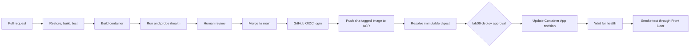

# 🚀 Lab 06: Deploy Code with GitHub Actions

Lab 04 examined the design of a secure Azure platform, and the instructor-preprovisioned environment supplies that platform for this lab. Lab 05 migrated the `eShop` database, and the Container App still runs a placeholder image. In this challenge, you will create a CI/CD workflow that validates the modernized retail application, builds a container, pushes an immutable image to the existing Azure Container Registry, and releases a new Azure Container Apps revision.

The WinForms admin application is not part of this deployment. You will modernize it in Lab 09.

This lab takes approximately **60-75 minutes**.

## 🎯 Objectives

By the end of this lab, you will be able to:

- separate pull-request validation from deployment
- create a repeatable multi-stage .NET container build
- test a container before publishing it
- authenticate GitHub Actions to Azure with OIDC
- push an immutable image to ACR without registry passwords
- deploy an image by digest rather than by a mutable tag
- update an existing Container App without recreating its infrastructure
- verify revision health and roll back safely

## ✅ Prerequisites

- completed the planning, Bicep generation, validation, and review walkthrough in [Lab 04](../04-deploy-to-azure/README.md)
- access to the instructor-preprovisioned Lab 04 platform
- completed [Lab 05](../05-modernize-data/README.md), including the managed-identity database user
- the repository-specific OIDC bootstrap described below
- required reviewers configured on `lab06-deploy`
- the modernized .NET 10 retail app
- GitHub Actions enabled for the repository

The known-good application is under:

```text
labs/04-deploy-to-azure/sample-app/
```

That is the Module 3 end state: the storefront on .NET 10, rendered with Blazor, and already Azure ready. If you modernized the root application in place, use its corresponding solution and project paths instead.

## 🔑 Bootstrap GitHub OIDC

The Azure platform is already provisioned, but its GitHub federation cannot be
copied generically between repositories. An OIDC federated credential includes
the repository and GitHub environment in its subject, so this setup must be
completed for the repository that will run the Lab 06 workflow.

Before continuing, an instructor or administrator with access to both the Azure
deployment identity and the GitHub repository must:

1. bind the existing Lab 06 code-deployment identity to the `lab06` and
   `lab06-deploy` GitHub environments with environment-scoped federated
   credentials
2. create both GitHub environments and add the required reviewer protection to
   `lab06-deploy`
3. publish the non-secret Azure and Lab 04 resource variables required by the
   workflow to both environments
4. confirm that the existing identity retains only `AcrPush` on the registry,
   `Container Apps Contributor` on the retail app, and Reader on the Front Door
   profile

> [!IMPORTANT]
> Do not run `assets/scripts/Initialize-Lab04Repository.ps1` for this step. That
> script is the full Lab 04 infrastructure bootstrap: it creates resource
> groups, identities, Key Vault content, and infrastructure deployment
> settings. Running it against the preprovisioned environment could create a
> second lab boundary or rotate generated credentials. Use the
> instructor-approved repository OIDC setup for the existing deployment.

Verify the GitHub side of the bootstrap from the repository root:

```powershell
gh auth status
$repository = gh repo view --json nameWithOwner --jq '.nameWithOwner'

gh api "repos/$repository/environments/lab06" --jq '.name'
gh api "repos/$repository/environments/lab06-deploy" --jq '.name'

gh variable list --env lab06
gh variable list --env lab06-deploy
```

Both environments must contain the variables listed in the
[Identity and RBAC](#-identity-and-rbac) section. If an environment or variable
is missing, stop and have the instructor or repository administrator complete
the OIDC bootstrap before you create or run the deployment workflow. Do not
replace OIDC with an Azure client secret.

## 🧭 Delivery Flow



## 🔐 Identity and RBAC

The preprovisioned Lab 04 environment includes a **separate code-deployment identity**. Do not reuse the infrastructure identity.

| Principal | Role | Scope | Purpose |
| --- | --- | --- | --- |
| Lab 06 GitHub identity | `AcrPush` | ACR | Push and inspect image manifests |
| Lab 06 GitHub identity | `Container Apps Contributor` | Retail Container App | Create a revision by updating the image and configuration |
| Lab 06 GitHub identity | `Reader` | Front Door profile | Resolve the existing endpoint for the post-deployment smoke test |
| Retail Container App identity | `AcrPull` | ACR | Pull the released image at runtime |
| Retail Container App identity | Contained database user | `eShop` database | Read and write application data without a password |

The workflow receives a short-lived Azure token only after GitHub presents an OIDC token whose repository and environment claims match the federated credential. No Azure client secret or ACR password is stored in GitHub.

The Lab 04 preprovisioning process creates the non-secret environment variables needed by both Lab 06 jobs:

| Variable | Purpose |
| --- | --- |
| `AZURE_CLIENT_ID`, `AZURE_TENANT_ID`, `AZURE_SUBSCRIPTION_ID` | OIDC sign-in context for the dedicated code-deployment identity |
| `LAB06_CONTAINER_REGISTRY_NAME` | Existing Lab 04 registry |
| `LAB06_CONTAINER_APP_NAME` | Existing retail Container App |
| `LAB04_PRIMARY_RESOURCE_GROUP`, `LAB04_SECONDARY_RESOURCE_GROUP` | Registry, SQL, and application lookup scopes |
| `LAB04_GLOBAL_RESOURCE_GROUP`, `LAB04_PREFIX`, `LAB04_SUFFIX` | Existing Front Door endpoint lookup |

These are GitHub variables, not secrets. The identity's federated credential and resource-scoped role assignments are the authorization boundary.

## Challenge 1: Create the Container Contract

The application has no Dockerfile. Generate one rather than copying a template, because the container has to satisfy two things at once: how the application starts, and what the preprovisioned Lab 04 platform expects to run.

Open GitHub Copilot in **Agent** mode:

```text
Scan this application and the infrastructure deployed in Lab 04, then create a Dockerfile
and a .dockerignore for the retail app.

Read the application first: target framework, project layout, entry point, the health
endpoints it exposes, and every setting it reads from configuration.

Then read infra/lab04/complete to see what the platform expects: the ingress port, the
container registry, and how the Container App authenticates to Azure.

Requirements:
- multi-stage build, using the SDK image only for restore and publish and the ASP.NET
  runtime image for the final stage
- run as a non-root user
- listen on the port the Container Apps ingress targets
- no secrets, connection strings, or credentials baked into the image; anything the app
  needs at runtime arrives as an environment variable or through managed identity
- a .dockerignore that excludes source-control metadata, build output, and local secret files

Tell me about any place where the application and the infrastructure disagree.
```

Check the result against the contract before you build it:

- `mcr.microsoft.com/dotnet/sdk:10.0` only for restore and publish
- `mcr.microsoft.com/dotnet/aspnet:10.0` for the smaller runtime image
- a non-root runtime user
- port `8080` for platform ingress, and `/health` for pipeline and release probes
- a build context that excludes source-control metadata, build output, and local secret files

> 💡 The credentials question is the interesting one. The app needs a database connection at runtime, but the image must not contain it. Lab 04 gave the Container App a managed identity and a contained database user, so the connection string arrives as an environment variable and the identity supplies the authentication. If Copilot bakes a connection string into the image, that is the failure to catch here.

Build the application before building its image:

```powershell
dotnet restore .\labs\04-deploy-to-azure\sample-app\eShopLiteFx.sln
dotnet build .\labs\04-deploy-to-azure\sample-app\eShopLiteFx.sln `
  --configuration Release `
  --no-restore
```

Then build and test the container locally:

```powershell
$context = '.\labs\04-deploy-to-azure\sample-app'
$dockerfile = Join-Path $context 'src\eShopLite.StoreFx\Dockerfile'
$image = 'caldova-retail:lab06-local'

docker build --file $dockerfile --tag $image $context
docker run --detach --rm `
  --name caldova-retail-lab06 `
  --publish 8080:8080 `
  --env 'ConnectionStrings__StoreDbContext=Server=localhost;Database=eShop;User ID=test;Password=NotUsed1!;Encrypt=True;TrustServerCertificate=True' `
  $image

Invoke-WebRequest http://localhost:8080/health
docker stop caldova-retail-lab06
```

The dummy connection string permits startup but is never used by the health endpoint. It is only for a local container smoke test.

## Challenge 2: Design the Workflow

Open GitHub Copilot in **Plan** mode:

```text
Plan a GitHub Actions workflow for the modernized retail app in this repository.

Requirements:
- On pull requests that change the retail app, Dockerfile, or workflow: restore, build,
  test, build the container, run it locally, and verify /health. Do not authenticate to
  Azure and do not push or deploy.
- On pushes to main: repeat validation, authenticate with Azure Login and OIDC, sign in
  to the existing Lab 04 ACR, push one image tagged sha-<full commit SHA>, resolve its
  manifest digest, and deploy registry/repository@digest.
- Use the dedicated Lab 06 identity and the protected lab06-deploy environment.
- Update only the existing retail Container App. Do not deploy or modify infrastructure.
- Configure ACR pull through the Container App system identity.
- Set ConnectionStrings__StoreDbContext to a passwordless Azure SQL connection string
  using Authentication=Active Directory Managed Identity.
- Preserve the existing replica and autoscale settings.
- Wait for the new revision to become healthy and smoke test through Front Door.
- Add concurrency so an older deployment cannot overtake a newer commit.
- Add an explicit rollback procedure.
- Pin supported major versions of third-party actions.
- Never use latest as an image tag and never print tokens or credentials.

List required GitHub variables, permissions, jobs, job dependencies, and failure
conditions. Stop after the plan.
```

Review the plan. Reject it if:

- a pull-request job receives `id-token: write`
- the workflow uses an Azure client secret or ACR admin credentials
- build and deployment happen in one unreviewed job
- the image uses `latest`
- the Container App receives a SQL password
- the workflow changes replica limits or infrastructure
- deployment happens before the image is tested

## Challenge 3: Create Pull-Request Validation

Create:

```text
.github/workflows/lab06-retail-cicd.yml
```

Start with minimal permissions:

```yaml
permissions:
  contents: read
```

Add `pull_request` and `push` path filters for the retail app and workflow. The validation job must:

1. check out the commit
2. set up .NET 10
3. restore, build, and run available tests
4. build the Docker image with a local tag
5. start the container with a nonproduction dummy connection string
6. poll `/health`
7. stop the container even when the probe fails

Do not add Azure login to this job. Forked pull requests must be able to validate without Azure access.

## Challenge 4: Add Build and Push

For pushes to `main`, add a job that uses the `lab06` GitHub environment and only these job permissions:

```yaml
permissions:
  contents: read
  id-token: write
```

Authenticate with `azure/login`, then use:

```bash
az acr login --name "$ACR_NAME"
docker push "$IMAGE_REFERENCE"
```

The tag must be:

```text
sha-${GITHUB_SHA}
```

Resolve the digest from ACR and pass the digest-qualified image reference to the deployment job. A digest makes the approved artifact immutable even if someone later creates another tag.

## Challenge 5: Deploy a New Revision

Use a separate job with the protected `lab06-deploy` environment. It must:

1. authenticate through the `lab06-deploy` federated credential
2. verify the target app and registry match Lab 04
3. configure the app's system identity for ACR pull
4. update the image by digest
5. set the passwordless Azure SQL connection string
6. wait for the new revision to report healthy
7. test the public Front Door endpoint

The passwordless connection string has this shape:

```text
Server=tcp:<server>.database.windows.net,1433;Initial Catalog=eShop;Authentication=Active Directory Managed Identity;Encrypt=True;TrustServerCertificate=False;Connection Timeout=30;
```

It identifies endpoints and authentication mode but contains no credential.

## Challenge 6: Review and Run

Before opening the pull request:

```powershell
git diff -- .\.github\workflows\lab06-retail-cicd.yml
git status --short
```

Verify:

- [ ] PR validation has no Azure permissions.
- [ ] Deployment is limited to `main`.
- [ ] `id-token: write` exists only on Azure jobs.
- [ ] the image tag contains the complete commit SHA.
- [ ] the deployed reference contains an ACR digest.
- [ ] no registry or SQL password is used.
- [ ] the deploy job uses `lab06-deploy`.
- [ ] concurrency prevents overlapping production deployments.
- [ ] the app is updated rather than recreated.

Push a branch and open a pull request. Confirm validation succeeds, review the changes, and merge. Approve `lab06-deploy` only after verifying that the image digest belongs to the merged commit.

## ✅ Verify the Release

In the workflow summary and Azure portal, verify:

- a new image manifest exists in ACR with the `sha-<commit>` tag
- the Container App revision references the same manifest digest
- the revision is healthy
- minimum replicas and autoscaling remain unchanged
- `/health` succeeds through Front Door
- catalog and sign-in paths can reach the migrated database
- the previous revision remains visible for rollback evidence

## ↩️ Rollback

Find the previous healthy revision and its image digest:

```powershell
az containerapp revision list `
  --name '<container-app-name>' `
  --resource-group '<application-resource-group>' `
  --output table
```

Re-run the workflow using a revert commit, or update the app to the previously approved digest. Do not “fix” a failed release by moving the old image to the `latest` tag.

Document:

- failed commit SHA
- failed digest
- previous healthy digest
- evidence that the rollback became healthy
- follow-up issue or corrective change

## 🛟 Known-Good Workflow

If your workflow does not validate and lab time is running short:

1. preserve your workflow and failure logs
2. compare it with [the completed workflow](../../assets/solutions/lab06/lab06-retail-cicd.yml)
3. copy the completed workflow into `.github/workflows/lab06-retail-cicd.yml`
4. review every permission, environment, variable, and Azure command before committing
5. explain the defect in your original workflow during the debrief

## 🧹 Cleanup

This lab adds images and revisions but no new Azure service.

To reduce registry storage, delete only known obsolete tags after confirming that no active or rollback revision references their digest. Do not delete the Lab 04 resource groups until all remaining labs are complete.

---

[← Previous: Modernize Data](../05-modernize-data/README.md)