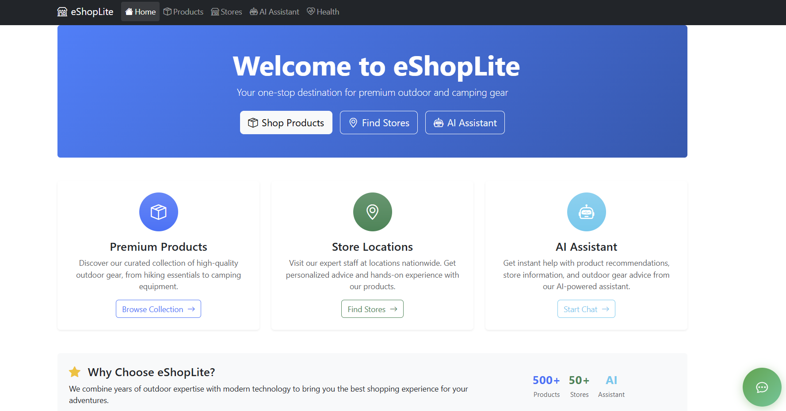
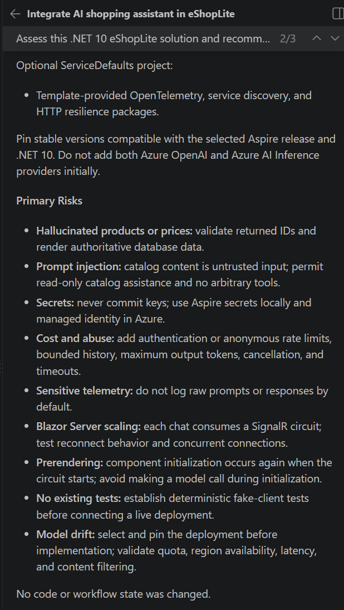
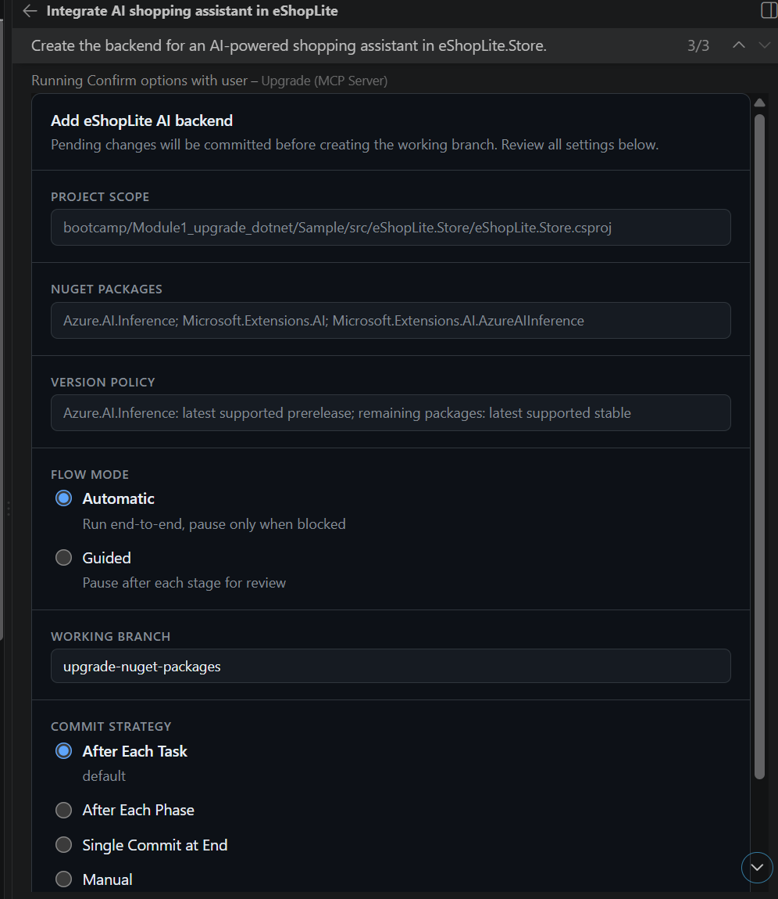
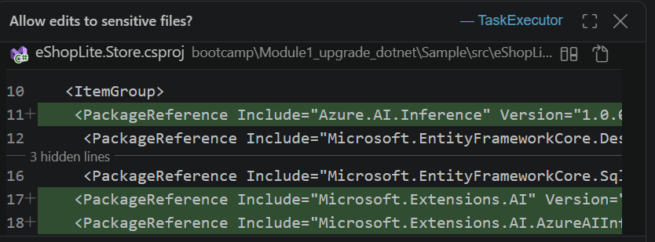

# 🧠 Lab 08: Add AI Capabilities

The storefront is on .NET 10, its data lives in a managed Azure database, it runs in Azure Container Apps, and you can see what it's doing in Application Insights. What it still does not do is anything a customer would notice — it is the same catalog, cart, and sign-in it had on .NET Framework 4.8. That was deliberate: behavior stayed fixed so the migration stayed verifiable.

This module is where the modernization starts paying for itself. You'll add a product-aware shopping assistant to the storefront — a Blazor chat widget backed by a model hosted in Azure, grounded in the same product catalog the store already reads from its database.



## 💼 Business case

Caldova Retail didn't fund the .NET 10 upgrade in order to be on .NET 10. They funded it to reach the things the old platform closed off — managed Azure hosting, Entra ID, Key Vault, and the current .NET AI libraries, none of which have a .NET Framework 4.8 story. A shopping assistant is the visible proof of that: an afternoon's work on the modernized app, and effectively unbuildable on the app you started with.

It lands here rather than in the middle of the migration for a practical reason. The plumbing this feature needs — managed identity, a secret store, and telemetry to prove it behaves — already exists by this point. Adding it earlier would have meant pasting an API key into a config file and hoping.

It is also where the customer conversation shifts from *what does the migration cost* to *what does the migration make possible*, which is usually the conversation that gets a modernization program funded.

## 📋 What you'll do

- 🤖 Wire an Azure-hosted chat model into the storefront through `Microsoft.Extensions.AI`
- 🛍️ Ground responses in the Caldova catalog using the app's existing store service
- 💬 Add a floating Blazor chat widget to the storefront layout
- 🔐 Keep the endpoint and credentials out of source control
- 🛡️ Fail gracefully when the model is unconfigured or unreachable
- 🔎 Recognize the same in-process state trap Module 3 warned about, in code you just wrote

## 🧱 What you're adding it to

Be clear about the shape of the app before you start: **this is a single web application, not a set of microservices.** There is no AppHost, no service discovery, no separate products API, and nothing to orchestrate. The storefront reads the catalog directly through its store service and Entity Framework, and that service is the seam the assistant will use.

```text
Caldova storefront (ASP.NET Core, .NET 10, Blazor Server)
├── Components/                Blazor pages and layout   ← chat widget goes here
├── Services/
│   ├── StoreService           catalog reads             ← grounding data
│   ├── CartService
│   ├── AuthService
│   └── ChatbotService         ← new
└── Data/StoreDbContext        EF Core → SQL Server
```

Project, folder, and file names come out of *your* Module 3 run, so adjust anything below to match what you actually have.

> ⚠️ **GitHub Models is retired**
>
> GitHub Models was retired on July 30, 2026 — the playground, model catalog, inference API, and BYOK features are all gone. Use **Azure OpenAI** or **Azure AI Foundry** for model access. GitHub Copilot in Visual Studio Code is still how you write the code.

## 🔍 Prerequisites

Before starting, ensure you have:

- Visual Studio Code with the GitHub Copilot extension installed and signed in
- A GitHub Copilot subscription, paid or free
- The modernized storefront from Modules 2–6, building and running locally — you develop the feature locally, then redeploy it
- An **Azure OpenAI** or **Azure AI Foundry** resource with a chat model deployed — a small model such as `gpt-4o-mini` is plenty
- The endpoint URL and deployment name for that model
- Azure CLI signed in with `az login`, if you use the keyless path below

> 💡 Ask your instructor whether there is a shared model deployment for the room. You do not need your own resource to complete this module.

> 💡 **Which agent?**
>
> The `@upgrade` agent you used in Modules 2 and 3 is built for framework and platform modernization. This module adds a *feature*, so use regular Copilot Chat agent mode. Keep `@upgrade` for asking whether what you added still fits the modernized architecture.

## 🔑 Decide how the app authenticates first

Module 3 ended with getting the app ready for Key Vault and managed identity. Don't undo that here by pasting an API key into `appsettings.json`. Two options:

| Approach | How it works | Choose when |
| --- | --- | --- |
| **Entra ID (recommended)** | `DefaultAzureCredential` uses your `az login` identity locally and the app's managed identity once deployed — the same identity Module 5 already gave it. No secret exists anywhere. | You have, or can be granted, the **Cognitive Services OpenAI User** role on the resource |
| **API key** | The key lives in .NET user secrets locally, and in the Key Vault you provisioned in Module 5 once deployed | Keyless access isn't available in your subscription |

Either way, nothing secret ends up in a file you commit. If you take the key path:

```powershell
dotnet user-secrets set "AI:Key" "<your-key>"
```

## 🛠️ Implementation

Work through the prompts below one at a time in Copilot Chat, and build after each one. Review what it proposes before you accept it — the point of the module is the review, not the typing.

### Step 1: Ask Copilot to plan against your actual code

Start with a planning prompt so Copilot reads the solution you produced in Module 3 rather than assuming a generic sample:

```plaintext
This is a single ASP.NET Core Blazor Server app on .NET 10 — the modernized Caldova Retail storefront. It has no AppHost, no microservices, and no separate API project.

Plan how to add a product-aware shopping assistant to it, using Microsoft.Extensions.AI for provider-neutral chat, an Azure OpenAI or Azure AI Foundry deployment for inference, and a Blazor chat widget in the existing layout.

Ground responses in the product catalog through the existing store service rather than querying the DbContext directly.

List the files you would add or change, the packages you would add, and the risks — before writing any code.
```

Read the plan and push back on anything that adds architecture this app doesn't need. If it proposes an AppHost, a separate AI microservice, or a new HTTP API in front of the chat service, say no and ask it to keep everything in the existing web project.



### Step 2: Create the chatbot service



```plaintext
Add a product-aware chatbot service to the Caldova storefront web project.

This is a single ASP.NET Core Blazor app. Do not add an AppHost, service discovery, a separate API project, or an HTTP controller in front of the service.

1. Add these NuGet packages to the web project, using current stable versions where one exists:
   - Azure.AI.OpenAI
   - Azure.Identity
   - Microsoft.Extensions.AI
   - Microsoft.Extensions.AI.OpenAI

2. Create Models/ChatModels.cs with:
   - ChatMessageDto (Id, Content, IsUser, Timestamp)
   - ChatRequest (Message, SessionId)
   - ChatResponse (Message, SessionId, IsSuccessful, ErrorMessage)
   - ChatSession (Id, Messages, CreatedAt, LastActivity)

3. Create Services/IChatbotService.cs and Services/ChatbotService.cs:
   - Depend on Microsoft.Extensions.AI.IChatClient, not on a provider-specific client type.
   - Inject the existing store service (IStoreService) and use its product methods to build catalog context. Do not query StoreDbContext directly and do not add new data access.
   - Send only the products relevant to the question, not the whole catalog, and never include user account details in the prompt.
   - Keep per-session history keyed by SessionId and include the last 10 messages as conversation context.
   - System prompt: a Caldova Retail shopping assistant that answers product questions only from the catalog context it is given, and says it doesn't know rather than inventing products, prices, or stock.
   - Methods: SendMessageAsync, GetChatHistoryAsync, ClearChatHistoryAsync.
   - If AI configuration is missing or the model call fails, log it and return a friendly fallback message. The storefront must keep working with the assistant switched off.

Build the project when you are done. Do not create UI components yet.
```



> 💡 **Note**
>
> Package versions move. Let Copilot pick the latest stable version of each package, and accept a prerelease only where the package has no stable release.

> 🔐 **Grounding is a security boundary, not just a quality feature**
>
> Everything the service puts into the prompt leaves your process. Catalog rows are fine. Order history, email addresses, and session identifiers are not. Check what Copilot actually assembled into the context string before you move on — this is the review an architect gets asked about later.

### Step 3: Create the Blazor chat widget


```plaintext
Add a chat UI to the Caldova storefront Blazor app.

1. Create a ChatWidget component under the existing shared components folder:
   - A floating button in the bottom-right corner, with an expandable chat window above it.
   - @inject IChatbotService directly. Do not call it over HTTP.
   - Use @rendermode InteractiveServer if this app uses per-component interactivity.
   - User messages aligned right, assistant messages aligned left.
   - A message input capped at 500 characters, a send button, a loading indicator while a
     response is pending, and a clear-chat button in the header.
   - Responsive on small screens, and styled to match the existing storefront design.

2. Add the widget near the end of MainLayout.razor so it appears on every page.

3. Update _Imports.razor with any namespaces required.

4. Build the project and fix any compile errors.
```

The widget talks to `IChatbotService` through dependency injection, the same way the rest of the Blazor app talks to `IStoreService` — no new API surface, no extra hop.

### Step 4: Register the AI client

There is no AppHost in this solution, so registration happens in the storefront's own `Program.cs` and configuration comes from `appsettings.json` plus user secrets.

```plaintext
Register the AI chat client in the storefront's Program.cs.

- Read AI:Endpoint and AI:Deployment from configuration, and AI:Key from user secrets if it is set.
- If AI:Key is present, authenticate with AzureKeyCredential. Otherwise use DefaultAzureCredential.
- Register the chat client only when Endpoint and Deployment are both configured.
- Register IChatbotService as scoped either way, so the app still starts when AI is not configured.
- Put only non-secret values in appsettings.Development.json. Never write a key into a committed file.
```

The registration should end up close to this:

```csharp
using Azure;
using Azure.AI.OpenAI;
using Azure.Identity;
using Microsoft.Extensions.AI;

var endpoint = builder.Configuration["AI:Endpoint"];
var deployment = builder.Configuration["AI:Deployment"];
var key = builder.Configuration["AI:Key"];

if (!string.IsNullOrWhiteSpace(endpoint) && !string.IsNullOrWhiteSpace(deployment))
{
    var azureOpenAI = string.IsNullOrWhiteSpace(key)
        ? new AzureOpenAIClient(new Uri(endpoint), new DefaultAzureCredential())
        : new AzureOpenAIClient(new Uri(endpoint), new AzureKeyCredential(key));

    builder.Services.AddChatClient(azureOpenAI.GetChatClient(deployment).AsIChatClient());
}

builder.Services.AddScoped<IChatbotService, ChatbotService>();
```

With the endpoint and deployment name in `appsettings.Development.json`:

```json
"AI": {
  "Endpoint": "https://<your-resource>.openai.azure.com/",
  "Deployment": "gpt-4o-mini"
}
```

> 💡 **Why the `if`**
>
> Anyone who clones this repo without an Azure OpenAI resource still gets a storefront that builds and runs. An AI feature that takes the whole app down when its dependency is missing is a worse app than the one you started with.

### Step 5: Run it

Run the storefront from the Visual Studio Code terminal — one project, no orchestrator:

```powershell
dotnet run --project <path-to-storefront-project>
```

If you took the keyless path, make sure `az login` is done first and that your account holds the **Cognitive Services OpenAI User** role on the model resource. A 401 from the first chat request almost always means the role assignment, not the code.

### Step 6: Redeploy and watch it

Once it works locally, put it back where the app actually lives. Two things to close out:

1. **Grant the app's identity access to the model.** Locally the client used *your* `az login` identity. In Azure it uses the app's managed identity, which needs the same **Cognitive Services OpenAI User** role on the Azure OpenAI resource. If you took the key path instead, add the key to Key Vault and reference it from the app's configuration — do not put it in an environment variable in plain text.

1. **Redeploy** using the same infrastructure workflow you built in Module 5, with `AI:Endpoint` and `AI:Deployment` added as non-secret configuration.

Then open Application Insights from Module 6 and send the assistant a few messages. The model call shows up as an outbound **dependency** on the request, which is the first time in this bootcamp that a feature's cost and latency are visible rather than assumed. Look at the dependency duration — a chat completion is an order of magnitude slower than the catalog query next to it, and that shapes every conversation about timeouts, retries, and where the feature belongs in a page load.

## 🔎 The state trap, again

Look at where `ChatbotService` keeps its conversation history. If Copilot followed the usual pattern, it's a `ConcurrentDictionary` in the service — in the memory of one process.

That is the same problem as `SessionStore.cs` in Module 3, in code that is minutes old. Locally it works perfectly, because locally there is one instance. But Module 5 deployed this app with a minimum of two replicas, so this is not hypothetical — a user whose next message lands on the other replica is talking to an assistant with no memory of the conversation.

You have two defensible answers, and picking one is the exercise:

- **Accept it.** Chat history is disposable, the widget is client-side within a Blazor circuit anyway, and losing it costs the user very little.
- **Externalize it.** Move history to `IDistributedCache` alongside whatever you chose for the cart, so both pieces of session state have one story instead of two.

What you should not do is leave it unexamined. New code inherits the old assumptions unless someone checks — which is exactly how the original `machineKey` and session problems got into the app in the first place.

## ✅ Verification

With the storefront running, open it in the browser and work through these:

1. **The widget appears on every page.** Click the button in the bottom-right corner from the home page, the catalog, and the cart.

1. **Grounded answers.** Ask questions the catalog can actually answer:

   - "What products do you have?"
   - "What can you tell me about the first product on the home page?"
   - "How much does it cost?" — a follow-up, to confirm conversation context is being sent

1. **Refused answers.** Ask about something that isn't in the Caldova catalog, such as "Do you sell laptops?" or "Is the blue one in stock in Seattle?". A grounded assistant says it doesn't know. If it invents a product, a price, or stock levels, the system prompt or the catalog context needs work — and that is the finding, not a failure.

1. **Fallback.** Remove the `AI:Endpoint` value and restart. The storefront should still build, start, and sell products, with the assistant reporting that it's unavailable.


By the end of this module you should have:

- 🔹 An AI shopping assistant in the storefront, backed by Azure OpenAI or Azure AI Foundry
- 🔹 Responses grounded in the Caldova catalog through the app's existing store service
- 🔹 A responsive floating Blazor chat widget on every page
- 🔹 Provider-neutral wiring through `Microsoft.Extensions.AI`, so the model host can change later
- 🔹 No endpoint, key, or deployment name committed to source control
- 🔹 A storefront that still works with the assistant turned off
- 🔹 A decision recorded about where chat history lives once the app scales out
- 🔹 The model call visible as a dependency in Application Insights

## 🎯 What you've accomplished

You added a genuinely new customer-facing capability to an application that, at the start of this bootcamp, could not have hosted it. Nothing here required a rewrite, a microservices split, or an orchestrator — it is the same single web app, with one more service and one more component, deployed through the same pipeline and observed through the same telemetry as everything else.

That is the argument worth carrying into a customer conversation. The migration was not the deliverable; it was the thing that made the deliverable possible.

---
[← Previous: Add Azure Application Insights](../07-add-application-insights/README.md)
