# 🖥️ Lab 09: Modernize a Desktop App with the Copilot CLI

> 🎓 **Bonus Capstone Module** — This module is a bonus chapter.

The storefront is modernized, deployed to Azure Container Apps, and instrumented. One thing in the eShopLite estate is still untouched: the **WinForms admin tool** the operations team uses every day. This module finishes the job.

You will use the **Copilot CLI** rather than an IDE, which is a another technique for app modernization — and the one that scales when the next customer hands you a list of applications rather than one.

Because you have already seen the full assess → plan → execute workflow in the earlier modules, and because this is a single small project, this module takes the **direct** route instead: one agent, one pass, and you review the diff at the end.

This module takes approximately **30-45 minutes**.

## 📋 What You'll Learn

This module changes two things at once: a new **tool** — GitHub Copilot CLI, driving the upgrade from a terminal instead of an IDE — and a new **kind of application** — a Windows desktop app rather than a website.

In this module, you will learn how to:

- run an agentic upgrade end to end from the **command line**
- upgrade a **desktop application** from .NET Framework 4.8 to .NET 10, and see where desktop differs from the web apps in earlier modules
- recognize the work the tooling **cannot** finish on its own, and what still needs a person
- keep the app's screens and workflows intact, so the staff who use it every day do not need retraining

## 🧭 Why This Module Matters

Real modernization work includes more than websites and APIs. Many teams still rely on internal back-office tools for catalog management, support, fulfillment, and operations — and those tools rarely show up on the first inventory a customer hands you.

This module closes that gap in two directions. The customer-facing storefront is already modernized and running in Azure, but the operations team is still on a legacy desktop app — so you see how a different application type behaves under the same modernization process. And because you drive it from the CLI, you see the approach that scales: an architect looking at 200 applications needs something scriptable, not 200 sessions in an IDE.

## ✅ Prerequisites

Before you begin, make sure you have:

- **PowerShell** — you will drive this module from the command line
- **MSBuild**, from either **Build Tools for Visual Studio 2022 or later** or the full **Visual Studio** IDE, with the **.NET desktop development** workload
- the **.NET 10 SDK** installed
- **Git**, so you can commit a baseline and diff what the agent changes
- a **GitHub Copilot** subscription
- **GitHub Copilot CLI** installed and signed in — see [github/copilot-cli](https://github.com/github/copilot-cli)

> 💡 The **GitHub Copilot upgrade** agent runs on several surfaces, including GitHub Copilot CLI, Visual Studio, and Visual Studio Code. This module uses the **CLI** as its path. On the CLI the agent is a plugin you install once — Step 2 covers it.

## 🧪 Application Overview

The **Caldova Retail admin tool** is a .NET Framework 4.8 WinForms application used by eShopLite staff.

- **Solution:** [src/app-modernization/caldova-retail-admin-app/eShopLiteAdminFx.sln](../../src/app-modernization/caldova-retail-admin-app/eShopLiteAdminFx.sln)
- **Project:** `eShopLite.AdminFx`
- **UI:** `MenuStrip`, `StatusStrip`, `TabControl`, `DataGridView`, and modal dialogs (`LoginForm`, `ProductEditForm`, `AboutDialog`)
- **Features:** sign-in, product list, add/edit/delete workflow, and a read-only orders view
- **Legacy patterns:** old-style `.csproj`, `packages.config`, `App.config`, direct `HttpClient`, `Newtonsoft.Json`, and manual dependency wiring in `Program.cs`

Your target end state for this module:

- **Target:** `net10.0-windows`
- **Patterns:** SDK-style project, `appsettings.json`, Generic Host, DI, `IHttpClientFactory`, and `System.Text.Json`

## 📚 Instructions

### Step 1: Run the legacy app and establish a baseline

1. Open **PowerShell** in `src/app-modernization/caldova-retail-admin-app`.
1. Start GitHub Copilot CLI by typing `copilot` and pressing **Enter**.

    ```powershell
    copilot
    ```

1. Get the session set up before you ask for anything:
   - If Copilot asks whether you **trust the files in this folder**, approve it. Choosing *"remember this folder"* saves you the prompt next time.
   - If you are not signed in, Copilot prompts you to run `/login`. Type it and follow the on-screen instructions.

    ```text
    /login
    ```

1. Ask it to build and run the app. Example prompt:

    ```text
    Build this app using MSBuild and then run it.
    ```

1. Copilot proposes commands one at a time and waits for your approval. **Keep approving until the app's login window appears on screen.** If a command fails, tell it what you saw and let it try again — recovering from a failed build is exactly what you want to watch it do.

    Notice what it works out on its own: this project cannot be built with `dotnet build`. The old-style `.csproj` and `packages.config` need `nuget.exe` to restore and the full MSBuild toolchain to compile. You did not have to know that going in, and you did not have to look up where MSBuild is installed.

    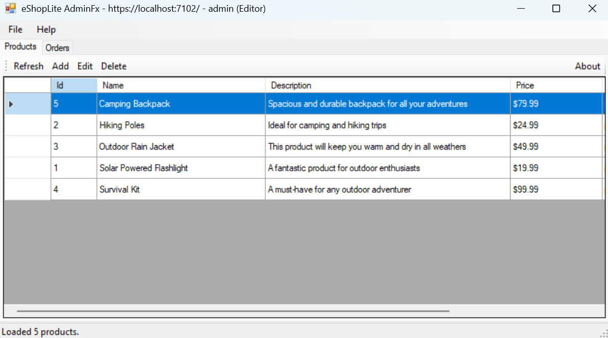

1. Sign in with the seed account `admin` / `admin123` — the full list is in the [admin tool README](../../src/app-modernization/caldova-retail-admin-app/README.md#sign-in).
1. Explore both tabs:
   - **Products**: refresh the grid, add a product, edit a product, and delete a product
   - **Orders**: confirm the read-only order list loads from `Data\orders.json`
1. Note the legacy implementation details before you change anything:
   - settings come from `App.config`
   - services are created manually in `Program.cs`
   - HTTP calls use `new HttpClient()` directly
   - JSON uses `Newtonsoft.Json`
1. **Close the app before you continue.** A running app holds its own executable open and will block the next build.

> 💡 Getting to a single `dotnet run` is part of what this migration buys you. Compare the effort here with what it takes to run the app once the upgrade is done.

<details>
<summary>If Copilot struggles, or you would rather run the commands yourself</summary>

Find MSBuild, then use that same one for both restore and build — mixing versions causes confusing errors.

```powershell
$vswhere = "${env:ProgramFiles(x86)}\Microsoft Visual Studio\Installer\vswhere.exe"
$msbuild = & $vswhere -latest -products * -requires Microsoft.Component.MSBuild -find "MSBuild\**\Bin\MSBuild.exe" | Select-Object -First 1
$msbuild
```

Restore the `packages.config` dependencies with `nuget.exe`:

```powershell
Invoke-WebRequest -Uri "https://dist.nuget.org/win-x86-commandline/latest/nuget.exe" -OutFile "$env:TEMP\nuget.exe" -UseBasicParsing
& "$env:TEMP\nuget.exe" restore ".\eShopLiteAdminFx.sln" -MSBuildPath (Split-Path $msbuild)
```

Build and run:

```powershell
& $msbuild ".\eShopLiteAdminFx.sln" /t:Build /p:Configuration=Debug /v:minimal
.\eShopLite.AdminFx\bin\Debug\eShopLite.AdminFx.exe
```

Or open `eShopLiteAdminFx.sln` in Visual Studio and press **F5**.

</details>

> **Note**
>
> In the current workshop modules, the Products API is read-only. Product create/update/delete operations still update the app's **local working copy**, so you can validate the desktop workflow even when the backend does not expose write endpoints yet.

### Step 2: Let tooling handle the mechanical migration

Your goal in this step is to get from an old-style WinForms project to a **.NET 10 WinForms project**.

Use the **GitHub Copilot upgrade** agent, invoked as `@upgrade`. Unlike the staged workflow you already worked through in the earlier modules, this one does a **direct conversion** — it rewrites the project and validates it with a build, without a separate assess and plan stage. That suits this module: one small project, and a change small enough to read in a single diff.

#### Which agent should you use?

You may see Copilot suggest `@modernize` instead. Both handle .NET, and neither is better than the other — they are shaped for different jobs.

**`@upgrade`** (the `upgrade-agent` plugin) does a direct, single-project conversion. It rewrites the project and then proves its own work with a build. It should generate assessments and plans but should not go through the same approval gate.

**`@modernize`** (the `github-copilot-modernization` plugin) is an orchestrator. It runs the same **assess → plan → execute** workflow you used in the earlier modules, producing a report and a `plan.md` you approve *before* it touches any code. It can also route to specialist sub-agents, such as `modernize-azure-dotnet` for Azure migration work.

**This is a small app — one project, one framework retarget — so this module uses `@upgrade`.** The change is small enough to read in a single sitting, and an approval gate would cost more than it saves.

Reach for `@modernize` when the scope is larger, or when a customer wants a reviewable plan before anything changes. It installs separately:

```text
/plugin marketplace add microsoft/github-copilot-modernization
/plugin install github-copilot-modernization@github-copilot-modernization
```

#### Install the upgrade agent

The upgrade agent does not ship with GitHub Copilot CLI. Install it as a plugin before you go any further.

1. You should still be at the `copilot >` prompt from Step 1. If you closed it, start it again with `copilot`.
1. Add the marketplace.

    ```text
    /plugin marketplace add microsoft/upgrade-agent-plugins
    ```

1. Install the plugin.

    ```text
    /plugin install upgrade-agent@upgrade-agent-plugins
    ```

1. Confirm `upgrade-agent` appears in the list.

    ```text
    /agent
    ```

> 💡 If the plugin fails to install, close every instance of Visual Studio, VS Code, and Copilot CLI, then try again.

#### Start the agent

> 📖 Source: [GitHub Copilot upgrade overview](https://learn.microsoft.com/en-us/dotnet/core/porting/github-copilot-upgrade/overview) and [Install GitHub Copilot upgrade](https://learn.microsoft.com/en-us/dotnet/core/porting/github-copilot-upgrade/install) on Microsoft Learn, which also document the Visual Studio, VS Code, and GitHub Copilot app entry points. This module uses the CLI throughout.

1. Type your request, starting with `@upgrade`, and press **Enter**. Example prompt:

    ```text
    @upgrade Upgrade this project to .NET 10 and modernize how it handles configuration and dependencies. Create a new branch for the changes.
    ```

    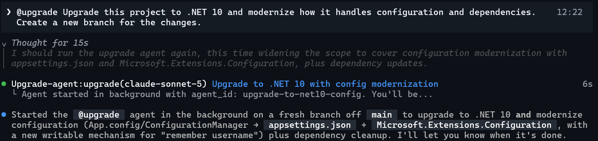

    Copilot recognizes the request and hands it to `upgrade-agent:upgrade`, which runs as a **background agent** — you will see it report tool calls as it works.

    ‼️ It is important to be explicit in your request. A prompt like "convert this app to .NET 10" could result in a framework-only upgrade, so it works on .NET 10 but is not modernized. It helps to spell out that you want the app modernized. Of course, you can always ask it to update some other part of the code if it finishes the upgrade and you are still not satisfied.

1. Copilot pauses for permission whenever an action reaches outside what it has already been allowed, for example **Allow directory access** or allow using a certain tool when it reads a path outside the current folder. Use **↑ / ↓** to choose an option and press **Enter**.

    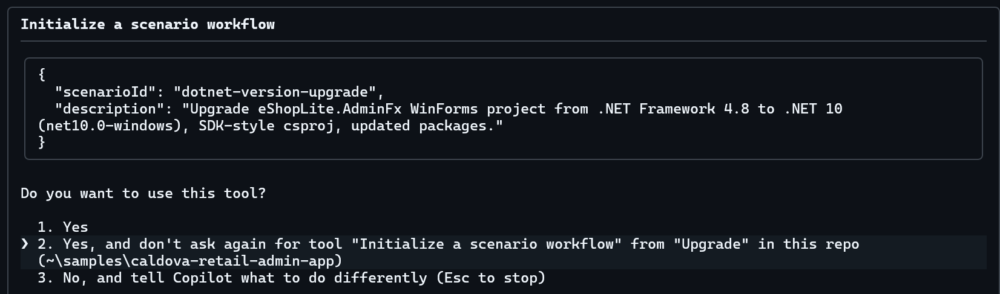

    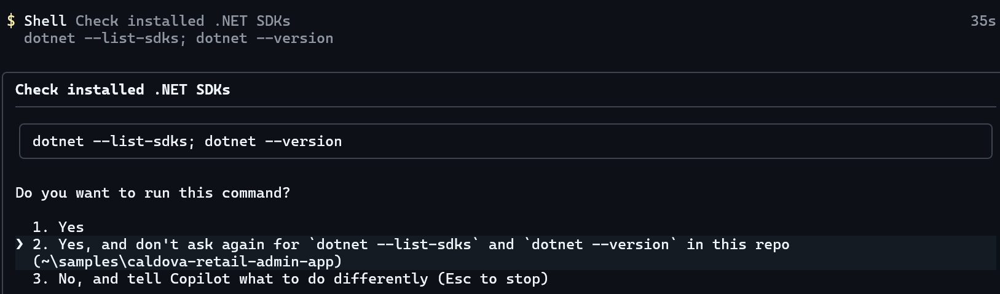

1. A framework conversion triggers a lot of these prompts. If the interruptions get tedious, you can enable all permissions.

    ```text
    /allow-all
    ```

    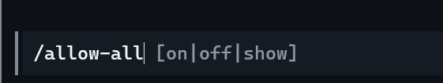

    > ‼️ `/allow-all` enables every permission — tools, paths, and URLs — until you close the session. It is fine for this lab sample. Think carefully before using it on a repository you care about, because you stop seeing each action before it happens. `/permissions` offers a middle ground, and `/reset-allowed-tools` starts over.

    > 💡 **To stop the agent at any time, press Esc.** The status bar shows `esc interrupt` while it is working. Esc also backs out of any permission prompt.

1. Once the scenario kicks off, a dashboard should open. This will track the progress throughout the upgrade, just like it does in the IDE extension.

    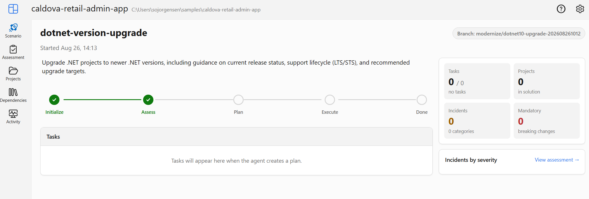

1. As it goes thorugh the scenario, it should generate artifacts too. To inspect the files, navigate to the .github folder of the repository root.

    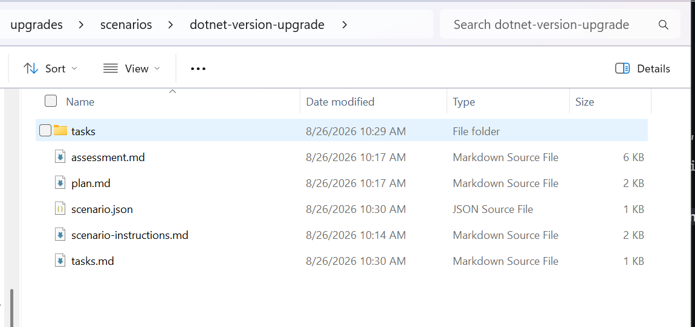

    The plan details what the upgrade journey looks like.

    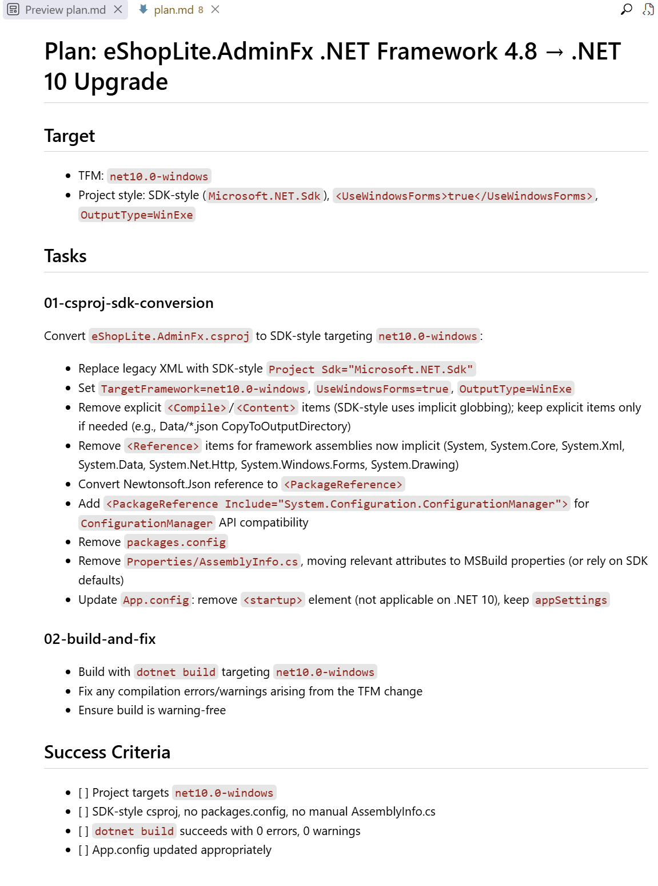

1. Wait for the agent to finish. It should take 5-15 minutes. It converts the project, then validates its own work with a `dotnet restore` and `dotnet build`, and prints a small summary of what it changed.

    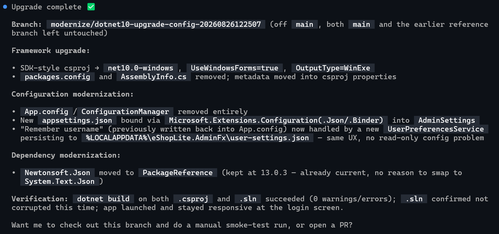

1. The agent may come back with follow-up questions. Answer them however you like — and treat it as a chance to think like the customer would. A smoke test to prove the behavior still holds is usually worth asking for. You can also put your own questions to the agent, such as asking it to summarize what changed in more detail.

1. You can also refer back the dashboard to verify the update is done and confirm the tasks are complete, for a UI visual. Keep in mind, this is an agentic approach, so the task breakdown make look different for each individual's run.

    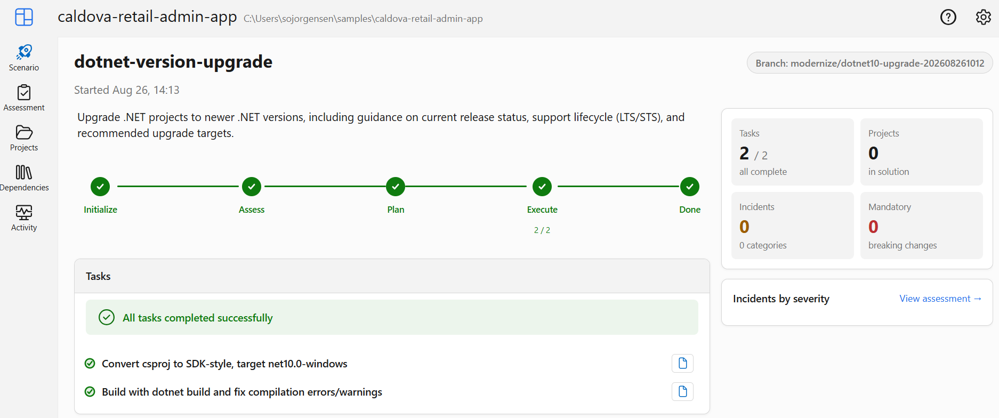

1. The new app shoud open automatically. If it does not, ask copilot to run the app. Check out the new app. Notice how it looks the same as the previous one, just the underlying code is different.

    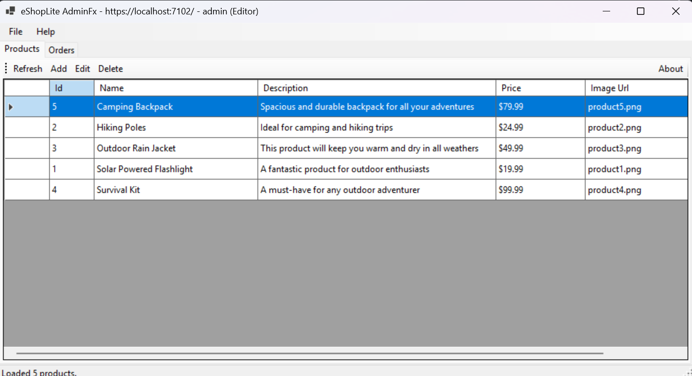

**Useful keys while the agent runs:**

| Input | What it does |
| --- | --- |
| **Esc** | Stop the current operation while it is still thinking |
| **↑ / ↓** then **Enter** | Choose an option at a permission prompt |
| `/allow-all` | Allow every tool, path, and URL for the rest of the session |
| `/permissions` | Switch to a less restrictive mode without going full `allow-all` |
| `/reset-allowed-tools` | Start over on what is auto-allowed |
| **Shift+Tab** | Toggle plan mode, to agree a plan before any code is written |
| **Ctrl+T** | Show or hide the model's reasoning |
| `/usage` | Session stats — credits used, duration, lines edited |
| `?` | List every available command |

### Step 3: Review the changes and verify functional parity

The agent summarized its own work and reported a passing build. That is its account of what happened — useful, but it is not an independent check. This is where you form your own view.

The most valuable thing you can do is ask about anything you did not follow. The agent still has the full context of what it just did, so use it:

```text
Explain what changed in this project and why, and flag anything that could alter runtime behavior.
```

```text
Which of my original files were deleted, and what replaced them?
```

```text
Is there anything you changed that you are not fully confident about?
```

That last one is worth asking every time. An agent will usually tell you where it guessed, if you ask.

Then confirm the app itself, against the baseline you captured in Step 1:

1. Sign in and work through both tabs again.
1. Check the product list, the add/edit/delete workflow, and the orders view all behave as they did before.
1. Look for anything visually off — fonts, spacing, tab layout, toolbar rendering.

> 💡 This is the habit worth taking back to a customer. An agent that converts in one pass is fast, but the review is not optional — it just moves from *before* the change to *after* it. On a portfolio of applications, that review is the whole job.

## 🩹 Troubleshooting

### Build fails after you re-run the module

Both of these hit people on a second attempt, not a first clean run.

**`error : Your project does not reference ".NETFramework,Version=v4.8" framework`**

You have a stale `obj` folder from a previous migrated build. Its `project.assets.json` still targets `net10.0-windows`, so the restore of the legacy project fails. Delete the build output and restore again:

```powershell
Remove-Item .\eShopLite.AdminFx\bin, .\eShopLite.AdminFx\obj -Recurse -Force
```

**`error MSB3027: Could not copy ... The file is locked by: "eShopLite.AdminFx"`**

The app is still running and holding its own executable open. Close the window, or:

```powershell
Get-Process eShopLite.AdminFx -ErrorAction SilentlyContinue | Stop-Process
```

> 💡 `bin` and `obj` are build output. They are never needed in source control and are always regenerated — deleting them is always safe.

### Designer drift or broken forms

- Rebuild the solution first.
- Compare the designer file with its pre-migration version using `git diff` if event wiring or resource references are missing.
- If you have the Visual Studio IDE, open the form in the designer and look for control-name mismatches.

### Missing packages after migration

- Make sure all `packages.config` dependencies were converted or replaced.
- Prefer supported modern packages over carrying forward old compatibility packages unchanged.

### The app does not run on macOS or Linux

- That is expected. WinForms on modern .NET is still **Windows-only**.

### Products do not save back to the API

- That is expected in the current workshop flow.
- The desktop app keeps a **local working copy** so you can still validate CRUD behavior while the API remains read-only.

## 🎯 What You Accomplished

By finishing this module, you practiced the real-world work of desktop modernization:

- moving a WinForms app from **.NET Framework 4.8** to **.NET 10**
- converting a legacy project system to modern SDK-style conventions
- using the **GitHub Copilot upgrade** agent from the command line to do the migration in one pass, then building an understanding of the upgrade yourself

You now have a repeatable pattern for modernizing applications.

---
[← Previous: Add AI Capabilities](../08-add-ai-capabilities/README.md) | [🎉 Bootcamp Complete! Back to Main →](../../README.md)
