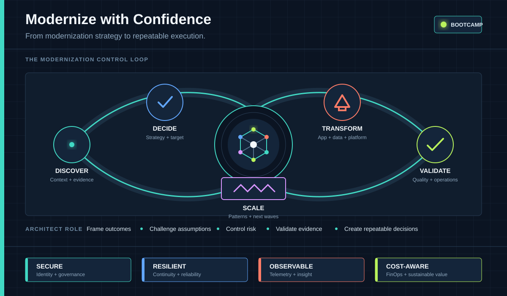

#  Modernize with Confidence Bootcamp

This lab is the hands-on learning environment for **Modernize with Confidence**, a bootcamp for CSAs who want to understand agentic modernization and guide customers through early modernization conversations.

The bootcamp goes beyond moving existing servers to the cloud. Attendees learn how AI-assisted tools, architectural judgment, and Azure services can work together to assess an application estate, identify practical modernization opportunities, and shape a phased path from legacy infrastructure toward secure, resilient, and manageable cloud platforms.

The repository contains deliberately legacy .NET Framework applications and a SQL Server data tier that represent a realistic modernization starting point.

##  The Application

The app we will be working with is **Caldova Retail**, an ASP.NET MVC 5 storefront on .NET Framework 4.8, backed by Entity Framework 6 and a SQL Server database. Its dated project structure, dependencies, authentication, and hosting assumptions are what the labs assess and modernize.

The source code is in [`src/app-modernization/caldova-retail-web-app/`](../src/app-modernization/caldova-retail-web-app/), and its [README](../src/app-modernization/caldova-retail-web-app/README.md) covers what the app does and how to point it at the database.

##  Who This Is For

The bootcamp is designed primarily for infrastructure and cloud architects who participate in application and data modernization discussions. It is especially relevant to architects who need to connect infrastructure concerns with application architecture, security, operations, data platforms, and software delivery practices.

Deep application development experience is not the goal. Attendees will instead build enough understanding of the complete modernization lifecycle to ask better discovery questions, recognize constraints and opportunities, involve the right specialists, and help customers move from an initial conversation to an actionable modernization direction.

##  What Attendees Will Learn

By working through the bootcamp, attendees will learn how to:

- Use an agentic modernization approach to accelerate discovery, assessment, planning, and implementation while keeping architectural decisions and validation under human control.
- Assess legacy applications, virtual machines, databases, dependencies, and operational constraints before recommending a migration strategy.
- Frame customer conversations around business outcomes, technical risk, readiness, and the tradeoffs between rehost, replatform, refactor, rearchitect, rebuild, and retire.
- Use GitHub Copilot and modernization tooling to examine existing code, surface technical debt, identify upgrade paths, and assist with targeted changes.
- Evaluate Azure compute and application hosting options, including Azure Virtual Machines, Azure App Service, Azure Container Apps, and Azure Kubernetes Service.
- Plan the evolution of SQL Server workloads toward managed Azure data services such as Azure SQL Managed Instance and Azure SQL Database.
- Apply identity, secrets management, governance, and security capabilities using Microsoft Entra ID, Azure Key Vault, Azure Policy, and Microsoft Defender for Cloud.
- Introduce DevSecOps practices with GitHub, GitHub Actions, GitHub Copilot, and Azure DevOps.
- Include resiliency, business continuity, cost management, and FinOps considerations in a modernization roadmap.
- Turn lessons from a pilot workload into repeatable patterns that can be applied across a larger application portfolio.

##  Learning Approach

The labs follow the progression of a real modernization engagement:

1. Understand the current environment and establish a reliable baseline.
2. Assess application, data, infrastructure, security, and operational readiness.
3. Select an appropriate modernization strategy for each workload component.
4. Use agentic tools to support analysis and implementation without replacing engineering review.
5. Validate functionality, security, observability, resiliency, and operational readiness.
6. Capture decisions and reusable patterns for the next modernization wave.

The emphasis is not on finding a single "correct" Azure service. It is on developing a defensible decision process that balances business continuity, modernization value, delivery risk, and the customer's capacity for change.
