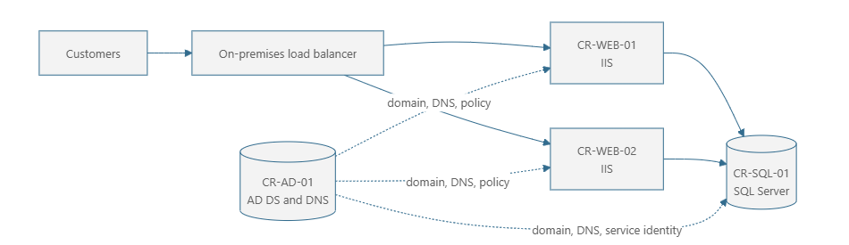

# 🔎 Lab 01: Assess Caldova Retail with Azure Migrate

Caldova Retail wants to move its online store out of an aging datacenter, but "move it to Azure" is not a plan yet. First, the team needs to know what it has, how the pieces depend on each other, where each piece could run in Azure, what has to be fixed before it moves, and whether the move makes business sense.

This is a reading module. It shows how **Azure Migrate**, Microsoft's tool for planning a move to Azure, helps answer those questions. You will walk through a sample assessment of Caldova's servers and learn how to turn what it finds into migration decisions.

> [!NOTE]
> This is a discussion and interpretation lab. You will not deploy an Azure Migrate appliance or migrate a server. The sample report is a teaching aid modeled on Azure Migrate concepts; it is not an export from a live environment.

## 🎯 Learning objectives

By the end of this module, you will be able to:

- explain the role of Azure Migrate in a migration and modernization initiative
- distinguish discovery, assessment, business-case, and migration-planning outputs
- interpret readiness, right-sizing, performance coverage, dependencies, and cost estimates
- identify where server, web application, SQL, and identity assessments need different expertise
- turn assessment findings into customer decisions, remediation work, and migration waves
- explain why an Azure Migrate recommendation is evidence for a decision, not the decision itself

## 💼 Business case: Caldova Retail

Caldova Retail operates a customer-facing ASP.NET MVC storefront in its primary datacenter. The application runs on two Windows Server virtual machines behind a load balancer, with a dedicated SQL Server and an Active Directory Domain Services (AD DS) domain controller that also provides DNS to the server network.

The platform is stable, but it creates growing business risk:

- datacenter hardware reaches the end of its support contract within 12 months
- holiday traffic requires capacity planning and manual scaling months in advance
- recovery depends on datacenter procedures that have not recently been tested end to end
- the application is tied to Windows and .NET Framework 4.8, limiting its hosting and scaling options
- SQL Server licensing, backup, patching, and high availability remain operational responsibilities
- the environment has no reliable workload inventory or documented dependency map
- leadership wants a cost range before approving migration funding

### Desired outcomes

Caldova's leaders agree on five outcomes:

1. Reduce the risk created by the datacenter exit deadline.
2. Improve storefront resilience before the next peak retail season.
3. Establish a measurable cloud cost baseline and avoid reproducing overprovisioning.
4. Modernize the application and data platform where the benefit justifies the change.
5. Build a repeatable approach for the next group of retail workloads.

These outcomes matter more than picking an Azure service. The assessment has to help Caldova decide what to move and in what order, without disrupting the business or taking on more change than the team can handle.

### 📖 Key terms

| Term | What it means |
| --- | --- |
| **Estate** | Everything the customer runs today: servers, apps, databases, and the connections between them |
| **Workload** | A set of servers and apps that together deliver one business service, such as the online store |
| **Assessment** | Azure Migrate's report on whether, where, and at what cost a workload could run in Azure |
| **Rehost** ("lift and shift") | Move servers to Azure VMs with as little change as possible |
| **Replatform / refactor** | Change the app so it can use managed Azure services instead of servers you run yourself |
| **IaaS vs. PaaS** | *Infrastructure as a service*: you rent VMs and still manage them. *Platform as a service*: Azure runs the platform and you just run your app or database on it |
| **Right-sizing** | Choosing an Azure size based on what the server actually uses, not what it was originally given |
| **TCO** | *Total cost of ownership*: the full cost of running something, including hardware, licenses, and staff time |
| **Migration wave** | A group of workloads moved together, with its own plan, tests, and rollback plan |
| **Domain controller (AD DS)** | The server that handles sign-in and network names (DNS) for the other servers |

## 🏢 Current estate

| Asset | Role | Illustrative source configuration | Key operational dependency |
| --- | --- | --- | --- |
| `CR-WEB-01` | IIS storefront node 1 | Windows Server 2019, 4 vCPU, 16 GB RAM, 150 GB disk | SQL, AD DS/DNS, load balancer |
| `CR-WEB-02` | IIS storefront node 2 | Windows Server 2019, 4 vCPU, 16 GB RAM, 150 GB disk | SQL, AD DS/DNS, load balancer |
| `CR-SQL-01` | Storefront database | Windows Server 2019, SQL Server 2016 Standard, 8 vCPU, 32 GB RAM, 1 TB disk | AD DS/DNS, backup target |
| `CR-AD-01` | AD DS domain controller and DNS | Windows Server 2019, 2 vCPU, 8 GB RAM, 128 GB disk | Network connectivity, time source, directory replication |

The diagram shows an immediate concern: `CR-AD-01` is Caldova's only domain controller, the server every other server depends on for sign-in and network names. An assessment might say it would run fine on an Azure VM, but that does **not** mean it's safe to move Caldova's only domain controller like any other server.

## 🧭 Where Azure Migrate fits

Azure Migrate is a central hub for discovering, assessing, and tracking the migration of on-premises infrastructure, applications, and data. In a customer project, it is used across several stages, not as a one-time scan.

### 1. Establish scope

Start with the business outcomes, deadlines, constraints, and decision owners. Create an Azure Migrate project in the appropriate geography, identify the first workload boundary, and agree on how discovered data may be collected and retained.

Azure Migrate does not replace customer interviews. It cannot infer an application owner, revenue impact, recovery objective, compliance obligation, or acceptable outage from CPU counters.

### 2. Discover the estate

Azure Migrate can discover servers from VMware, Hyper-V, physical environments, other clouds, or an imported inventory. Appliance-based discovery provides the richest inventory and performance data. A CSV import is useful for an early estimate, but it cannot provide the same observation quality.

Discovery can identify:

- server configuration, operating system, disks, and network adapters
- installed applications, IIS web applications, and SQL Server instances and databases
- resource utilization over time
- network connections used for dependency analysis
- support status and potential migration blockers

Always double-check what Azure Migrate finds against the customer's own records, monitoring tools, and the people who run each app. Azure Migrate can miss things, and not everything it finds needs to move.

### 3. Group workloads and dependencies

Server lists are not migration plans. Group assets by the business application they support, then use dependency information to validate:

- inbound users, APIs, batch jobs, and file transfers
- database and identity dependencies
- DNS, certificates, secrets, service accounts, and scheduled tasks
- monitoring, backup, security, and management agents
- latency-sensitive or hard-coded connections
- upstream and downstream systems owned by other teams

For Caldova, the two IIS nodes and database form one production workload. Moving a web server without its reachable data and identity dependencies could create an outage even if every individual server is marked ready.

### 4. Create workload-specific assessments

Azure Migrate combines several assessment views:

| Assessment | Question it helps answer | Example Caldova use |
| --- | --- | --- |
| Azure VM assessment | Can this server run in Azure, at what size, and at what estimated infrastructure cost? | Establish a rehost baseline for all four servers |
| Web app assessment | Can discovered ASP.NET applications be containerized for Azure Container Apps or use another supported application target, and what requires remediation? | Test whether the IIS-hosted storefront can move to managed container hosting |
| Azure SQL assessment | Which Azure SQL target is compatible, appropriately sized, and cost effective? | Compare Azure SQL Managed Instance, Azure SQL Database, and SQL Server on Azure VM |
| Business case | How do current costs compare with modeled Azure costs and migration strategies? | Present a directional TCO, cash-flow, savings, and modernization view to sponsors |

The business case combines the results of these assessments. If you tell it to prefer managed services (PaaS), it recommends them where they fit and falls back to Azure VMs for everything else.

### 5. Compare migration strategies

Assessment findings help the team evaluate the common migration motions:

| Motion | Meaning for Caldova |
| --- | --- |
| Rehost | Move the Windows, IIS, SQL, and supporting servers to Azure VMs with minimal application change |
| Replatform | Containerize the web application for Azure Container Apps and move SQL to a managed Azure SQL target |
| Refactor or rearchitect | Upgrade the application, remove server-local assumptions, and adopt cloud-native hosting and operations |
| Repurchase | Replace a capability with a software as a service product where it provides better business value |
| Retire | Remove unused servers, applications, databases, or interfaces confirmed by owners |
| Retain | Keep a workload on-premises temporarily because of dependencies, risk, economics, or timing |

Moving servers as-is is the smallest change, but not always the safest choice in the long run. And just because a managed service is recommended doesn't mean Caldova's team can take on every change it requires in the first wave.

#### Choose a modernization direction

The assessment supports a focused comparison rather than an automatic service
selection:

| Option | Benefit | Tradeoff for Caldova |
| --- | --- | --- |
| Rehost both servers to Azure VMs | Lowest immediate application change | Retains Windows and SQL Server administration, patching, fixed server capacity, and most current operational work |
| Containerize the web app for Azure Container Apps and move data to Azure SQL Managed Instance | Managed container revisions and scaling with broad SQL Server compatibility | Requires application containerization, cloud-readiness changes, database assessment, and a new operating model |
| Run the web container on AKS | Full Kubernetes control and extensibility | Adds control-plane and operational complexity that this small workload has not justified |

For this illustrative assessment, Caldova selects **Azure Container Apps** for
the containerized web workload and **Azure SQL Managed Instance** for the SQL
Server 2016 database. This is a direction to validate, not proof that either
tier is ready to migrate.

### 6. Build the business case and roadmap

Azure Migrate can model:

- on-premises and Azure total cost of ownership
- right-sized Azure compute, storage, and database costs
- Azure Hybrid Benefit and applicable savings options
- migration strategies and potential savings
- support-status and modernization opportunities
- sustainability insights

Use these results to create a decision record and phased roadmap. Validate important estimates in the Azure pricing calculator and with the customer's licensing, procurement, finance, and architecture teams.

### 7. Migrate, validate, and optimize

After target architectures and waves are approved, Azure Migrate and integrated tools can help track and execute migrations. Each wave still needs rehearsals, rollback criteria, functional and performance testing, security validation, operational acceptance, and post-migration cost review.

Migration is not complete when replication finishes. It is complete when the workload meets its agreed business and technical success measures and the old environment can be safely retired.

## 📊 How to read an assessment

### Readiness

Azure Migrate uses four broad readiness categories:

- **Ready for Azure**: the assessed workload can use the target without identified blocking changes
- **Conditionally ready for Azure**: the target may work, but one or more findings require review or remediation
- **Not ready for Azure**: a blocking condition prevents use of the assessed target
- **Readiness unknown**: the available metadata is insufficient to make a determination

Readiness is target-specific. A server might be ready for an Azure VM while its web application is conditionally ready for containerization on Azure Container Apps and its database is conditionally ready for Azure SQL Managed Instance.

### Right-sizing

An **as-is** assessment recommends a target from allocated source capacity. A **performance-based** assessment uses observed CPU, memory, disk IOPS, disk throughput, and network activity. Performance-based sizing can reduce overprovisioning, but only when the collection period represents normal and peak business cycles.

Two settings shape the result. The **percentile** decides which usage to size for: the 95th percentile ignores the busiest 5% of the time. The **comfort factor** adds a safety margin; 1.3 means 30% extra. Ignoring short spikes is usually fine for web servers that can add more copies, but risky for a database whose busiest day (such as month-end) wasn't in the data.

### Performance coverage

Performance coverage indicates how much of the data required for a reliable performance-based recommendation was available. Microsoft recommends investigating coverage below 80 percent, collecting more data, recalculating the assessment, or using as-is sizing when the performance evidence is insufficient.

Coverage is not a confidence score for the whole migration. It says nothing about application test quality, business ownership, undocumented interfaces, or recovery procedures.

## 🧾 Illustrative Caldova Retail assessment

The following condensed view combines concepts that appear across Azure VM, web app, SQL, and business-case reports. A live Azure Migrate project presents workload-specific reports rather than this single teaching table.

### Assessment assumptions

| Setting | Sample value |
| --- | --- |
| Discovery source | Azure Migrate appliance |
| Observation period | 30 days, including a representative promotion |
| Sizing method | Performance-based |
| Percentile and comfort factor | 95th percentile, 1.3 comfort factor |
| Target region | Central US |
| Currency | USD |
| Migration preference | Modernize with PaaS where compatible; use IaaS as fallback |
| Savings assumptions | Three-year savings options where applicable; Azure Hybrid Benefit for eligible Windows Server and SQL Server licenses |
| Performance coverage | 96% for the four servers |

> [!IMPORTANT]
> All configurations, utilization values, target sizes, and prices below are fictional and intentionally simplified. Azure prices vary by region, date, offer, reservation or savings plan, license entitlement, storage, network traffic, backup, support, and negotiated agreement. Recalculate the assessment and validate it against current pricing before using any figure in a customer proposal.

### Sample findings

| Asset | Observed utilization | Assessment finding | Illustrative preferred target | Required validation or remediation | Wave |
| --- | --- | --- | --- | --- | --- |
| `CR-WEB-01` | CPU P95 28%; RAM 46%; low disk I/O | **Conditionally ready** for containerization; ready for Azure VM | One Azure Container App on the Consumption workload profile with two minimum replicas | Externalize session state and configuration; verify Linux and container compatibility, file writes, certificates, authentication, health checks, and scale-out behavior | 2 |
| `CR-WEB-02` | CPU P95 24%; RAM 42%; low disk I/O | **Conditionally ready** for containerization; ready for Azure VM | Consolidate into the same Container App rather than preserving server identity | Validate node parity, remove machine-specific configuration, and prove revision traffic splitting and rollback | 2 |
| `CR-SQL-01` | CPU P95 38%; RAM 68%; peak 2,500 IOPS; 620 GB used | **Conditionally ready** for Azure SQL Managed Instance | General Purpose Azure SQL Managed Instance, four vCores, storage sized above observed use and growth | Run feature and compatibility assessment; test latency and throughput; validate SQL Agent jobs, linked servers, logins, backup retention, HA/DR, and maintenance window | 2 |
| `CR-AD-01` | CPU P95 12%; RAM 35%; low disk I/O | **Ready** for a compatible Azure VM from a server-sizing perspective; **architecture hold** for identity | New right-sized Azure VM domain controller as part of a redundant AD DS design | Do not migrate the sole domain controller as an ordinary server. Validate AD health, DNS, sites and subnets, replication, time, recovery, connectivity, and a second domain controller before any cutover | 0 |

### Illustrative monthly target estimate

| Cost area | Illustrative monthly estimate | What the estimate represents |
| --- | ---: | --- |
| Web workload | $80 | One Azure Container App with two active 0.5-vCPU, 1-GiB replicas and two million monthly requests on the Consumption workload profile |
| Managed SQL target | $760 | Compute and modeled data storage with assumed eligible licensing benefit |
| AD DS VM | $145 | Right-sized VM, managed disks, and modeled backup allocation |
| Shared platform services | $185 | Simplified allocation for monitoring, backup, connectivity, and security services |
| **Illustrative total** | **$1,170** | Directional steady-state run cost, not a quote or complete TCO |

The web estimate models two always-active replicas and deliberately does not apply the subscription-level Container Apps free grant. It also excludes one-time migration labor, application remediation, data transfer during migration, landing-zone implementation, parallel-running costs, support plans, taxes, and customer-specific network charges.

A sponsor should see at least two comparisons:

1. **Rehost baseline:** What would it cost and take to move the four servers with the least change?
2. **Modernization path:** What additional short-term effort enables managed application and database services, and what operational, resilience, delivery, or licensing benefits justify it?

The cheapest monthly estimate is not automatically the best business outcome. The team should document the tradeoff rather than hide it inside a single total.

## 🔍 What the sample tells us

### The data is good enough to shape a hypothesis

Thirty days of data and 96 percent performance coverage support an initial size and cost discussion. They do not prove that the period captured Black Friday, month-end processing, failover behavior, or annual reporting. Caldova must compare the collection window with its business calendar.

### The web tier has a modernization opportunity

The two web servers are barely used, so copying their current sizes into Azure would mean paying for capacity nobody uses. Azure Container Apps could remove the need to manage servers and make it easier to release new versions and add capacity, but only after the app is tested and packaged as a container. The later labs cover that code work, which a server assessment can't see.

### The SQL target needs a specialist review

The usage data suggests a smaller managed database could work, but it's a starting point, not a decision. A database specialist still needs to check feature compatibility, speed, recovery needs, and the busiest periods, and any of those can change the right size and cost a lot.

### Sort out sign-in (identity) before anything else moves

A "ready" result for the domain controller only means the server would run in Azure. It doesn't mean the sign-in setup is safe to move. Caldova should first connect its network privately to Azure, set up at least two domain controllers there, test that they stay in sync and can be recovered, and only then change or retire the original one.

Microsoft Entra ID is the cloud identity and access service used for Azure resources and modern applications. It is not a drop-in replacement for every AD DS protocol, domain join, Group Policy, DNS, or legacy authentication dependency. Identity modernization is a separate decision stream.

## 🌊 Proposed migration waves

| Wave | Focus | Exit criteria |
| --- | --- | --- |
| 0 - Foundation and identity | Landing zone, governance, private connectivity, DNS, new Azure domain controller, monitoring, security, backup, and operational ownership | Connectivity and identity tested; no single-domain-controller dependency; target controls approved |
| 1 - Non-production proving | Representative application deployment, database copy, configuration remediation, performance tests, and runbook rehearsal | Functional, security, performance, recovery, and rollback tests pass |
| 2 - Production storefront | Managed SQL migration and synchronized web-tier cutover during an approved window | Business transactions reconcile; service levels hold; rollback window closes with owner approval |
| 3 - Optimize and retire | Cost tuning, reservations or savings plans, operational handoff, legacy shutdown, and evidence retention | Azure costs reviewed; old servers and licenses retired safely; lessons captured for the next workload |

Don't put servers in different waves just because they are separate rows in the assessment. A wave is a planned business change with an owner, a test plan, a rollback plan, a communication plan, and clear conditions for when it is done.

## 🗣️ Questions to ask the customer

### Business and ownership

- Which business process and revenue stream does the workload support?
- Who owns the application, data, infrastructure, security, and final go-live decision?
- What deadline is fixed, and what business event makes it fixed?
- What outcome would make the initiative successful six months after migration?

### Service levels and continuity

- What are the availability target, recovery time objective, and recovery point objective?
- Which seasonal, weekly, and daily peaks must the observation period include?
- When was failover or restore last tested successfully?
- What outage window and rollback point can the business approve?

### Application and data

- Which URLs, APIs, jobs, shares, queues, certificates, and external partners interact with the workload?
- Does the application write to local disk or keep session state in a server process?
- Which SQL features, agents, linked servers, logins, and maintenance jobs are used?
- What data classifications, residency obligations, and retention requirements apply?

### Identity, security, and operations

- Which services use domain join, LDAP, Kerberos, NTLM, Group Policy, or AD DS-integrated DNS?
- Are service accounts documented, rotated, and permitted to use managed identities in a future design?
- Which landing-zone, policy, logging, Defender for Cloud, network, and key-management controls are mandatory?
- Who patches, monitors, backs up, restores, and responds to incidents after migration?

### Commercial assumptions

- Which Windows Server and SQL Server licenses qualify for Azure Hybrid Benefit?
- Which workloads run continuously enough for reservations or savings plans?
- What costs are currently omitted from the on-premises baseline?
- How long will source and target environments run in parallel?

## 📦 Expected customer deliverables

An assessment engagement should leave the customer with more than a portal screenshot:

- validated workload inventory and named owners
- dependency map and unresolved discovery gaps
- assessment assumptions and data-quality statement
- rehost baseline and modernization options
- readiness findings with remediation owners
- directional business case with sensitivity ranges
- target-architecture decisions and open questions
- migration waves with entry, exit, test, and rollback criteria
- risk, issue, assumption, and dependency log
- next-step roadmap and decision dates

## 🔗 How this connects to the bootcamp

Azure Migrate assesses the infrastructure, the servers, the apps it finds on them, and the databases.

The next labs continue the same initiative:

- Lab 02 assesses and upgrades the .NET application.
- Lab 03 modernizes the UI and scaffolds the app to support Azure services.
- Lab 04 designs the governed Azure foundation.
- Lab 05 assesses and migrates the SQL workload.
- Lab 06 deploys the app and establishes repeatable application delivery.

Together, these labs demonstrate why infrastructure discovery, application modernization, data modernization, platform engineering, and operational readiness must inform one roadmap.

## ✅ Key takeaways

- Start with business outcomes and a workload boundary, not a preferred Azure service.
- Use appliance discovery and representative performance history when possible.
- Treat dependencies, data quality, and assessment assumptions as first-class findings.
- Compare a rehost baseline with modernization options instead of presenting one unexplained answer.
- Validate cost, licensing, compatibility, security, resilience, and operations with the responsible specialists.
- Never use server readiness alone to approve an Active Directory migration.
- Turn assessment evidence into owned remediation work and coordinated migration waves.

## 📚 References

- [What is Azure Migrate?](https://learn.microsoft.com/azure/migrate/migrate-services-overview)
- [Overview of Azure Migrate assessment reports](https://learn.microsoft.com/azure/migrate/assessment-report)
- [Build a business case with Azure Migrate](https://learn.microsoft.com/azure/migrate/how-to-build-a-business-case)
- [How an Azure Migrate business case is calculated](https://learn.microsoft.com/azure/migrate/concepts-business-case-calculation)
- [Create an Azure Migrate web app assessment](https://learn.microsoft.com/azure/migrate/create-web-app-assessment)
- [Azure Container Apps overview](https://learn.microsoft.com/azure/container-apps/overview)
- [Azure Container Apps pricing](https://azure.microsoft.com/pricing/details/container-apps/)
- [Assess SQL Server instances for migration to Azure SQL](https://learn.microsoft.com/azure/migrate/tutorial-assess-sql)
- [Overview of Azure Migrate assessment types](https://learn.microsoft.com/azure/migrate/concepts-assessment-overview)
- [Cloud Adoption Framework: Plan a cloud migration](https://learn.microsoft.com/azure/cloud-adoption-framework/migrate/plan-migration)
- [Azure Architecture Center: Deploy AD DS in an Azure virtual network](https://learn.microsoft.com/azure/architecture/reference-architectures/identity/adds-extend-domain)