# 🚀 Lab 02: Upgrade with GitHub Copilot Modernization

The Caldova Retail storefront is built on **.NET Framework 4.8**, an older version of Microsoft's .NET platform. It only runs on Windows and no longer gets new features, which limits where the app can run in Azure. Before anything else can be modernized, the app has to move to **.NET 10**, the current version, which also runs on Linux and in containers.

In this module you'll use **GitHub Copilot Modernization** to make that move. Rather than finding and fixing every piece of code that no longer works by hand, you'll guide an AI agent that reviews the code, writes a plan you can check and edit, and then carries it out one task at a time.

> 🧭 New to GitHub Copilot Chat? [Copilot Essentials](https://github.com/Azure-Samples/modernize-bootcamp/blob/main/docs/copilot-essentials.md) is a short reference on modes, models, context, cost, and course-correcting.

> 🖥️ **Where you work.** You do this whole lab on the **W11-Workstation** virtual machine in your Skillable lab environment. Its sign-in credentials are on the **Resources** tab of your lab instructions. Everything you need, including VS Code, the GitHub Copilot extensions, and the build tools, is already installed on the VM. At no point do you need to leave the VM or use your own computer.

## 💼 Business case

Caldova Retail runs on .NET Framework 4.8, the last version of a platform that is no longer being developed. It still gets security fixes, but no new features and no performance work. The app has to move onto current .NET before anything else can be modernized, which is why this comes first.

## 📋 What You'll Do

- 👀 See the storefront as it runs on-premises today, then get your own copy running on the VM
- 🔎 Assess a legacy codebase with the GitHub Copilot upgrade agent
- 🔄 Migrate the storefront from .NET Framework 4.8 to .NET 10
- 📋 Review the generated upgrade plan and hold it to scope
- ✅ Verify the application still behaves exactly as it did before

> 💡 **SCOPE**
>
> This module updates the **underlying framework only**. A framework upgrade does not change how the app looks or what it does: the upgrade agent updates the framework, packages, and supporting code under the hood so the app runs on a modern, supported version of .NET that is compatible with Azure. The database remains on SQL Server, and the app stays visually and functionally identical for the end user. The data tier and the user interface are modernized in later modules.
>
> Keeping the scope tight is what makes the upgrade verifiable: if the app behaves the same afterwards, the framework change is sound.

## 👀 See the app as it runs today

Caldova Retail is already running on-premises, on a Windows Server behind IIS. Check it out:

1. Open **Edge** from the taskbar:

   

2. Open the bookmarked application, running on-premises:

   

Walk around the storefront for a minute and notice how it behaves:

- The product catalog loads, with images
- Sign-in works for both accounts — use the demo logins below
- Adding an item to the cart works

| Username | Password | Role | Notes |
| --- | --- | --- | --- |
| `alice` | `Password1!` | Admin, Manager | Has existing order history |
| `bob` | `Password1!` | Employee | Has existing order history |

## 🛠️ Setup

> The upgrade agent saves its changes in Git as it works, so run this module against **your own fork**: your own copy of the repository on GitHub. That way your changes don't affect the workshop repository or anyone else.

**1. Sign in to the workshop repository.** Open a new tab in Microsoft Edge and type this link in your browser +++https://github.com/Skillable-Events/caldova-retail+++

1. On the Skillable Events single sign-on page, select **Continue**.

   

   > 💡 If the sign-in keeps returning to the same page or shows an error, wait a few minutes and try again; this is a transient error. If it takes you to the Skillable GH Enterprise main page [Skillable-Events GH](https://github.com/enterprises/Skillable-Events) search for "caldova-retail" in the search bar and access the repository that way.

2. In the **Sign in** box, enter the **Username** listed under **Azure portal** on the **Resources** tab of your lab instructions, then select **Next**.
3. Enter the **Password** from the same **Azure portal** section. If you are asked for a **Temporary Access Pass**, enter the **TAP** value instead. If it prompts you to stay signed in, hit **Yes**.

**2. Fork and clone the repository.**

1. On the repository page, select **Fork**, then **Create fork** with the defaults left alone.

   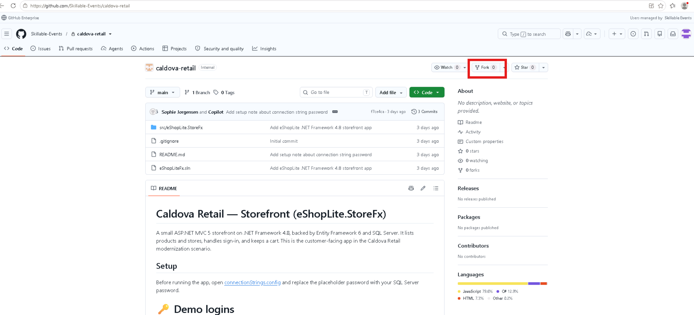

   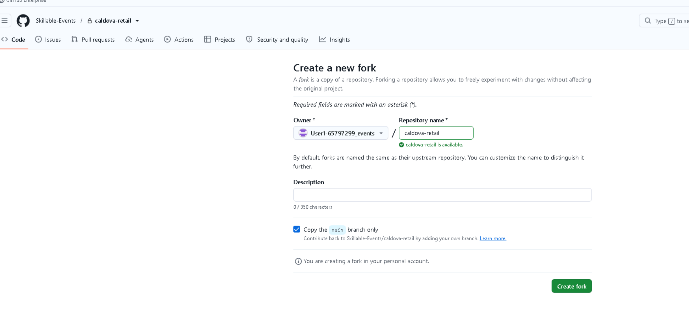

2. In your new fork, select **Code**, then copy the **HTTPS** URL. It should look something like `https://github.com/User1-12345678_events/caldova-retail.git`.

   

   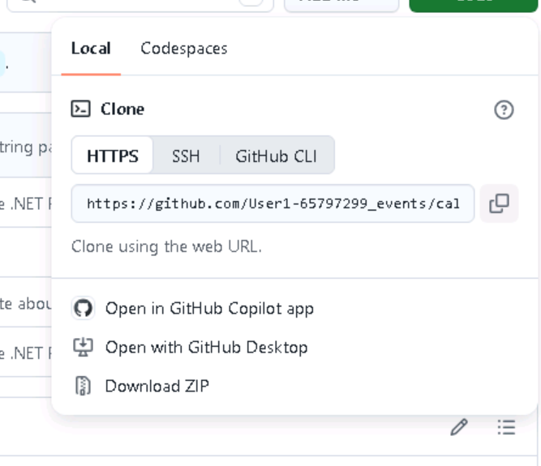

3. Open PowerShell from your applications and clone your fork, pasting the URL you copied into it (run this from the default location -- C:\Users\Admin):

   ```powershell
   git clone <your-fork-url>
   ```

   If you are asked to sign in, choose **Sign in with your browser**, approve the authorization (select **"Authorize git-ecosystem"**), then return to PowerShell. The clone starts once you are signed in.
   > 💡 If you face any errors here, the sign in may not have persisted. If that is the case, re-type in the original repo link, +++https://github.com/Skillable-Events/caldova-retail+++, follow the sign in, click the button to stay signed in, and then run the Powershell command again.

**3. Open the storefront folder in VS Code.** Run this command in PowerShell to open the application in VSCode:

```powershell
cd caldova-retail
code .
```

If `code` is not recognized, start VS Code from your applications and use **File → Open Folder…**, then pick the `caldova-retail` folder.

> 💡 If VS Code prompts you to sign in, select **Continue with GitHub**. An authorization page opens in the browser; select **Continue**, then **Authorize Visual-Studio-Code**. Return to VS Code once you are signed in.

If VS Code opens the folder in **Restricted Mode**, select **Manage** in the banner at the top of the window, then select **Trust**. Once the page shows **In a Trusted Folder**, close that tab.


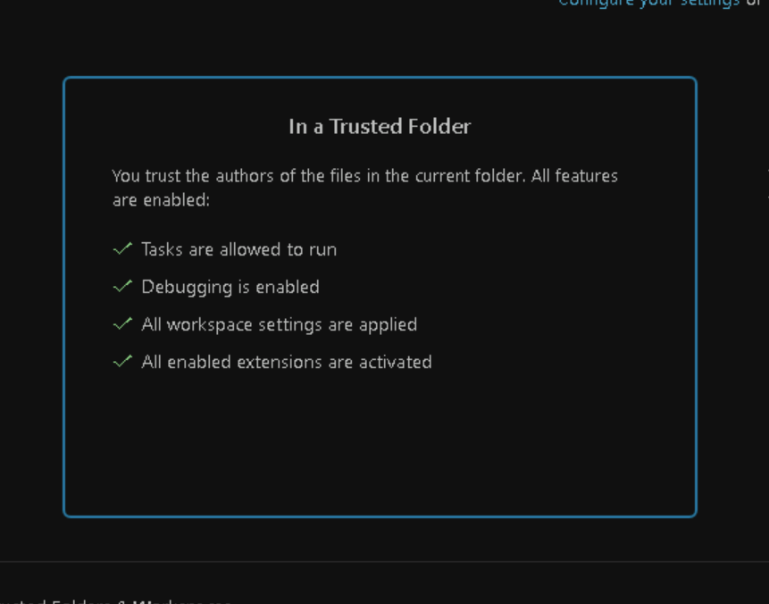

You are in the right place when the Explorer shows `eShopLiteFx.sln` next to a `src` folder.

**4. Give the app its database password.** The app reads its connection string from `src\eShopLite.StoreFx\connectionStrings.config`. Open that file (navigate under the src folder) and replace the placeholder password with the **W11-Workstation** password from the **Resources** tab of your lab instructions. Leave the server, database, and user exactly as they are.

## ▶️ Run the App

To make sure the setup was completed correctly, ask Copilot Chat to build and launch the legacy app for you.

> 💡 Running this .NET Framework app outside a server requires **MSBuild** (the tool that builds the app) and **IIS Express** (a small web server for testing), because legacy ASP.NET apps like this one can't be started with the usual `dotnet run`. Both tools are already installed on the VM, so there is nothing to set up. Keep it in mind for future customer scenarios where you need to run a legacy app yourself.

Open Copilot Chat by selecting the chat icon in the top menu bar, to the right of the search bar:


> 💡 If Copilot prompts you to sign in, select **Continue with GitHub**. An authorization page opens in the browser; select **Continue**, then **Authorize Visual-Studio-Code**. Return to VS Code once you are signed in.

Then, type in the chatbox and submit this prompt:

```plaintext
This is a .NET Framework 4.8 ASP.NET MVC app using packages.config. Restore its packages with nuget.exe, build the solution with MSBuild, and launch it locally with IIS Express. Tell me the URL when it is running.
```

A plain "run this app" prompt would also work. Copilot would inspect the project and work out the build and launch steps itself. Spelling them out up front just gets you there faster and avoids potential trial and error.

Once it loads, walk the app and confirm your copy matches the on-premises one you looked at earlier:

- [ ] The product catalog loads, with images
- [ ] Sign-in works for both accounts — use these demo logins:

  | Username | Password | Role | Notes |
  | --- | --- | --- | --- |
  | `alice` | `Password1!` | Admin, Manager | Has existing order history |
  | `bob` | `Password1!` | Employee | Has existing order history |

- [ ] Adding an item to the cart works

If the build fails, continue prompting Copilot to investigate the error.

You now have your own copy of the on-premises app running on .NET Framework 4.8, behaving exactly as it does on the server. That is the baseline everything that follows is measured against. Time to modernize it.

## 🤖 How GitHub Copilot Modernization Works

GitHub Copilot Modernization works through a three-stage workflow: **Assessment → Planning → Execution**.

- **Assessment:** Copilot analyzes your project structure, dependencies, and code patterns to identify upgrade requirements and potential breaking changes
- **Planning:** The tool generates a detailed upgrade plan document based on assessment findings
- **Execution:** You review the plan, add custom requirements, and Copilot performs the automated upgrade

This lab uses two VS Code extensions that work together. **GitHub Copilot modernization** runs the application assessment and is where you start the upgrade. **GitHub Copilot upgrade** provides the **Upgrade** agent in Copilot Chat that carries out the assessment, planning, and execution for the .NET upgrade. Both are already installed on the VM. They are expected to merge into a single tool over time.

We're going to upgrade our application to achieve one goal: **move the storefront from .NET Framework 4.8 to .NET 10**, with its existing behavior intact.

## Run the GHCP Modernization Application Assessment

Module 1 assessed the **infrastructure** with Azure Migrate — servers, sizing, and dependencies. The modernization extension assesses the **application code**, which is the other half of the picture. Azure Migrate can tell you a server is ready to move; the application assessment tells you whether the code should move as-is or be upgraded first.

You can run one at any time, without committing to an upgrade.

**1. Open the modernization extension.** Click the **GitHub Copilot app modernization** icon in the Activity Bar down the left-hand side of VS Code.


> 💡 **Don't see the icon?** This lab uses two extensions, and both should already be installed on the VM. If either is missing, select the **Extensions** icon in the left sidebar:
>
> 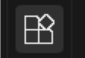
>
> Then search for each of these and select **Install**:
>
> - **GitHub Copilot modernization**
> - **GitHub Copilot upgrade**

**2. Click Start Assessment.**

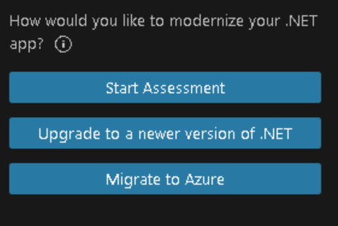

**3. Choose Recommended Assessment.** You are offered a Recommended or a Custom assessment. For this lab, we will proceed with Recommended. Custom does a deeper review of the whole codebase, including how it is structured and how its data is organized, and takes much longer.

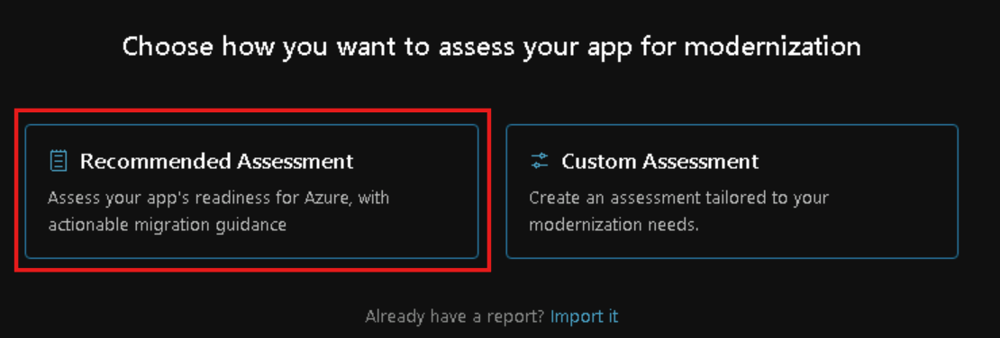

**4. Leave the default target as Cloud Readiness.** Select **OK** with the Cloud Readiness box checked. This measures how ready the app is for Azure. It may take ~30 seconds to appear as running. Expect it to run for a couple of minutes.

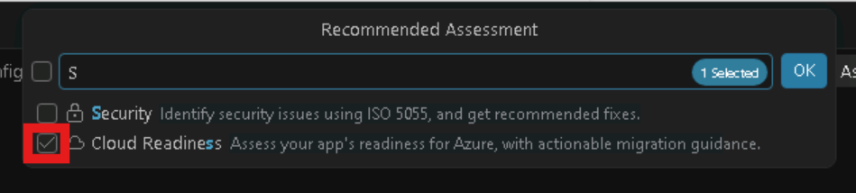

**5. Read the results.** Cloud readiness issues are grouped into **Mandatory**, **Potential**, and **Optional**. The summary estimates the effort to reach the highlighted target Azure service (Azure App Service, Azure Container Apps, or Azure Kubernetes Service) by grouping it into T-shirt sizes, and correctly identifies the app as running on .NET Framework 4.8. Try changing the Target Service dropdown from Azure App Service to Azure Container Apps. Note how issues may disappear/appear/change criticality since this is a different hosting service.

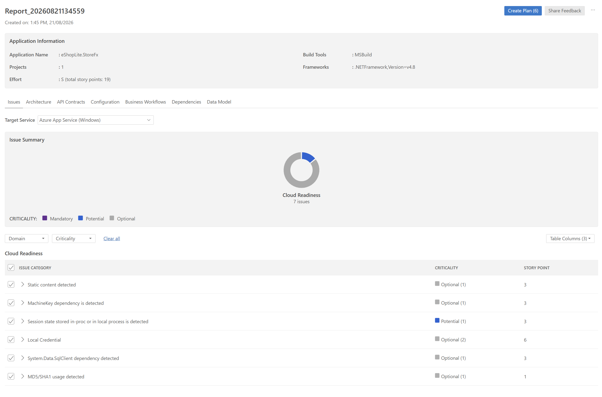

Expand any issue to see what the extension found and the guidance it recommends — the affected code, why it matters for the target service, and what a fix would involve. This is the most useful part of the assessment: the counts tell you how big the job is, and the details are what you would walk a customer through.

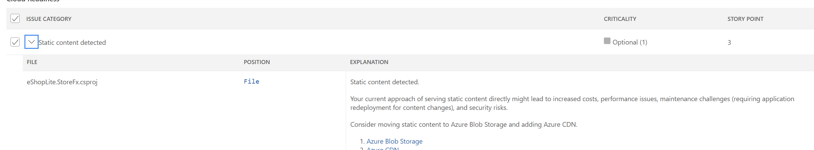

In the top right corner of the assessment there is an option to **Create Plan**, which would generate a plan to remediate the issues it found. We are skipping that here — the framework upgrade comes first, and these findings could change once the app is on .NET 10. For this module the assessment is just a read on the app.

> 💡 **TIP**
>
> You do not have to keep the assessment open to keep it. Reopen the extension from the Activity Bar and choose **Open Assessment Dashboard** — every assessment you have run is listed there, so you can refer back to this one later.

---

## 🚀 Upgrading to .NET 10

The rest of this module is the upgrade itself, in five steps.

## 1️⃣ Initiate the Upgrade

1. Open the GitHub Copilot modernization extension.

   > 💡 Can't find it? Select **Extensions** in the Activity Bar, search for `modernization`, and select **GitHub Copilot modernization**.
   >
   > 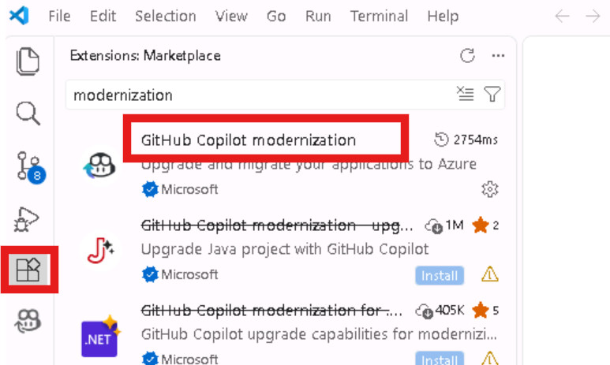

2. Select "Upgrade to a newer version of .NET"

   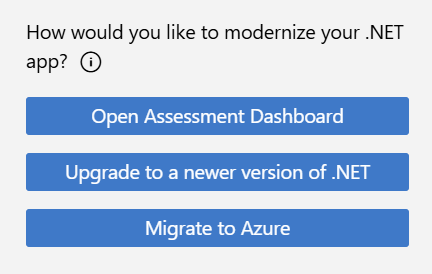

3. Copilot Chat should open with the **Upgrade** agent already selected. If it is not, open the **agent picker** at the bottom of the chat box and select **Upgrade**. If **Upgrade** is not listed, check that the **GitHub Copilot upgrade** extension is installed: select **Extensions** in the Activity Bar and search for `GitHub Copilot upgrade` (install it if it is not installed).

   The Upgrade agent is built for this job. A general Copilot agent works from what the AI model already knows. The Upgrade agent instead follows tested, step-by-step upgrade instructions, uses real build tools to find code that will break, and rebuilds the app after each task to check that nothing broke.

   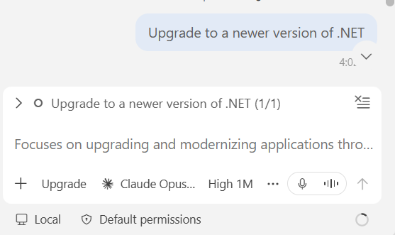

   > 💡 **PICKING A MODEL**
   >
   > **The default is fine for this lab.** If you do change it, prefer a powerful model like Claude Opus.

4. After a minute or two, a pop-up window opens with options for the upgrade. Notice that it has already detected that the app runs on .NET Framework 4.8 and found the solution file (the `.sln` file that ties the app's projects together). If you get an error instead of the pop-up, type `Try again` in the chat. Select the following options:

   - **Target Framework:** .NET 10
   - **Flow Mode:** Guided. The agent pauses after the assessment and again after the plan, so you can check its work before it changes any code. This is the best choice while you are learning, and with customers who want to approve each stage. **Automatic** runs from start to finish without stopping; use it once you know the tool and the change is low-risk.
   - **Create working branch:** Check the box. A branch is a separate line of work in Git. The upgraded code goes on the new branch, and your original code stays untouched so you can always go back to it.
   - **Branch name:** upgrade-net10 (or whatever you prefer)
   - **Commit strategy:** Commit after each task. A commit is a saved checkpoint of the code, so you get one checkpoint per finished task.

   Don't worry if some of these options are missing or extra ones appear; the agent doesn't show exactly the same options every time. For any extra options, keep the default, which is what Copilot recommends. Select **Confirm** to start the upgrade with these settings.

   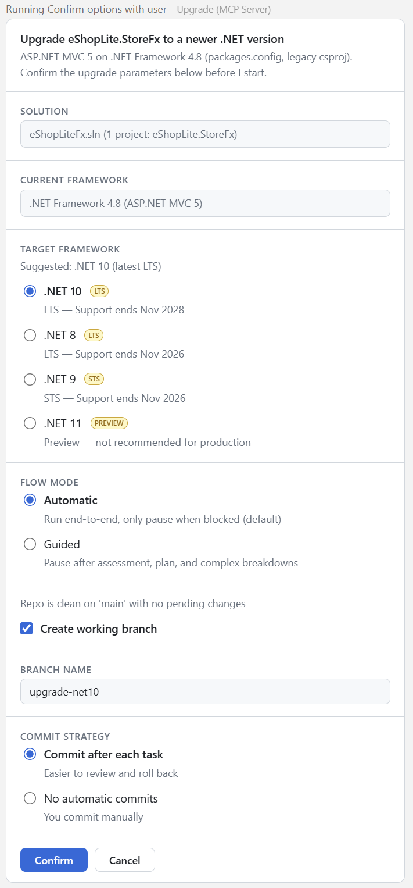

   The window then shows a confirmation.

   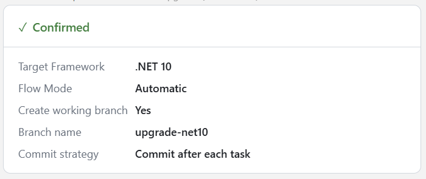

> ‼️ **IMPORTANT**
>
> The agent runs many commands and actions (called tool calls). When VS Code asks you to approve one, read what it is about to do, then approve it. Watching these approvals during the assessment and planning stages is a good way to see how the agent works. With customers, it is best to review each of these calls so they feel comfortable with them.
>
> If VS Code asks **Allow MCP tools from "Upgrade" to make LLM requests?**, select **Allow in this Session**. The Upgrade agent needs this to run its analysis. (MCP, the Model Context Protocol, is how extensions give Copilot extra tools and reference files. The **Upgrade MCP server** comes with the GitHub Copilot upgrade extension and gives the Upgrade agent its upgrade tools and instructions.)
>
> 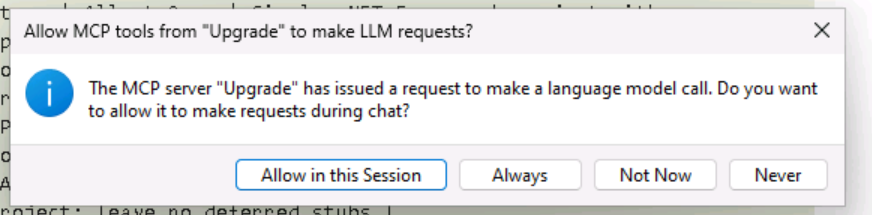

## 2️⃣ Initial Assessment

Once the scenario starts, the agent runs the assessment before it plans or changes anything. You don't drive this stage — it runs on its own — but what it produces is what you review next.

### Dashboard initialization

You will see the scenario has been initialized and shows links to Dashboard and Activity. Open the dashboard link (it may open automatically).

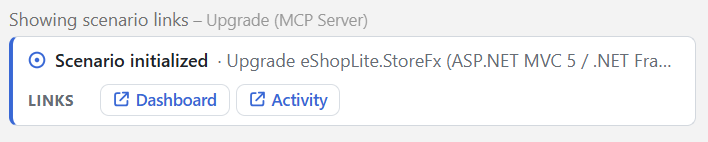

You can see the dashboard is on the "Assess" phase. Observe the other aspects of the dashboard. Throughout this module, it will move between phases until the .NET Framework has been fully updated. It is a great reference to keep track of the upgrade progress.

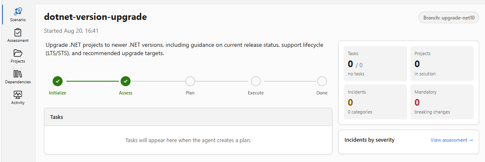

> 💡 **NOTE**
>
> During the upgrade, Copilot may ask permission to read files outside your project folder. This is safe to approve: the agent is reading instruction files from the **Upgrade MCP server** so it can follow a structured process.

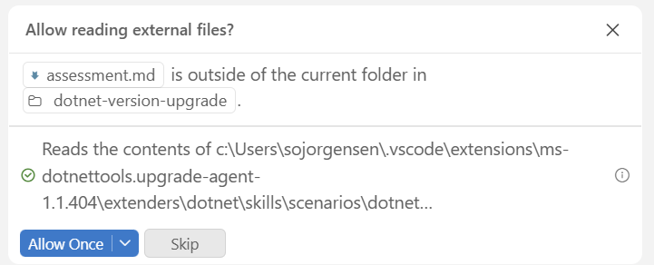

### What the agent examines

- **Project structure** — How the code is organized, which project file format it uses, and which .NET version it targets
- **NuGet packages** — The third-party code libraries the app uses, and whether each one has a version that works on .NET 10
- **API usage patterns** — Deprecated .NET Framework APIs, categorized as binary incompatible, source incompatible, or behavioral change
- **Old web framework** — Parts of the app built on the old ASP.NET web framework (`System.Web`), which does not exist in .NET 10 and has to be rewritten
- **Binding redirects** — Old settings that tell the app which library versions to load; if they are wrong, the app crashes when it runs
- **Effort and risk** — Roughly how many lines of code need to change, how hard each part is, and whether to add tests first that record how the app behaves today

### Where the assessment is written

The agent saves its findings into a workflow folder in your repository rather than leaving them in the chat:

```text
.github/upgrades/scenarios/dotnet-version-upgrade/assessment.md
```

You should also see an "Assessment complete" pop-up with a link to it:

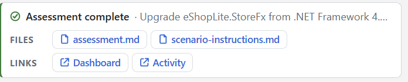

You can also find the files yourself in the **Explorer** view. Expand `.github` → `upgrades\scenarios\dotnet-version-upgrade` to see `assessment.md` alongside the other files the agent created for this upgrade, such as `scenario-instructions.md`. You can open any of these files at any point to see what the agent is working from.

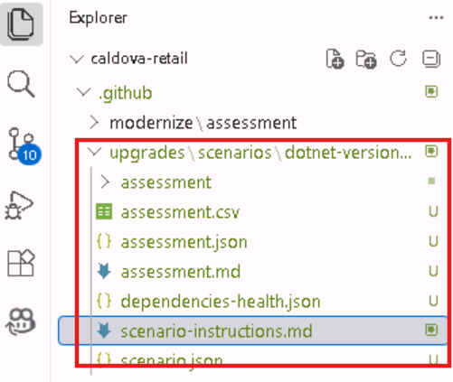

Open `assessment.md` and read it. The report is long, so focus on these four sections. They are the most important ones to look at.

| Section | What to look for | Why it matters |
|---|---|---|
| **Package Compatibility** | Anything marked ⚠️ incompatible | A library with no .NET 10 version has to be replaced or removed. This is the only kind of issue that can block the upgrade completely. |
| **Technologies and Features** | Which technology causes the most issues | This tells you how big the change is. In our run, roughly 99% of issues came from the old web framework (`System.Web`), so the web parts of the app have to be rewritten, not just pointed at a new .NET version. |
| **Binding Redirect Configuration** | The 🔴 Mandatory count | These problems don't show up when the app is built. They show up as errors the first time someone uses the app. |
| **Projects Compatibility** | Difficulty, estimated lines of code (LOC), and the 🧪 test flag | Shows how big the job is, and whether to write tests that record how the app behaves today before changing anything. |

> 💡 **NOTE**
>
> The figures quoted here and below — issue counts, percentages, estimated lines of code — are examples from one run against this storefront. **Your numbers could differ.** The assessment is produced by an agent analyzing your workspace at that moment, so counts can shift with package versions, SDK versions, and the tool's own updates. Read them as an indication of shape and scale, not as values to match.

The layout is the same for every .NET upgrade assessment, but sections only appear when there is something to report. In your own projects, a missing section means nothing was found — not that something went wrong.

## 3️⃣ Review and Shape the Plan

### Confirm Upgrade Options

First, the agent shows a pop-up with upgrade options. Look through them.

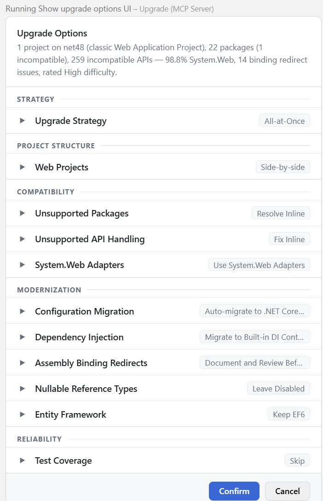

From the dropdown, change project structure for Web projects from Side-by-Side to All-at-Once. This changes the code rewrites from incremental side-by-side to a single pass.

**Side-by-side** builds a *new* version of the app next to the old one and moves pages over a few at a time, while the old app keeps serving customers. That suits a large website that can never go offline, but it means running two versions of the app, plus extra code to route each request to the right one, for the whole project.

**All-at-once** rewrites the web app in a single pass. The tool recommends it for small web apps (roughly ten controllers or fewer; a controller is the code that handles one area of the site) when some downtime is acceptable. The storefront has only four controllers, so this is clearer and faster for the workshop.

Keep the other defaults. To save time, we skip the option to generate automated tests. In a real project, those tests check that the app behaves the same before and after the upgrade.

Hit confirm.

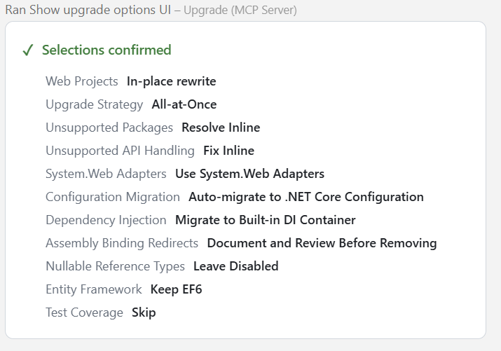

Once you confirm, the agent writes the plan.

> 💡 **NOTE**
>
> If prompted, keep approving requests to read files outside your project. These are instruction files from the **Upgrade MCP server**, which help the agent build the plan step by step.

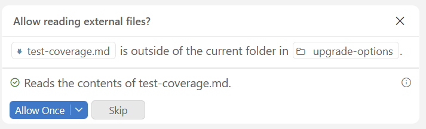

### Review the Generated Plan

When the "plan ready" pop-up appears, open the `plan.md` file.

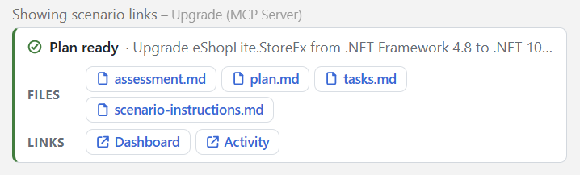

Both files are saved in the same folder as the assessment:

```text
.github/upgrades/scenarios/dotnet-version-upgrade/plan.md
.github/upgrades/scenarios/dotnet-version-upgrade/tasks.md
```

**1. Open `plan.md` and review it carefully.**

It lists the library updates, the code that will break, and the steps the agent plans to take. The agent follows this file exactly, so **to change the approach, just edit the text in `plan.md`**.

> 💡 **NOTE**
>
> Because we chose **Guided** flow mode, the agent stops here and waits for you before it changes any code. This is the moment to edit `plan.md` — whatever you leave in it is what gets executed. In **Automatic** mode the agent would carry straight on without asking.

**2. Open `tasks.md`.**

Like the dashboard, this file checks off each task as it finishes. The agent decides how to split up the work, so **your task list may not match this one exactly**; names, counts, and order can change between runs. You don't need to understand every term below. In short, the agent checks prerequisites, updates the project files, rewrites the code that no longer works on .NET 10, and then tests the app. A typical breakdown looks like this:

| Task | What it does |
|---|---|
| `01-prerequisites` | Confirms the .NET 10 SDK and records current working behavior as a manual acceptance checklist. No tests are generated. |
| `02-project-system-conversion` | Classic WAP → SDK-style `Microsoft.NET.Sdk.Web`, `packages.config` → `PackageReference`. Drops around 9 framework-provided packages and 12 binding redirects. **The code will not compile after this task — that is by design.** |
| `03-aspnet-core-migration` | The real work. `Global.asax` → `Program.cs`, Autofac → built-in DI, Forms Auth → cookie auth, `Web.config` → `appsettings.json`, static files → `wwwroot`. In our run this was roughly 259 API fixes across 12 files. |
| `04-final-validation` | Runs `dotnet run` and verifies products load from SQL Server, sign-in works for both accounts, the cart persists, and orders write back. |

What should hold steady is the **shape**: establish prerequisites, convert the project system, port the application code, then validate. If your run produces six tasks instead of four, that is the agent splitting the same work differently — not a sign anything is wrong.

## 4️⃣ Monitor the Upgrade Process

Once you approve the plan, the tool begins the upgrade. In Guided mode nothing is executed until you do, so take the time to read `plan.md` first. During this phase:

- Files will be modified incrementally
- Git commits will be created for each major change
- Progress will be displayed in the chat interface and on the modernization dashboard

> 💡 **Optional: let the agent run without asking.** During this phase the agent runs many more commands, such as a build after every change. Now that you've seen what it does, you can optionally let it run them without asking for the rest of the session: select **Default Permissions** at the bottom of the chat and change it to **Allow All**. If you do, keep an eye on the dashboard and `tasks.md` to follow along as each task completes. With customers, keep approving each call unless they are comfortable letting the agent run freely.

> 💡 When the agent finishes a task and tries to commit, it may report that no Git identity is set up. Reply in the chat with `Commit with <your lab email>`, using the **Username** listed under **Azure portal** on the **Resources** tab.

Keep the dashboard or tasks.md file open.

As the tool works through each task, monitor the chat box to observe the agent's behavior. You can see how it is going about changes and what files it is altering. The Copilot Chat is also available to help you understand the changes being made and to provide context on any issues that arise.

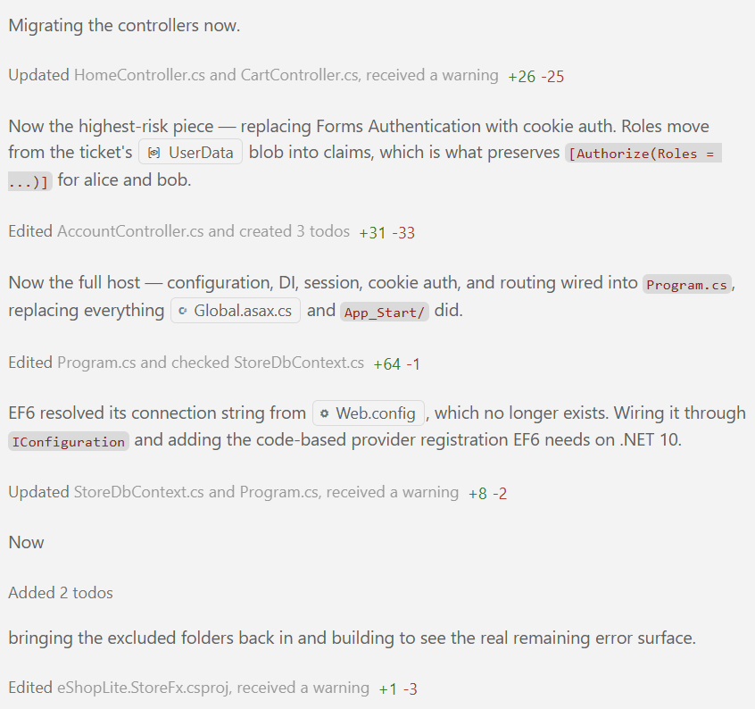

Useful things to ask while it runs:

```plaintext
Explain what you just changed in this task and why.
```

```plaintext
What was the .NET Framework way of doing this, and what replaces it in .NET 10?
```

```plaintext
Why is this task taking a while?
```

Check the activity tab of the dashboard. It records the timeline, log, and commits of the upgrade. You can see it shows the steps the agent is taking, such as rebuilding the app after changing a file.

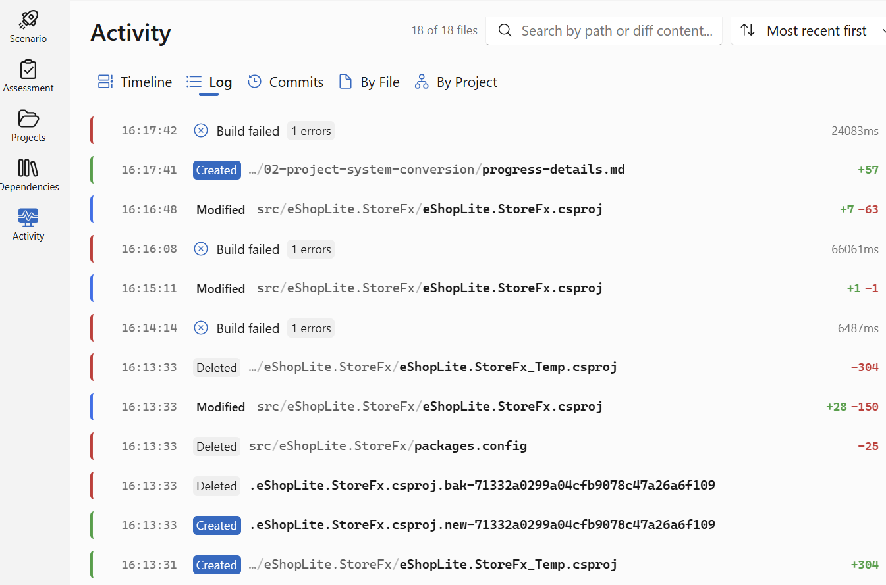

### 🧭 Steering the agent

The agent decides each next step based on what it just saw, so it does not always move in a straight line. It can occasionally stall, drift, or stop early. You stay in control the whole time:

- **It seems slow or stalled.** If the chat is not producing output as quickly as you expect, stop the run and type `continue`.
- **You want to see what it is doing right now.** Hover over a step in the chat. If an arrow appears on the right, select it to open the background work the agent is running, such as a subagent reviewing or validating a task, for more detail.

  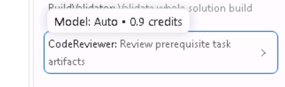

- **You want to redirect it mid-task.** Type your message while the agent is still working and send it as a **steering** message (hover over the message and select steering). Copilot reads it before carrying on, instead of queuing it until the current step finishes.
- **It is badly stuck or off track.** You can always start a fresh chat with the Upgrade agent and ask it to pick the upgrade back up from where it left off, or restart entirely.
- **It stops with an error.** Ask it to keep going, or ask why it stopped, for example `Try to continue` or `Why did you get this error?`. In the example below, the agent stopped during initialization; a follow-up message is enough to get it moving again.

  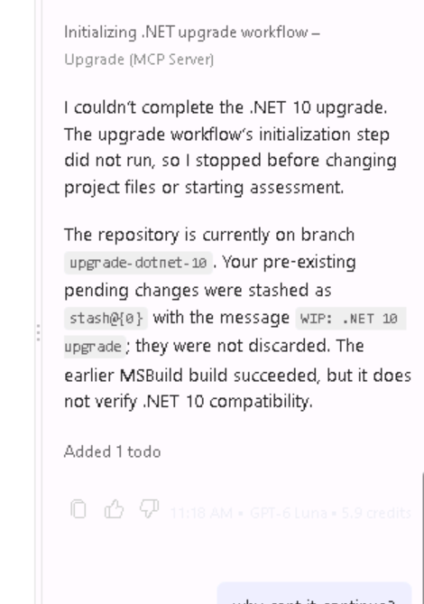

- **The dashboard is not updating.** The dashboard can get stuck, and you may see an error in the chat saying the agent failed to save state. This is a known issue. The upgrade still continues in order, so keep an eye on the chat and the Source Control view instead. If commits are still landing, the upgrade is fine and only the dashboard is behind.

> 🛟 **Still really stuck, or has the upgrade been running for a very long time (>1 hour)?** Don't let it block the rest of the day. We have a copy of the app already upgraded to .NET 10. You can stop here and start the following module; its first note shows how to fork and clone it.

## 5️⃣ Finalize the Migration

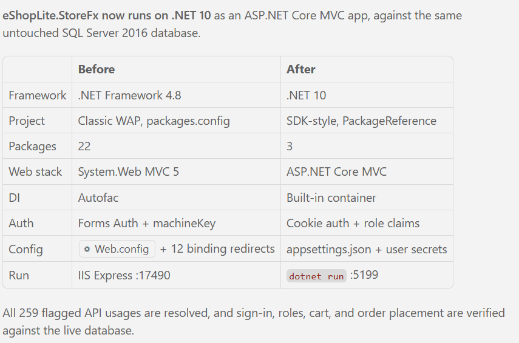

> 💡 **Check the database password.** After the upgrade, the app reads its database connection from `src\eShopLite.StoreFx\appsettings.json` instead of `connectionStrings.config`. Open `appsettings.json` and check the `StoreDbContext` connection string. If the password is still a placeholder, either ask Copilot to carry over the connection string from `connectionStrings.config`, or replace the placeholder yourself with the **W11-Workstation** password from the **Resources** tab. Without the right password, the app can't reach the database and the products won't load.

When the final validation task completes, ask the agent to start the app and check it for you:

```plaintext
Run the application and confirm it works end to end. Check that the product catalog loads with images, sign-in works for both accounts, the cart persists across page loads, and placing an order writes back to SQL Server. Tell me about anything that behaves differently than it did before the upgrade.
```

The agent will build the project, start it, and report what it finds. Open the URL yourself as well and walk the same paths you used before the upgrade:

- The product catalog loads, with images
- Sign-in works for both accounts — use these demo logins:

  | Username | Password | Role | Notes |
  | --- | --- | --- | --- |
  | `alice` | `Password1!` | Admin, Manager | Has existing order history |
  | `bob` | `Password1!` | Employee | Has existing order history |

- Adding to the cart persists across page loads
- Placing an order writes back to SQL Server

Notice what you are checking for: **nothing has changed**. The storefront should look and behave exactly as it did on .NET Framework. That's why this module keeps the database and the app's look the same: if anything looks or behaves differently, it's a bug caused by the upgrade, and you know exactly where to look.

If something is off, the [troubleshooting steps](#-handling-common-issues) below cover the common cases.

### ✅ Final check

- ✅ Running on .NET 10
- ✅ Using the modern project file format and library references
- ✅ Reading its settings from `appsettings.json` instead of `Web.config`
- ✅ Starting with `dotnet run`, without IIS Express
- ✅ Showing the **same pages** and using the **same SQL Server database** as before

🎉 **Congratulations — your storefront is running on .NET 10.**

An app that only ran on Windows with .NET Framework 4.8 and IIS Express is now a modern .NET 10 app that starts with `dotnet run`. It runs on a supported version of .NET, it can run on Linux and in a container, and it can now use the Azure hosting options covered later in this bootcamp. None of that was possible an hour ago.

## 🎯 What You've Accomplished

By using GitHub Copilot's modernization capabilities, you've:

- 🔹 Moved a .NET Framework 4.8 application onto .NET 10
- 🔹 Updated the project files to the modern format
- 🔹 Used AI to find and fix the code that no longer worked on .NET 10
- 🔹 Kept the database and the app's look and behavior the same, so the change is easy to check

Doing this upgrade by hand usually takes days of finding and fixing code and libraries that no longer work. With GitHub Copilot, you did it in a fraction of the time, and the change is small enough to actually review.

## 🔧 Handling Common Issues

### Error Recovery

Sometimes the tool may encounter errors during the upgrade. When this happens:

1. If you see an error message, select **Resume**. This often fixes the problem on the next try.
2. If the error persists, type in the chatbox:

   ```
   Fix the errors and continue with the update
   ```

3. For a specific error, paste the error message into the chat and ask Copilot to explain and fix it.

### Static Assets and Views

The upgrade moves files around, so images, scripts, and styles (CSS) sometimes stop loading even though the pages themselves are fine. If pages look unstyled or images are missing, use this prompt:

```
The pages load but the scripts and stylesheets in subfolders are not resolving. Check the static file configuration and asset paths for the new project layout, and fix them step by step. Keep the existing MVC views.
```

### Database Connectivity

The database does not change in this module, but *the way the app finds it* does: the database connection settings move from `connectionStrings.config` into `appsettings.json`. If data stops loading, check that first:

```
The products are not loading. Check that the SQL Server connection string was carried over correctly into the new configuration system and that Entity Framework is reading it. Think and do this step by step.
```

### Runtime Error Resolution

For runtime errors:

1. Stop the running app (`Shift+F5`, or press `Ctrl+C` in the terminal running `dotnet run`)
2. Copy the error message from the **Terminal** or **Debug Console** panel
3. Paste it into the Copilot chat for analysis and resolution

> 💡 **Going further: custom skills**
>
> The agent's built-in instructions cover steps that are the same in every .NET app. If a customer has their own coding standards, you can add them as Markdown files under `.github/skills/` in the repository, and the agent will follow them too. This matters most when a customer has many apps to modernize: you work out the pattern once, and every later app gets it automatically. Custom skills are out of scope for this workshop; see [GitHub Copilot upgrade scenarios and skills](https://learn.microsoft.com/dotnet/core/porting/github-copilot-upgrade/scenarios-and-skills) to learn more.

## ➡️ What's Next

You've completed the framework upgrade using GitHub Copilot Modernization. The app runs on .NET 10, but running on modern .NET is not the same as being ready for Azure. The code still expects to run as a single copy on one server. In Azure, it may run as several copies at once, and it should use Azure services for things like storing secrets.

In the next module you'll rebuild the storefront's pages with Blazor, which is where the app's look can finally change. Then you'll ask Copilot whether the app is ready for Azure and work through what it finds.
