# ☁️ Lab 03: Get the App Ready for Azure

Module 2 moved the storefront onto .NET 10. To do that, the upgrade also had to rewrite how the app starts up and where it keeps its settings (now in `appsettings.json`). What it did not do is make the app ready to run **in Azure**.

> 🎯 **This module: make the app ready for the cloud.** You work on the **application code**: rebuild the pages with Blazor, then close the gaps that would stop the app running well in Azure. Nothing is created in Azure. Module 4 then designs the Azure environment the app will run in.

You work in **GitHub Copilot Chat** for the whole module: first with the **Upgrade** agent to convert the pages to Blazor, then with the GitHub Copilot modernization extension's **Migrate to Azure** option to find and fix what the app needs before it can run in Azure.

> 🧭 New to GitHub Copilot Chat? [Copilot Essentials](https://github.com/Azure-Samples/modernize-bootcamp/blob/main/docs/copilot-essentials.md) is a short reference on modes, models, context, cost, and course-correcting.

> 💡 **Didn't finish the .NET 10 upgrade in Module 2?** Use our copy of the app that already runs on .NET 10, and start this module from there:
>
> 1. In Microsoft Edge, go to +++https://github.com/Skillable-Events/caldova-retail-dotnet10+++. Sign in the same way you did in Module 2 if you are asked.
> 2. Select **Fork**, then **Create fork** with the defaults left alone.
> 3. In your new fork, select **Code**, then copy the **HTTPS** URL.
> 4. Open PowerShell from your applications and run these commands from the default location (`C:\Users\Admin`), pasting the URL you copied:
>
>    ```powershell
>    git clone <your-fork-url>
>    cd caldova-retail-dotnet10
>    code .
>    ```
>
> 5. If VS Code opens the folder in **Restricted Mode**, select **Manage**, then **Trust**.
> 6. Open `src\eShopLite.StoreFx\appsettings.json` and replace the placeholder password in the `StoreDbContext` connection string with the **W11-Workstation** password from the **Resources** tab of your lab instructions.
> 7. Run the app and confirm the catalog loads before you continue.

## 📋 What you'll do

- 🚀 Rebuild the storefront's pages with Blazor components
- ☁️ Ask whether the app is Azure ready, and fix what comes back

## 1️⃣ Convert to Blazor pages

Right now, the storefront's pages are built with **ASP.NET MVC**. Each page is a *view* (an HTML template with blanks), and a separate *controller* handles each request, gets the data, and fills in the template. In this step you move the pages to **Blazor**, Microsoft's newer way to build web pages in .NET. With Blazor, each page is a *component*: a single file that holds both the page's layout and its code, built from reusable pieces such as a product card or the cart. The app still runs on .NET 10; only the way its pages are built changes.

Unlike Module 2, this step does change the pages themselves. Copilot will rebuild each page as a Blazor component. Because the pages are being rebuilt anyway, this is also a good moment to give the store a more modern look, so the prompt below asks for that too.

With the Upgrade agent selected in the chat, use the following prompt to guide Copilot:

```plaintext
Convert the existing ASP.NET MVC pages to Blazor components in this .NET 10 application. This includes:

Identify the MVC views, controllers, models, and services involved.
Recommend whether Blazor Server interactivity or static server rendering is most appropriate for this app.
Convert all existing pages one page at a time to use Blazor (preferably Blazor Server or Blazor WebAssembly, depending on suitability).
Remove all non-Blazor pages and ensure routing is correctly configured.
Preserve layout, validation, images, and existing user-facing behavior.
Ensure all media (images, videos, etc.) are correctly referenced and rendered in the new Blazor components.
Fix issues where the page renders blank or fails to load due to routing or layout problems.
Leverage Blazor components to make it look more modern, sleek, and aesthetic.
```

> 💡 **NOTE**
>
> That last line is deliberately vague — "modern, sleek, and aesthetic" means whatever the model decides it means. Expect your result to look different from the screenshots below, and different from the person sitting next to you. That is fine. The point of this step is that you *can* modernize a UI by asking, not that everyone lands on the same UI.
>
> If you have something specific in mind, say so. Name the color palette, ask for product cards in a responsive grid, or paste in a screenshot of a design you like. The more specific the ask, the less the model has to invent.
>
> The same applies when something breaks. If a page renders blank, a component goes missing, or routing misbehaves, describe that specific problem in the chat and let Copilot fix it before moving on.

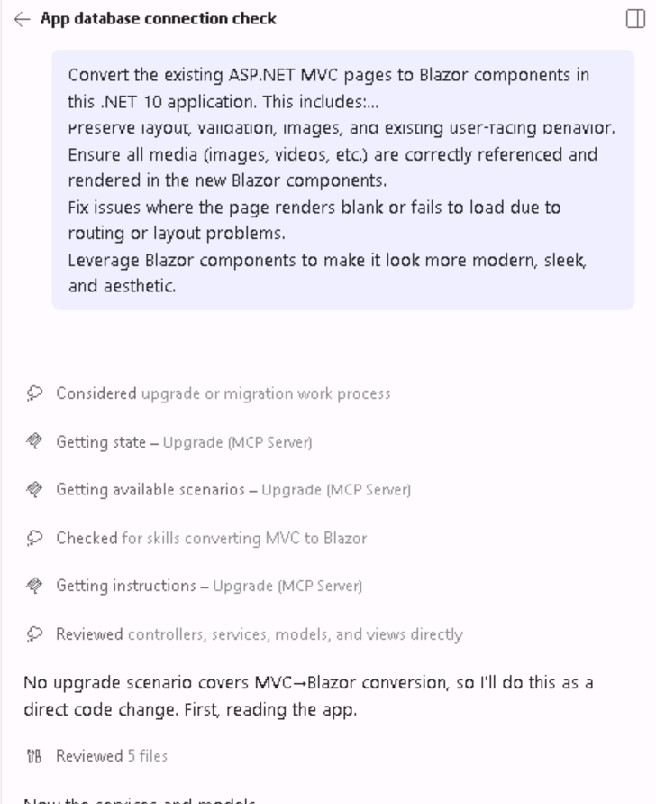

If the agent asks you to confirm any options, choose the one it recommends. If it does not give a recommendation, ask it which option it recommends and why.

Notice what the agent says: no upgrade scenario covers MVC → Blazor, so it will do this as a **direct code change**. The Upgrade agent ships with tested scenarios for common migrations, but it is not limited to them. It is strong at understanding languages and frameworks and converting between them, and it still runs structured checks as it works, such as reading the app before it edits and building to verify its changes. Because the Upgrade agent is built on top of GitHub Copilot, you can also ask it questions and give it requests outside its predefined scenarios, just as you would any other Copilot agent.

Copilot will convert the MVC pages to Blazor components, ensuring that all functionality is preserved and adding some new features. Expect this update to take ~10-30 min.

This is our final page (yours may look different):

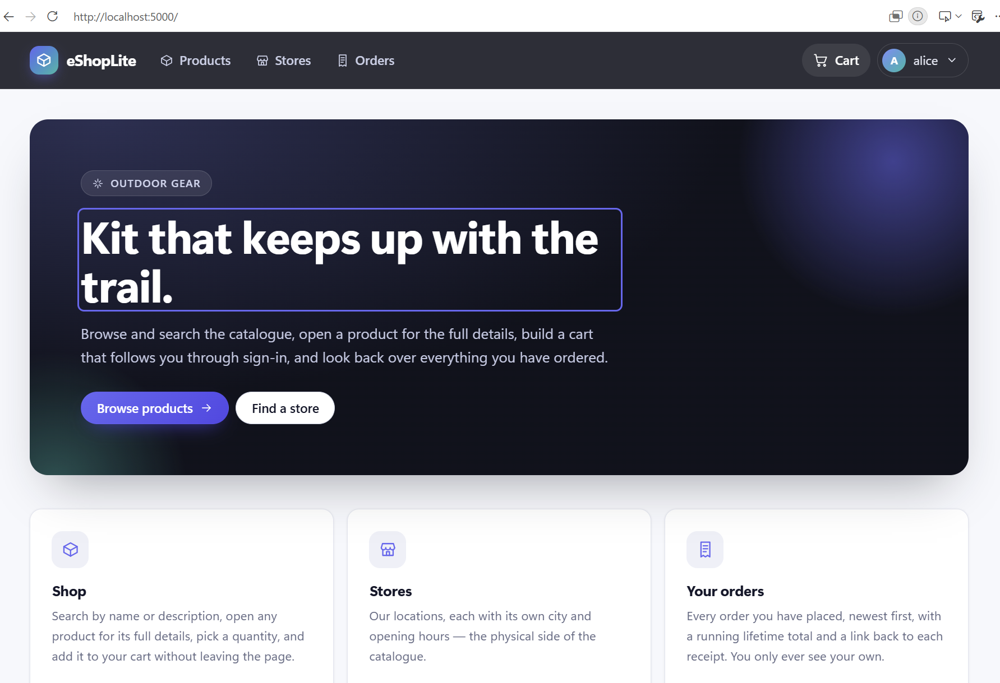

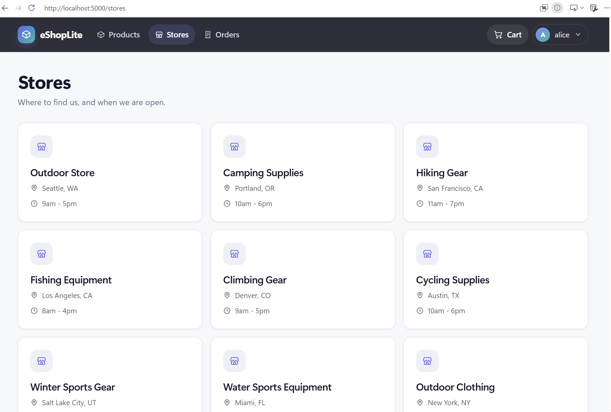

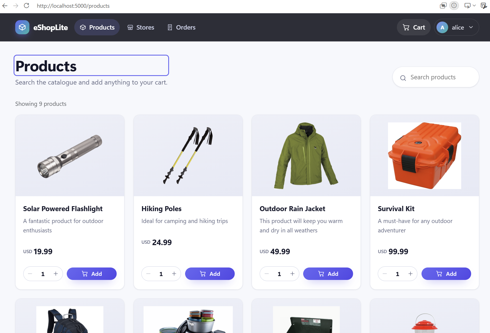

### ✅ Build and test the Blazor conversion

If Copilot does not automatically do this verification, then prompt copilot to build and run the app:

```plaintext
1. Build the solution to ensure no compilation errors
1. Run the application and verify all functionality
1. Check that:
   - All pages load correctly and render as Blazor components
   - Images and static content display properly
   - Sign-in still works for alice and bob (password Password1!) and the cart still holds its contents
   - No MVC views or controllers are left behind in the routing
   - The application starts cleanly from the Visual Studio Code terminal
```

Use these demo logins when you check sign-in yourself:

| Username | Password | Role | Notes |
| --- | --- | --- | --- |
| `alice` | `Password1!` | Admin, Manager | Has existing order history |
| `bob` | `Password1!` | Employee | Has existing order history |

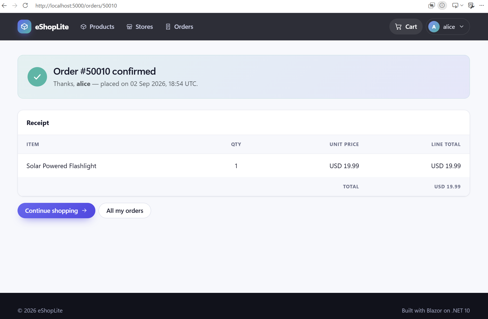

> 💡 The app does the same things it did at the end of Module 2 — that is the point. Everything so far changed *how* the app runs and renders, not *what* it does.

## 2️⃣ Get the app cloud ready

The app runs on .NET 10 and renders through Blazor, but its code does not yet know how to work with Azure services such as Key Vault or managed identity. Nothing so far has touched that, because a framework upgrade has no reason to.

**In this step you make code changes only.** You add the code the app needs to use Azure services, but you do not create the services themselves. We will create the IaC for services in later modules.

For example, if the app has the database password hard-coded in a config file today, in this step, you wire the code to read that secret from **Azure Key Vault** instead.

You'll use the same **GitHub Copilot modernization** extension you used in Module 2, this time with its **Migrate to Azure** option.

> 💡 **How Migrate to Azure works.** Behind this option is a set of agents built specifically for moving .NET apps to Azure. The **modernize** agent coordinates the work in three stages, **assess → plan → execute**, and hands each stage to a specialized agent: an assessment coordinator, a planning coordinator, and an execution coordinator. Instead of improvising, these agents use predefined migration tasks that capture Microsoft's best practices for common changes, such as reading secrets from Key Vault or connecting to a database with a managed identity, and they build the app to check their work. You stay in control: the agent stops after planning so you can review the plan before any code changes. See [GitHub Copilot modernization overview](https://learn.microsoft.com/dotnet/azure/migration/appmod/overview) to learn more.

1. **Start Migrate to Azure.** Open the GitHub Copilot modernization extension from the Activity Bar on the left side of VS Code:

   

   Under **QuickStart**, select **Migrate to Azure**.

   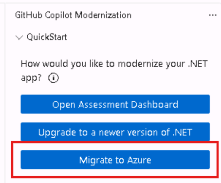

   A chat opens with the prompt "Migrate this application to Azure". Notice that it runs on the **modernize** agent, the orchestrator described above.

2. **Choose what to migrate.** When the agent asks **What do you want to migrate to Azure?**, select **My entire application** and then **Submit**. This assesses the whole app; you'll narrow the scope in a later step.

   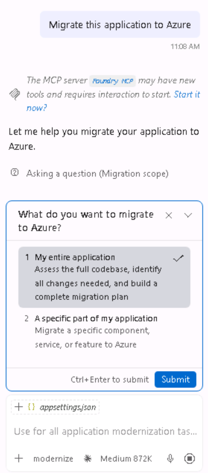

3. **Review the assessment.** The agent runs the same **cloud readiness assessment** you saw in Module 2, because it needs to know what to change before the app can move to Azure. This time, notice that **Frameworks** shows **net10.0**: the assessment picks up the upgrade you just did. Compare it with the Module 2 report: some issues are gone because of the upgrade, and the ones left are what still stands between the app and Azure.

   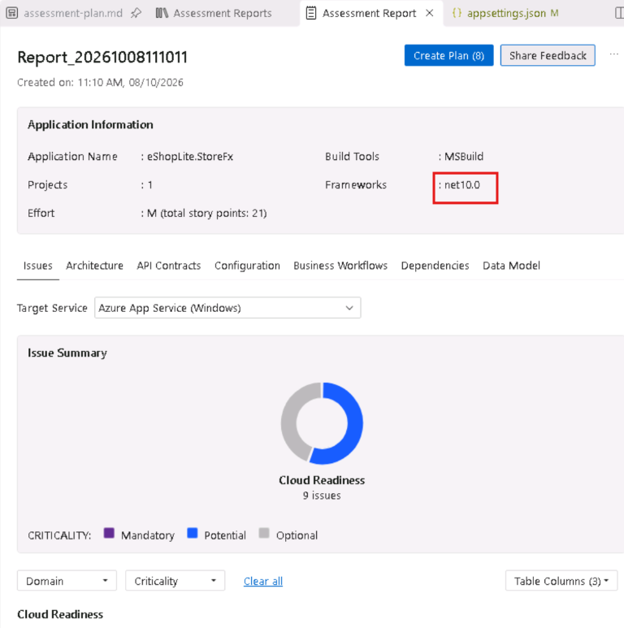

4. **Read the agent's suggestions.** After the assessment, the agent lists ideas in the chat for what to change or move to Azure. Yours may differ, but you will likely see suggestions for hosting, the database, secrets, and session or cache storage.

   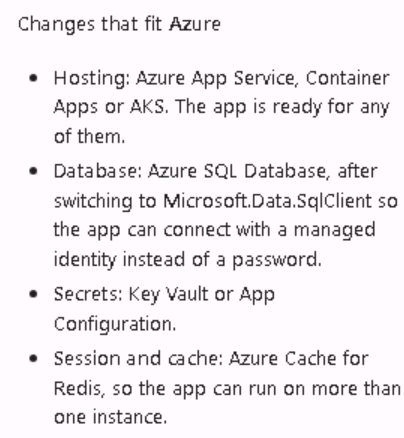

   The agent may suggest hosting options such as App Service, Container Apps, or AKS. You don't need to choose one now: the code changes in this module are the same for any of them. You'll compare the options and choose one in Module 4.

5. **Narrow the scope, then move to planning.** Not everything the agent suggests belongs in this module. The database is migrated in Lab 05, the infrastructure (Bicep) is designed in Module 4, and the Dockerfile comes in Module 6. Tell the agent explicitly, so it doesn't make those changes:

   ```plaintext
   Proceed to planning, but do not create a Dockerfile or infrastructure (Bicep/Terraform) files. Don't migrate or change the database. The app must keep connecting to the same existing SQL Server with the same connection details. Create a new branch for the changes.
   ```

   The modernize agent hands the work to the **planning-coordinator** agent, which writes the migration plan.

   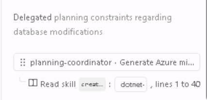

6. **Review the plan.** When the plan is ready, the agent tells you where to find it. Nothing has changed in your code yet, and the branch hasn't been created.

   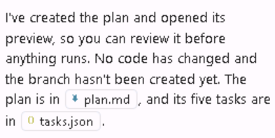

   The plan is saved in the `.github/modernize` folder of your repository:

   - **`plan.md`** describes the changes the agent intends to make and why.
   - **`tasks.json`** lists the tasks it will carry out, in order.

   Read through the tasks. Your plan may have a different number of tasks, or different ones, from the person next to you; that's expected. If anything doesn't belong, such as a task that touches the database or creates infrastructure files, edit `plan.md` directly or tell the agent in the chat.

   **Add one rule to the plan.** None of the Azure services exist yet, so the app has to keep working without them. Add this rule either by typing it in the chat and asking the agent to add it to the plan, or by navigating to the `.github/modernize` folder and editing `plan.md` directly:

   ```plaintext
   Every Azure service added by this plan must be optional and switched on only by a configuration setting; when the setting is empty, the app must run exactly as it did before without contacting Azure, and if the settings for a service are only partly filled in, the app must stop at startup with a clear error instead of silently falling back.
   ```

   This rule does two things. With no Azure settings, the app runs exactly as it does today, so you can still run it on the VM at the end of this module. And if someone fills in only part of a service's settings later, the app stops with a clear error instead of quietly ignoring Azure, which would be much harder to notice.

   If a task doesn't make sense, ask Copilot to explain it:

   ```plaintext
   For each task in the plan, explain in plain language what would go wrong in Azure without it.
   ```

7. **Run the plan.** When the plan looks right, send:

   ```plaintext
   Execute the plan.
   ```

8. **Follow the progress.** The Migrate to Azure agents don't have the dashboard you used with the Upgrade agent in Module 2; that dashboard is specific to framework upgrades. Instead, the agent writes a `progress.md` file for each task in the `.github/modernize/code-migration` folder and checks off each step as it finishes. Each task follows the same pattern:

   - **Code migration:** the files it changes, such as the project file, `appsettings.json`, and `Program.cs`.
   - **Validation and fixing:** it builds the app, checks the libraries for known security vulnerabilities (CVEs), checks that the changes are consistent and complete, and runs any tests.
   - **Final summary:** it commits the changes and writes a `summary.md` explaining what it did.

   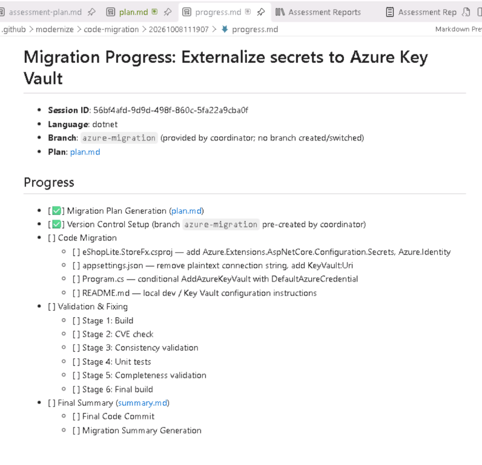

   If you're ever unsure how far along the migration is or what it's doing, ask in the chat, for example `What task are you on, and what's left?`

9. **Approve as it goes.** It will re-run the build and ask for approval to run commands. Grant them, and read the per-phase summaries as they appear instead of waiting until the end.

   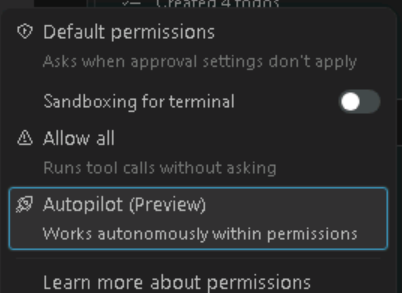

   > 💡 **A note on Autopilot.** The permissions menu at the bottom of the chat also offers **Autopilot (Preview)**, which goes a step further than **Allow All**: instead of asking before every command, the agent works through the whole task on its own, staying within its permissions. It's good to know this exists, and it can speed things up here, where you control the environment and can review every commit afterward. In a customer environment, treat it carefully: the customer cannot see or stop each individual action while it runs, so letting the agent work completely unsupervised trades visibility and control for speed. Prefer **Default Permissions** or **Allow All** when a customer needs to stay in control of what the agent does.

10. **Read the summary.** When every task is done, the agent posts a summary in the chat. It tells you:

    - which **branch** the changes are on. The agent creates a new local branch for this work from your Module 2 branch, and doesn't push anything to GitHub.
    - whether the app **builds**, and whether any **tests** ran. This app has no test projects, so expect no tests to run.
    - a table of each **task**, its **result**, and the **commit** it made, so you can review each change on its own.

    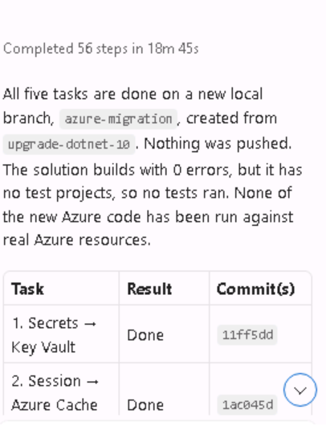

    Notice one honest line in the summary: none of the new Azure code has been run against real Azure resources yet. That's expected, because those resources don't exist until later modules. Each task also has its own `summary.md` in the `.github/modernize/code-migration` folder with more detail.

    If the summary is too technical, ask for a plainer version:

    ```plaintext
    Summarize the changes you made at a high level, not file level.
    ```

11. **Build and run the app on the VM.** Your code is now on the new branch the agent created. Because none of the Azure settings are filled in, the app should skip Azure entirely and work exactly as before: for example, it reads its database connection from local settings instead of Key Vault, and keeps shopping carts in memory instead of Redis.

    **First, check where the database connection lives now.** We still need it to run the app, since Key Vault isn't wired up to a real Key Vault yet. Ask Copilot:

    ```plaintext
    Where is the database connection string now? We still need it to run the app since Key Vault isn't wired up yet. Put it in user secrets and run this if needed.
    ```

    **Then build and run it.** Ask Copilot to build and run the app, and open the URL it gives you. The app should look and behave exactly as it did before this step: the products load, sign-in works for both demo accounts, and the cart keeps its contents.

    If the app fails to start or something looks off, it's usually trying to reach an Azure service that doesn't exist yet. Tell Copilot what you see, and ask it to check that every Azure service falls back to the app's current behavior when its settings are empty. You can also ask Copilot to run this check for you:

    ```plaintext
    Verify the changes you made actually work. Run the app and check the behavior, don't just re-read the code. For anything you can't verify without Azure resources, say so explicitly rather than assuming it works.
    ```

> 💡 Worth opening `appsettings.json` when the run finishes. Whatever the agent decided this app needs from Azure usually lands there as empty settings — a quick read tells you what the next module has to provision.

> 🎉 **That's it — the app is Azure ready.**
>
> Three modules ago this was a .NET Framework 4.8 app that only ran on Windows Server behind IIS. It now builds on .NET 10, renders through Blazor, and is wired to support Azure services. Next module you design the Azure platform those settings expect.

## 🔧 Troubleshooting common issues

### YARP errors

YARP is a tool that routes traffic when an old and a new version of an app run side by side. You chose the all-at-once upgrade in Module 2, so this app doesn't need it. If you see YARP errors:

- Ask Copilot to find where YARP is used in the app.
- Ask Copilot to remove the YARP packages, settings, and startup code.
- Rebuild the app after it is removed.

### Missing images or static files

If product images don't appear after modernization:

- Ask Copilot to check that images, styles, and other static files are in the `wwwroot` folder, which is where .NET 10 web apps serve them from.
- Ask Copilot to confirm that the app is set up to serve static files.
- Ask Copilot to check that the image paths in the pages match the files in `wwwroot`.

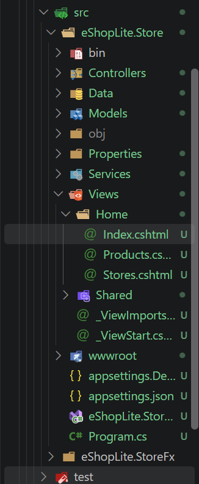

## ✅ Verification

By the end of this section, you should have:

- 🔹 Converted the MVC pages to Blazor components
- 🔹 Asked the agent directly whether the app is Azure ready
- 🔹 Closed the cloud readiness gaps it found
- 🔹 Kept the application buildable and its behavior unchanged throughout

> **Next module preview:** Module 4 designs the Azure resources this app now expects, such as the private networks, the identities it signs in with, and the service that runs it. You plan them and have Copilot write them as Bicep files. Your instructor has already set up the real Azure environment, so your Bicep stays as files in your repository to review, not something you deploy. The app itself is deployed in Module 6.
