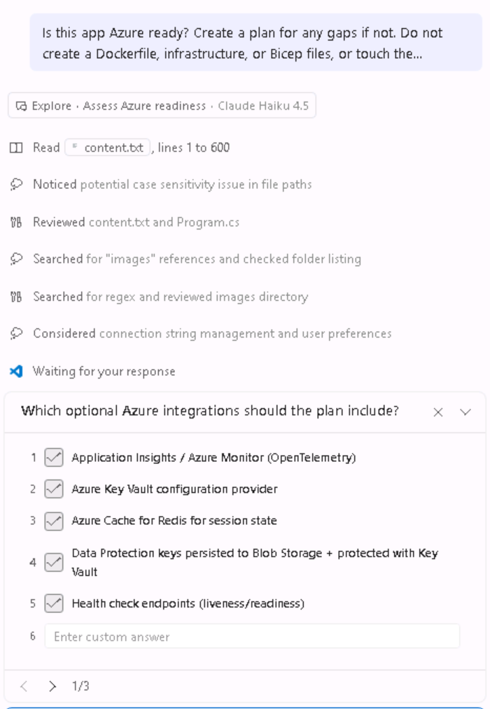

# ☁️ Lab 03: Get the App Ready for Azure

Module 2 got the storefront onto .NET 10. Because ASP.NET MVC 5 does not run there, that upgrade also had to move the app to dependency injection, `appsettings.json`, and the modern hosting model — whether you wanted it to or not. What it did not do is make the app ready to run **in Azure**.

> 🎯 **This module: make the app ready for the cloud.** You work on the **application code**: modernize the UI to Blazor, then close the gaps that would stop the app running well in Azure. Everything stays on your machine, and nothing is created in Azure. Module 4 then designs the Azure environment the app will run in.

In this chapter you will work in **GitHub Copilot Chat** throughout — mostly regular chat, where the job is ordinary refactoring, with the `@upgrade` agent available for the optional question that opens the module. Convert the MVC pages to Blazor components, then ask directly whether the app is ready for Azure and close the gaps that come back.

> 🧭 New to GitHub Copilot Chat? [Copilot Essentials](https://github.com/Azure-Samples/modernize-bootcamp/blob/main/docs/copilot-essentials.md) is a short reference on modes, models, context, cost, and course-correcting.

## 📋 What you'll do

- 🚀 Convert the MVC pages to Blazor components
- ☁️ Ask whether the app is Azure ready, and fix what comes back

## 1️⃣ Convert to Blazor pages

The storefront still renders through MVC views and controllers. They work fine on .NET 10, but they keep the front end on an older rendering model than the rest of the stack. You will convert those pages to Blazor components, and ask for a more modern look while you are at it.

With the Upgrade agent selected in the chat, use the following prompt to guide Copilot:

```plaintext
Convert the existing ASP.NET MVC pages to Blazor components in this .NET 10 application. This includes:

Identify the MVC views, controllers, models, and services involved.
Recommend whether Blazor Server interactivity or static server rendering is most appropriate for this app.
Convert all existing pages one page at a time to use Blazor (preferably Blazor Server or Blazor WebAssembly, depending on suitability).
Remove all non-Blazor pages and ensure routing is correctly configured.
Preserve layout, validation, images, and existing user-facing behavior.
Ensure all media (images, videos, etc.) are correctly referenced and rendered in the new Blazor components.
Fix issues where the page renders blank or fails to load due to routing or layout problems.
Leverage Blazor components to make it look more modern, sleek, and aesthetic.
```

> 💡 **NOTE**
>
> That last line is deliberately vague — "modern, sleek, and aesthetic" means whatever the model decides it means. Expect your result to look different from the screenshots below, and different from the person sitting next to you. That is fine. The point of this step is that you *can* modernize a UI by asking, not that everyone lands on the same UI.
>
> If you have something specific in mind, say so. Name the color palette, ask for product cards in a responsive grid, or paste in a screenshot of a design you like. The more specific the ask, the less the model has to invent.
>
> The same applies when something breaks. If a page renders blank, a component goes missing, or routing misbehaves, describe that specific problem in the chat and let Copilot fix it before moving on.


If the agent asks you to confirm any options, choose the one it recommends. If it does not give a recommendation, ask it which option it recommends and why.

Notice what the agent says: no upgrade scenario covers MVC → Blazor, so it will do this as a **direct code change**. The Upgrade agent ships with tested scenarios for common migrations, but it is not limited to them. It is strong at understanding languages and frameworks and converting between them, and it still runs structured checks as it works, such as reading the app before it edits and building to verify its changes. Because the Upgrade agent is built on top of GitHub Copilot, you can also ask it questions and give it requests outside its predefined scenarios, just as you would any other Copilot agent.

Copilot will convert the MVC pages to Blazor components, ensuring that all functionality is preserved and adding some new features. Expect this update to take ~10-30 min.

This is our final page (yours may look different):


### ✅ Build and test the Blazor conversion

If Copilot does not automatically do this verification, then prompt copilot to build and run the app:

```plaintext
1. Build the solution to ensure no compilation errors
1. Run the application and verify all functionality
1. Check that:
   - All pages load correctly and render as Blazor components
   - Images and static content display properly
   - Sign-in still works for alice and bob (password Password1!) and the cart still holds its contents
   - No MVC views or controllers are left behind in the routing
   - The application starts cleanly from the Visual Studio Code terminal
```

Use these demo logins when you check sign-in yourself:

| Username | Password | Role | Notes |
| --- | --- | --- | --- |
| `alice` | `Password1!` | Admin, Manager | Has existing order history |
| `bob` | `Password1!` | Employee | Has existing order history |


> 💡 The app does the same things it did at the end of Module 2 — that is the point. Everything so far changed *how* the app runs and renders, not *what* it does.

## 2️⃣ Get the app cloud ready

The app runs on .NET 10 and renders through Blazor, but its code does not yet know how to work with Azure services such as Key Vault or managed identity. Nothing so far has touched that, because a framework upgrade has no reason to.

**In this step you make code changes only.** You add the code the app needs to use Azure services, but you do not create the services themselves. We will create the IaC for services in later modules.

For example, if the app has the database password hard-coded in a config file today, in this step, you wire the code to read that secret from **Azure Key Vault** instead.

1. **Ask the question in plan mode.** In Copilot Chat, switch the mode dropdown to **Plan** and send:

   ```plaintext
   Is this app Azure ready? Create a plan for any gaps if not.

   Do not create a Dockerfile, infrastructure, or Bicep files, or touch the database -- these changes will come later. Create a new branch for the changes and please show a summary of changes after each phase.

   Keep every Azure integration optional: read it from configuration and fall back to current local behavior when that configuration is absent, so the app still builds and runs with no Azure resources. Don't hardcode endpoints, keys, or connection strings.
   ```

   

   Copilot may ask a few questions before it writes the plan, such as which optional Azure integrations to include. Keep the options it selects by default and continue.

2. **Read the plan.** The plan file should come back in the chat. Select **Open in Editor** to view it as a markdown file. It is reading your actual codebase, so what comes back is grounded rather than generic — expect concrete gaps like no HTTPS redirection, no forwarded headers, no health endpoint, and `"AllowedHosts": "*"`.

3. **Run the plan**. When the plan looks right, send:

   ```plaintext
   Proceed with the Azure readiness plan.
   ```

4. **Approve as it goes.** It will re-run the build and ask for approval to run commands. Grant them, and read the per-phase summaries as they appear instead of waiting until the end.

5. **Ask for a summary you can understand.** Once the upgrade completes, prompt Copilot for a high-level summary:

   ```plaintext
   Summarize the changes you made at a high level, not file level.
   ```

6. **Build and run it one more time.** The app should still look and behave exactly as it did before the run. If there are any build or unexpected errors, tell Copilot to check that it created fallbacks for local development. It may be hitting errors on Azure resources that do not exist yet. If sign-in, the cart, or anything else looks off, tell it in the chat and let it fix it before you move on. You can also ask Copilot to do this check:

   ```plaintext
   Verify the changes you made actually work. Run the app and check the behavior, don't just re-read the code. For anything you can't verify without Azure resources, say so explicitly rather than assuming it works.
   ```

> 💡 Worth opening `appsettings.json` when the run finishes. Whatever the agent decided this app needs from Azure usually lands there as empty settings — a quick read tells you what the next module has to provision. Keep that list; Module 4 opens by asking you for it.

> 🎉 **That's it — the app is Azure ready.**
>
> Three modules ago this was a .NET Framework 4.8 app that only ran on Windows Server behind IIS. It now builds on .NET 10, renders through Blazor, and is wired to support Azure services. Next module you design the Azure platform those settings expect.

## 🔧 Troubleshooting common issues

### YARP errors

If you encounter YARP (Yet Another Reverse Proxy) errors during an incremental ASP.NET Framework-to-ASP.NET Core migration and this workshop application no longer needs a side-by-side proxy:

- Ask Copilot to identify where YARP is referenced.
- Ask Copilot to remove unnecessary YARP packages, configuration, and proxy startup code.
- Rebuild the solution after removal.

### Missing images or static files

If product images don't appear after modernization:

- Ask Copilot to verify that static files are under `wwwroot`.
- Confirm that `app.UseStaticFiles()` is configured.
- Check that image paths in Razor views or Blazor components match the files under `wwwroot`.


## ✅ Verification

By the end of this section, you should have:

- 🔹 Converted the MVC pages to Blazor components
- 🔹 Asked the agent directly whether the app is Azure ready
- 🔹 Closed the cloud readiness gaps it found
- 🔹 Kept the application buildable and its behavior unchanged throughout

> **Next module preview:** Module 4 designs the Azure foundation this app now expects — networking, managed identity, and the container platform it will run on. You plan it and generate the Bicep for it; the live environment is already provisioned for you, so your implementation stays a local artifact to review rather than something you deploy. The app itself is deployed in Module 6.
