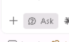

# ☁️ Lab 04: Design the Azure Foundation with GitHub Copilot

In Module 3, you set up the app's code to use Azure services, such as reading its database password from Key Vault. Those services do not exist yet. In this module, you use GitHub Copilot to write the infrastructure as code (Bicep files) for them, and to build the secure cloud foundation the app will be deployed into.

> 🎯 **This module: build the cloud foundation the app will run on.** Module 3 changed the **app's code**. This module designs the **Azure resources** around it: the networks, databases, Key Vault, and container hosting the app needs. You will work with GitHub Copilot in agent mode to write them as Bicep files.

The same foundation also supports the database migration in later modules, so it includes the servers, private network connections, and database targets that migration needs.

Your instructor has already set up the real Azure environment used by the later labs, so **you will not deploy the Bicep you write**. The goal is to practice designing infrastructure with GitHub Copilot while you stay in charge of the decisions. A tested, finished version of the Bicep is included so you can compare your work. Expect some differences: Copilot does not produce the exact same output every time, so your files will not match the finished version line for line.

## 🗺️ How This Lab Works

If you have not designed Azure infrastructure before, here is the whole process in plain terms:

- **Infrastructure as code (IaC)** means describing Azure resources (networks, databases, Key Vaults, container hosting) in files instead of clicking through the Azure portal. The files can be reviewed, versioned, and redeployed the same way every time.
- **Bicep** is Azure's IaC language. Each `.bicep` file declares the resources to create and how they connect.
- **The app tells you what to build.** In Module 3, Copilot wired the app to use Azure services through configuration, for example reading its database password from **Key Vault**. Each of those settings needs a real Azure resource behind it. If the app expects a Key Vault, the foundation must include one. If the app stores shopping carts in **Redis** so they survive across multiple app instances, the foundation must include a Redis cache.
- **The requirements tell you how to build it.** The required architecture and non-negotiable rules below cover security, networking, and resilience: private networking, no public IPs on VMs, no stored passwords, and at least two app replicas.

You will work through four steps with GitHub Copilot, and you approve each one before moving on:

1. **Explore:** Copilot reads the repository and lists what the app needs from Azure and what the requirements demand.
2. **Plan:** Copilot proposes the resources, networks, and identities, and how they map to those needs. You review and correct the plan.
3. **Generate:** Copilot writes the Bicep files for the approved plan, and you check that they build.
4. **Review:** Copilot reviews the Bicep against the plan and requirements. You decide which findings to fix, then compare your design with a known-good implementation.

This lab takes approximately **60 minutes**.

## 🎯 Objectives

By the end of this lab, you will be able to:

- map the Azure settings the app reads to the Azure resources that must exist to support them
- turn a list of requirements into an infrastructure plan you have reviewed
- compare the ways to run containers in Azure and explain why Azure Container Apps fits this app
- keep the app, migration, and database networks separate
- plan how the app adds and removes copies of itself within set limits, and stays available if one datacenter has a problem
- guide GitHub Copilot from an approved plan to working Bicep files
- spot where a real production design would need more review than this lab

## 🧭 Where This Fits

The earlier labs assessed and modernized the application. This lab designs the Azure platform that application now expects.

You design the foundation **for the storefront**, but you do not deploy the storefront in this module. The Container App your instructor already deployed runs a simple sample app (a placeholder) so the foundation can be checked on its own first. On Day 2, you will deploy the storefront onto the foundation you are about to design.

## 🏗️ Required Final Architecture


> [!IMPORTANT]
> **This architecture is designed for a workshop, not for production.** Some
> choices, such as regions, sizes, and network layout, were made to fit the lab's
> time, cost, and subscription limits. For a real customer, start from an
> [Azure landing zone](https://learn.microsoft.com/azure/cloud-adoption-framework/ready/landing-zone/)
> (Microsoft's recommended starting setup for an Azure environment), then review
> the design against the
> [Azure Well-Architected Framework](https://learn.microsoft.com/azure/well-architected/)
> and the customer's own requirements before deploying anything.

### Network baseline

A **virtual network (VNet)** is a private network in Azure. Each one gets a range of private addresses (its **address space**, written like `10.0.0.0/20`), which is divided into smaller sections called **subnets**.

| VNet | Region | Address space | Purpose |
| --- | --- | --- | --- |
| Primary database | North Central US | `10.0.0.0/20` | Bastion, VMs, Azure SQL private endpoint |
| Secondary database | Central US | `10.1.0.0/20` | SQL Managed Instance delegated subnet |
| Application | Central US by default | `10.20.0.0/20` | Internal, zone-redundant Container Apps environment |

The application region is a setting you can change. It must be a region that supports **Availability Zones** (separate datacenters within the same region). Central US is the default because North Central US doesn't support them for this setup. Don't name any subnet `default`, give each subnet one job, check that each subnet is big enough for the service that uses it, and leave room to grow.

## 🤔 Why Azure Container Apps?

You should still compare the options rather than accepting a service name without analysis.

| Option | Strength | Why it is not the baseline here |
| --- | --- | --- |
| Azure Container Apps | Azure runs the containers for you, can keep the app private, adds and removes copies automatically, and makes it easy to release and roll back versions | **Selected baseline** |
| App Service for Containers | Familiar web hosting, with staging slots for testing a release | Keeping several services private and managing container versions is less natural here |
| Azure Kubernetes Service (AKS) | Full control over Kubernetes, the most flexible way to run containers | This app doesn't need that level of control, and Kubernetes takes much more work to operate |

Azure Container Apps is the best fit because it runs the app privately and scales it automatically, without asking a small team to run Kubernetes. The app stays available because it runs as at least two copies (replicas) spread across separate datacenters (zone-redundant), adds more copies under load up to a set limit, and is reached only through **Azure Front Door**, a secure global entry point.

## 🔒 Non-Negotiable Requirements

These are the rules your plan and Bicep must follow. You don't need to understand every term in depth: Copilot uses this list when it designs, and you use it to check Copilot's work.

Your plan and implementation must:

- place both VMs in the primary database VNet and assign neither a public IP
- use Azure Bastion for browser-based RDP and SSH
- place SQL MI in its own delegated subnet in the peered secondary database VNet
- disable Azure SQL public network access and use Private Link and private DNS
- use one internal, zone-redundant workload-profile Container Apps environment in a dedicated application VNet
- expose the single application origin through Front Door Premium and Private Link
- run at least two placeholder-app replicas and use a bounded HTTP scaling rule
- use a Microsoft sample image on port `8080`; do not deploy the workshop application code
- use GitHub Actions OIDC, not a client secret
- scope the deployment identity to the lab resource groups
- use managed identities and deterministic, narrowly scoped role assignments
- store generated VM credentials in Key Vault and never print or commit them
- keep SQL MI in a separate manual workflow
- parameterize names, locations, CIDRs, SKUs, capacity, and required tags

## 🧪 Challenge 1: Explore Before You Plan

Continue in the same VSCode chat you were using. Use **Ask** mode to learn
what is already in the repository and to identify the evidence behind the
requirements.



```text
Explore this repository for Lab 04 without changing any files.

Identify:
- the Lab 04 requirements in infra/lab04/requirements.md
- the Azure resources implied by application configuration
- security, identity, networking, availability, operations, and cost constraints
- assumptions or conflicts that require human review

For each conclusion, cite the repository file that supports it. Separate observed
facts from recommendations. Do not create an implementation plan yet.
```

Read Copilot's list. If something isn't backed up by a file in the repository, or
a requirement is missing, ask a follow-up question. This keeps the plan based on
your actual repository instead of a generic Azure design.

## 🧪 Challenge 2: Produce and Review the Plan

Open Copilot Chat in **Plan** mode and submit:

```text
Analyze this repository and plan the Azure foundation for Lab 04.

Use the repository inventory we just reviewed.

Treat the Required Final Architecture and Non-Negotiable Requirements in
infra/lab04/requirements.md as a minimum, not a complete design. For every
application setting that implies an Azure resource, provision that resource at a
lab-sized SKU. Report what you added, what you deliberately left out, and why.

Before proposing Bicep files:
1. Compare Azure Container Apps, App Service for Containers, and AKS.
2. Produce a CIDR and subnet table with no overlaps.
3. Produce an identity and least-privilege RBAC matrix.
4. Separate the base deployment from the optional SQL Managed Instance deployment.
5. Explain failure modes, recovery, regional routing, scaling limits, cost drivers,
   secure administration, and cleanup.
6. List assumptions and unresolved questions.

Plan only Bicep files under infra/lab04/student/. Use modules where they create clear
resource boundaries, parameterize environment-specific values, and keep secrets out
of source and parameter files. Do not create or modify files. Stop for review.
```

Don't accept the first answer automatically. Reject a plan that:

- puts public IPs on the VMs
- enables Azure SQL public access
- uses one Container Apps environment for two regions
- calls two replicas “multi-region”
- gives broad Contributor access to the whole subscription
- uses an Azure client secret (a stored password for an app)
- deploys SQL MI automatically with the base environment
- puts passwords or other credentials in parameters, outputs, logs, or repository files

Even with these rules, some choices are still up to you. Make sure the plan
explains why it chose:

- how the Bicep is split into files (modules)
- the size of each subnet
- the VM and database sizes (SKUs)
- the maximum number of app copies, and how much traffic triggers adding one
- how resources are named, including the unique suffix that keeps names from clashing

Use focused follow-up prompts instead of asking Copilot to "make it better":

```text
Revise the plan with a decision record for every unresolved item. For each decision,
show the selected option, alternatives considered, evidence, tradeoffs, and the
condition that would cause us to revisit it. Do not implement anything.
```

```text
Review this plan as a skeptical Azure architect. Identify gaps against the Required
Final Architecture, Non-Negotiable Requirements, Azure Well-Architected pillars, and
the workshop architecture callout. Pay particular attention to network paths, DNS,
failure domains, recovery objectives, least privilege, secret handling, and bounded
scaling. Do not revise the plan until I approve the findings.
```

Fix the issues Copilot finds and save the approved plan before you switch modes.
Nothing gets generated until you approve the plan.

## 🧪 Challenge 3: Generate the Bicep

Switch to **Agent** mode:

```text
Implement the approved Lab 04 plan only under infra/lab04/student/.
Generate Bicep only. Do not deploy resources, run deployment scripts, modify workflows,
or edit infra/lab04/complete/.

Use current stable resource API versions, no committed secrets, Entra-only Azure SQL
authentication, internal Container Apps environments, bounded scaling, deterministic
role assignments, and parameter files with lab-sized defaults.

Follow the approved module boundaries and entry-point contracts. After generation,
build every Bicep entry point and show me the diff, validation output, and all
remaining warnings. Stop before making any unplanned correction.
```

Inspect the result:

```powershell
Get-ChildItem .\infra\lab04\student -Recurse
git diff -- .\infra\lab04\student
Get-ChildItem .\infra\lab04\student -Filter *.bicep -Recurse |
  ForEach-Object { az bicep build --file $_.FullName --stdout | Out-Null }
```

Building checks that the Bicep is written correctly. It does **not** prove that it
would deploy: a name might already be taken, the subscription might not have
enough capacity, or company policies might block a setting.

Use the [Lab 04 requirements](https://github.com/Skillable-Events/caldova-retail/blob/main/infra/lab04/requirements.md)
(`infra/lab04/requirements.md` in your fork) as the implementation checklist.

## 🧪 Challenge 4: Run the Human Review

Ask Copilot for a review before asking it to fix anything:

```text
Review my generated files under infra/lab04/student/ against the approved plan
and the Required Final Architecture and Non-Negotiable Requirements in
infra/lab04/requirements.md.

Report findings first, ordered by severity. Cite the affected file and explain the
deployment or runtime consequence. Check Bicep correctness, dependency ordering,
network and private DNS paths, least-privilege RBAC, secret exposure, availability,
bounded scaling, parameterization, and deterministic naming. Do not edit files.
```

Read each finding, decide which fixes you agree with, and ask Copilot to make only
those. After each round of fixes, rebuild the Bicep and look at what changed.

Finally, compare your approach with
[the complete implementation](https://github.com/Skillable-Events/caldova-retail/blob/main/infra/lab04/complete/README.md)
(`infra/lab04/complete/` in your fork). Differences
are things to discuss, not automatically mistakes. Be ready to explain:

- which requirements both implementations satisfy
- where module boundaries or parameter choices differ
- which design you would take to a formal architecture review
- what evidence is still missing before a production deployment

## 🏫 About the Preprovisioned Environment

Before the workshop, your instructor used the finished version of this Bicep to set up the shared Azure environment for the later labs. It includes the resource groups, the Key Vault, the VM passwords, and the identities and permissions everything uses.

You do **not** deploy the Bicep you write, run the setup scripts, or delete anything from the shared environment. Your Bicep stays as files in your repository, separate from what the later labs use.

At the start of Lab 06, GitHub is given permission to deploy the app to this environment. It uses **OIDC**, which lets GitHub prove who it is to Azure each time it runs, so no password ever has to be stored in GitHub. That permission only covers releasing the app; it is not used to deploy your Lab 04 Bicep. The identity GitHub uses can only do three things: push app images to the container registry, update the storefront's Container App, and read the Front Door settings to test the result.

## 🐢 Predeployed SQL Managed Instance

Your instructor also set up an **Azure SQL Managed Instance** (SQL MI), a managed version of SQL Server in Azure. It uses the free offer when the subscription allows it, and a paid tier otherwise.

To connect to it from the VM, you need to allow your VM's public IP address through its firewall. Run:

```powershell
az login
.\assets\scripts\Enable-Lab04SqlMiPublicAccess.ps1 `
  -SubscriptionId '<subscription-id>'
```

The script asks before it looks up your IP address. It then adds one firewall rule (an NSG rule) that allows only your address to reach the database on port 3342. Each participant gets their own rule, so you won't overwrite anyone else's. If your IP address changes, run the script again. Your instructor must give you **Network Contributor** access to the SQL MI firewall for this to work.

Connect to the address the script shows you, and sign in with your Microsoft Entra (Azure) account. Signing in with a SQL username and password is turned off.

## ✅ Review Checklist

- [ ] Every generated Bicep file builds without errors.
- [ ] The Bicep matches the approved plan, or any difference is written down and approved.
- [ ] Every Azure setting the app reads (for example Key Vault, Application Insights, or Redis) is backed by a planned resource, or the gap is recorded with a reason.
- [ ] Front Door reaches the app over a private connection (Private Link), not the public internet.
- [ ] The placeholder app always runs at least two copies (replicas), with a set maximum.
- [ ] The Container Apps environment is private and spread across separate datacenters (zone-redundant).
- [ ] Neither VM has a public IP address; you reach both through Azure Bastion.
- [ ] Azure SQL can't be reached from the public internet, and its private network name (private DNS) is set up correctly.
- [ ] SQL MI is deployed separately from everything else and uses Microsoft Entra sign-in.
- [ ] Network address ranges don't overlap, and every connection between networks is deliberate and explained.
- [ ] GitHub Actions signs in to Azure with OIDC, and no Azure password (client secret) is stored anywhere.
- [ ] Each identity gets only the permissions it needs, on only the resources it needs (least privilege).
- [ ] No password or other credential appears in code, workflows, parameters, logs, or outputs.
- [ ] Assumptions about reliability, security, cost, and performance are written down for a later review.
- [ ] A successful Bicep build is not treated as proof that it would deploy or is ready for production.

## 📖 References

- [What is an Azure landing zone?](https://learn.microsoft.com/azure/cloud-adoption-framework/ready/landing-zone/)
- [Azure Well-Architected Framework](https://learn.microsoft.com/azure/well-architected/)
- [Choose an Azure container service](https://learn.microsoft.com/azure/architecture/guide/technology-choices/compute-decision-tree)
- [Azure Container Apps networking](https://learn.microsoft.com/azure/container-apps/networking)
- [Azure Front Door with private Container Apps origins](https://learn.microsoft.com/azure/container-apps/front-door-custom-virtual-network-private-link)
- [Authenticate to Azure from GitHub Actions with OIDC](https://learn.microsoft.com/azure/developer/github/connect-from-azure-openid-connect)
- [Managed identities for Azure resources](https://learn.microsoft.com/entra/identity/managed-identities-azure-resources/overview)
- [Azure Bastion](https://learn.microsoft.com/azure/bastion/bastion-overview)
- [Azure SQL private endpoints](https://learn.microsoft.com/azure/azure-sql/database/private-endpoint-overview)
