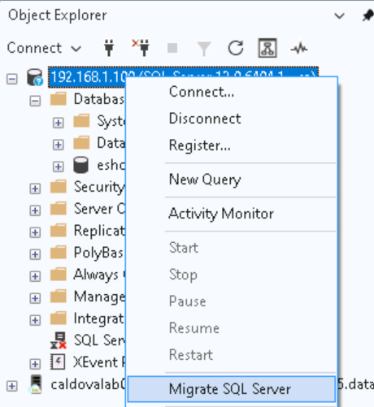
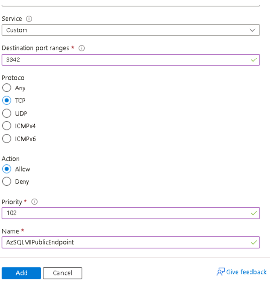
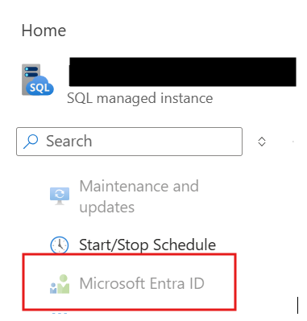
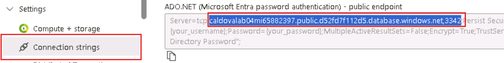
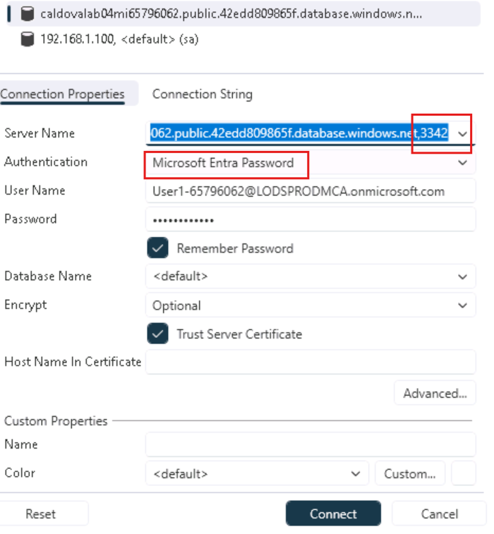
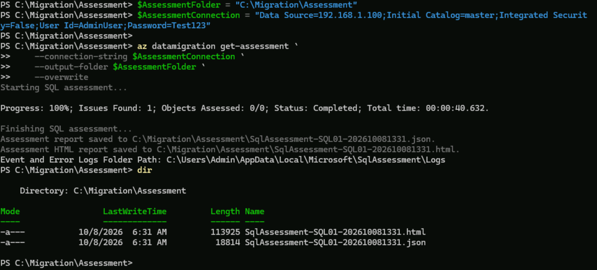
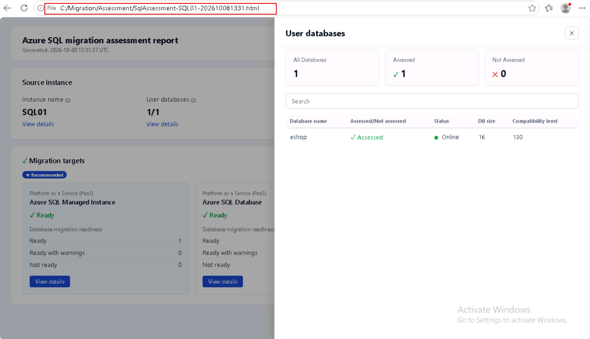
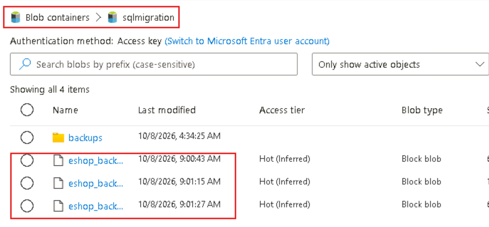

# Lab 05: Database Modernization Bootcamp

## SQL Server to Azure SQL Database — Student Migration Challenges

**Scenario:** Migrate the eShop database from SQL Server on VM to Azure SQL Database by using Azure Database Migration Service (DMS).

Now that the application is upgraded and moved to Azure PaaS services, it is time to modernize and migrate the database. 

***Security rule:*** *Never expose passwords, storage keys, SAS tokens, or connection strings in screenshots or submissions. Do not enable public RDP or public Azure SQL access unless the instructor explicitly requires it.*

Learning objectives

Students will learn to:

* Gather information about a SQL server database.
* Learn about diffenent authentication mechanisms in SQL server.
* Learn about different types of backups and migration techniques.
* Run an assessment of the source SQL Server database, analyze the report.
* Create Azure Data Migration Service (DMS)
* Run DMS online migration to SQL MI and verify migration. 

## Challenge 1 — Validate the source database

### Student tasks

1. Using SQL Server Management Studio, connect to the source database using the instructor-approved method.
2. Confirm that SQL Server services are running on the source database VM - windows service named "SQL Server (MSSQLSERVER)".
3. Connect to the local SQL Server with SQL Server Management Studio (SSMS) using "sa" SQL login given to you.
4. Record the SQL Server version,edition - right click on the server and type "new query". Execute the following SQL.

```sql
Use master;
select @@version ;
```
5. Right click on database eshop and click on peroperties to determine database size, collation, disk file name and size of database files and "recovery mode", as shown.

[](./images/Challenge_1_db_properties.png)

6. While there, also note down all the "page" names displayed when checking on database "properties" section.
7. From the "Files" section, note down the data files and transaction log file name.
8. You connected to the SQL server using SQL authentication. What are other ways to authenticate to a SQL server?
9. (Research on this) What is a logical and physical backup of SQL database ?
10. How is recovery mode and logical and/or physical backup related ?
11. Put the database into full recovery mode in SSMS running this query.

```sql
ALTER DATABASE
 eshop 
SET RECOVERY 
 full ;
```
12. Verify that the eshop database was placed in full recovery mode.

```sql
SELECT 
  name, recovery_model_desc 
FROM 
  sys.databases 
WHERE 
  name = 'eshop' ;
```

13. Run this query using SSMS. Investigate the results. Which table has the most number of rows ?

```text
DBCC CHECKDB (N'eShop') ;
```

## Success criteria

* SSMS connects to the source instance.
* The student records the source version, edition, size etc.
* You can explain at least four different authentication mechanisms and show at least two ways to connnect.
* You can explain recovery model and different types of backups.

## Challenge 2 — Pre-migration assessment of the source database 

SSMS 22 is the latest version of Microsoft’s SQL Server Management Studio, a 64-bit graphical tool for managing, developing, and administering SQL Server and Azure databases. We will use it in the lab to perform the database assessment, querying and performing the necessary backups to upload to Azure storage for the migration. To launch the tool, locate on the labs desktop the shortcut:

 

### Student tasks


1. Using SSMS, connect to the SQL Server 2016  that resides on a VM in this lab environment. The connection to "on-premises" SQL server is preconfigured in the lab. Right click on the server and choose "Migrate SQL Server".

 

2. #### <u>Do not Migrate or Upgrade the database</u>.

Run a "Migration rediness assessment". An html file will open in your browser once the assessment completes. This is the report.

 

3. Investigate the report. Find out compatibility issues with different SQL targets. 


4. Prepare to connect to the target SQL Managed Instance

The Azure SQL Managed Instance configured in this lab is configured to authenticate using <u>Entra only.</u>

Notice that there are several ways you can authenticate to SQL server using Entra. In this lab, you must select authentication method <b>Entra with Password.</b>  The public endpoint is used to connect from the virtual lab environment therefore when connecting using SSMS, port 3342 needs to be used. 

#### Validate firewall access to SQL MI before begining.

 Validate from the portal, that the NSG for the VNet that Azure SQL Managed Instance is allowing inbount access to port 3342.  If not, add an inbound rule for port 3342. From the overview page of SQL MI, click on virtual network/subnet. On the subnet page, find the Network Security Group name. Pull up that NSG by name and add an imbound port rule like this:

 

5. Select the right user login to connect to SQL MI. To find out the Entra ID to use for login, navigate from the portal to the deployed Azure SQL Managed Instance and go to Microsoft Entra ID on the left under Security. 
*Note* This will be the same user as your <b>azure login </b>. 



6. To retrieve the public endpoint FQDN and port number to use as part of the connection information, navigate to the Azure SQL Managed Instance in the portal.  Go to *Connection strings* an lookup the public endpoint examples.



Use that Entra ID and password to login using SSMS. Under "Databases" there is no database listed now.




7. Connect to the target SQL MI using SSMS. Notice that there are no databaes there.


## Success criteria

* You learn how to run an assessment using SSMS 22.
* Understand the assessment report and the comptatibility issues.
* You are able to connect to the SQL MI from the lab VM using Entra ID.

## Challenge 3 — Create the required azure resources

Azure SQL Managed Instance, the target database service, is already provisioned on your lab subscription to save time. You will need to validate that *System Assigned Managed Identity* is enabled for the server.  

In this part of the lab you will create the necesary Azure resources to perform the migration. Deploy the resources in the same region that Azure SQL MI is deployed.  You will:

- Create a resource provider (if it does not exist) in the subscription for DMS.
- Deploy an Azure storage account and a blob container to store database and transaction log file backups.
- Deploy an Azure Database Migration Service (DMS) to migrate the database.


### Student tasks

#### 1. Resource provider

From the Azure portal, go to *Subscriptions*.  Expand on settings. Click on *Ressource Providers* and confirm that *Microsoft.DataMigration* is registered.  If it is not, then register it.


#### 2. Azure SQL MI System Assigned Managed Identity

Locate the pre-deployed Azure SQL Managed instance in your lab subscription. Go to the *Identity* blade under Security and confirm that *System Assigned Managed Identity* is enabled.  If it is not then enable it.


#### 3. Storage Account

Provision an Azure Storage Account <b>in the same region as your SQL MI </b>and create a Blob container in it to store source database backup. 


Once the storage account is created, you will need to grant to your current Azure user the permission to manage Blob containers.  Do this via IAM.  Assign the *Storage Blob Data Owner* (or Contributor) role to your own Entra ID.


Similarly, you will need to grant permission so that the Managed Identity of the SQL MI can retrieve the backup, i.e. it has role "Storage Bolb Data Reader" role assigned. The identity has the same name as the SQL MI instance your lab subscription.


Create a Blob container in the storage account and a folder within the container.


#### 4. Database Migration Service (DMS)

<b>In the same region where Azure SQL MI</b> is deployed in the lab subscription, deploy Azure Database Migration Services (DMS).


## Success criteria

- Resource provider is registered for data migrations.
- SQL MI configured for System Assigned Managed Identity.
- Storage account is created in the same region as MI, with a Blob container in it.
- DMS is deployed in the same region as SQL MI.


## Challenge 4 — Online Migraton to SQL Managed Instance

In this challenge you will perform database backups to the Azure Storage account provisioned earlier.  You will then use DMS to perform an *Online* migration. To perform and online migration, DMS restores backups then takes advantage of the *Log Replay Service* (LRS) to replay transaction logs and complete the migration. 

### Student tasks

#### 1. Backup the database to Azure Storage using SSMS 22

Launch SSMS from the desktop:

 

Connect to the source database that resides in the VM. Expand the tree and Database folder and locate the *eShop* database. Right click and select Tasks->Backup.


Select *Full* for backup type and *URL* for *Back up to*. Click on *Add* to select the Azure Storage account and Blob container.


Click on *New Container*.


Login to the lab's subscription and select the storage account and container created earlier. Generate SAS credentials and save them in notepad. Click OK.


<b>Note:</b>

 DMS can restore a backup stored either in the root level of a container or inside a container - not any level further below it. 
 
 Complete the backup, prefix the file with "full_" so you can identify the file easily in the azure portal for the storage container. The backup should take less than a minute. 


Repeat the task this time taking a differential backup - with a name prefix line "diff_" .


The backups should be listed in the Blob container in the storage account.
Notice the size of the full and the differential backups. 

Do you think it is ever possible to have a differential backup larger than full backup ?


### 2. Migrate the database online using DMS

Navigate to the Azure portal to the DMS service created earlier.  Select "New Migration".


Next, choose the migration scenario - from Sql Server to Azure SQL MI.
Choose <b>Blob</b> as backup location and <b>online</b> as backup mode.


On the next page, configure details as shown. 

<b>Note: </b>

 DMS needs to configure a SQL datanase to track progress of migration for restartability. 
 
 What you are entering here is information for that tracking database - not your source or target database. You need not manage this instance for this lab. 

**Also note**

- This tracking database can be in a different region also. 
- Furthermore, if for some reason you want to try the migration again, you would need to provide a new tracking database name.


Select the Azure SQL managed Instance that already exists as a target.


Specify the location of the backup files ( full backup only is fine in this case ) in the Azure storage account as well as the target database name you eShop. Notice that the DMS restore creates the eShop database, in other words the database should not exist already there.


Start the migration. 


Follow the migration progress. Notice the migration details.


If all is well,  the full backups would have been restored.


The migration is not complete yet.  

Since this is an online migration with minimal outage, we need to apply any incremental data that was added sunce the migration started. This means backup of transaction logs need to be restored. 


In this lab, we will add some data to simulate that.

Go to the source database and add a new row to a table. Use SSMS 22 to launch a query window and run the command. 

You can enter a few more rows if you want.

```sql
INSERT INTO
 dbo.store 
VALUES
 ( 'Test', 'Test', 'Test', 'Test' ) ;
```

Next we need to backup the transaction logs to the storage account, in the same folder/location as the database backups.  Use SSMS to do this as well. Opt for *Transactions Logs* as the back up type.

<b>Mote: </b> 

Prefix the file name with "log_" so you can identify the file easily.


You can follow the progress of the log replay from the portal, same place as where the progress of the migration was being followed.

<b>Note: </b> 

- When you take a backup of the source database, DMS may take a minute or two to see the backup.

- Notice the order of restore operaion of DMS - first full, then differential, then logs - in the same order that the backup was taken. 


Wait till all transaction logs have all been restored and no files left ( as seen in azure storage ) to restore.

Perform the cutover. Wait for it to complete.


Navigate to the Azure SQL Managed instance and confirm the database is there and in good state. Click on *Databases* in the left to list all databases on this managed instance.


Go back to SSMS 22.  Connect to the Azure SQL Managed Instance and eShop database using Entra. Explore the tables and make sure they are all there.  Confirm the row you added above is also present. 

Run this following query to confirm the new row(s) you added

```sql
SELECT 
 *
FROM
 dbo.store 
WHERE 
 name like 'Test%' ;
```

#### Congratulations - you have migrated to Azure SQL

## Challenge 5 - Perform online migration using CLI

### VM SQL Server to Azure SQL Managed Instance with Azure DMS Via CLI

### Objective

Migrate on-premises SQL Server databases to Azure SQL Managed Instance using Azure CLI and Azure Database Migration Service (DMS). The flow includes assessment, remediation, provisioning, data migration, cutover, and post-migration validation.

#### End-to-End Flow

```text
Compatibility assessment
        |
Remediate blockers and reassess
        |
Prepare storage and backups
        |
Create Azure Database Migration Service
        |
Start online migration
        |
Monitor backup restoration
        |
Cut over applications
        |
Validate
```

For simplicity, the exercise will use the same Database Migration Service (DMS) and the same storage account 
and backups as the previous exercise.

The challenge uses Azure CLI from PowerShell. The `az datamigration` command group is an Azure CLI extension and requires Azure CLI 2.75.0 or later.

### 1. The Migration Mode

| Mode | Behavior | Downtime |
|---|---|---|
| Online | DMS restores a full backup and continually restores transaction-log backups. An explicit cutover completes the migration. | Usually limited to final cutover |

Use online migration when the source database must remain available while data is copied.

### 2. Prerequisites

Before starting:

1. Locate the Azure SQL Managed Instance already provisioned in your lab environnment's subscription.
3. Establish connectivity by using SSMS 22 installed on the lab VM's desktop, use the sa account.

.


### 3. Install and Configure Azure CLI

```powershell
az version
az upgrade

az extension add --name datamigration --upgrade

az login

az provider register --namespace Microsoft.DataMigration

az provider show `
    --namespace Microsoft.DataMigration `
    --query registrationState `
    --output tsv
```

The expected provider registration state is `Registered`.

### 4. Run the Migration Assessment

The assessment runs locally and does not require a DMS resource.

Using SSMS 22, connect to the *master* database in a query window and create a sysadmin user.
Avoid using special characters in the user and password in these exercises as to not spend time escaping characters
in the commands that need to run from command line.  Use this account to perform the assessment.

```
USE [master]
GO
-- Step 1: Create a SQL Server Login
CREATE LOGIN [AdminUser]
WITH PASSWORD = 'Test123';

-- Step 2: Add the Login to the Sysadmin Role
ALTER SERVER ROLE [sysadmin]
ADD MEMBER [AdminUser];
GO
```

Create a folder locally on the machine where the output will be generated ex. *C:\Migration\Assessment*.
Connectivity to the SQL server will use SQL Server authentication.  The *AdminUser* account created above will be used.  
Run the cmdlet below, replace all values with those of your lab environment. You will be prompted for the password.

#### SQL Server Authentication

```powershell
$AssessmentFolder = "C:\Migration\Assessment"

$AssessmentConnection = "Data Source=<put SQL Server IP here>;Initial Catalog=master;Integrated Security=False;User Id=<put user here>;Password=<put password here>"

az datamigration get-assessment `
    --connection-string $AssessmentConnection `
    --output-folder $AssessmentFolder `
    --overwrite
```



Review the resulting HTML or JSON for:

- Server-level assessment issues
- Database-level assessment issues
- `TargetReadinesses.AzureSqlManagedInstance`
- Warnings and errors
- `DatabaseRestoreFails`
- Impacted objects
- Recommended remediation



Pay particular attention to unsupported features, cross-database dependencies, CLR, linked servers, SQL Agent dependencies, Windows authentication dependencies, file layouts, database sizes, and encryption.

Resolve blocking issues and rerun the assessment. Retain the before-and-after reports as migration evidence.

## 5. Collect Performance Data and Obtain SKU Recommendations (optional)

The extension provides these commands:

```powershell
az datamigration performance-data-collection --help
az datamigration get-sku-recommendation --help
```

Collect performance data during normal operations, peak business hours, batch windows, reporting periods, and maintenance activity.  
There is no load placed on the database for this lab hence nothing meaningful will be produced.

Use the results to select:

- General Purpose or Business Critical
- vCore count
- Storage capacity and performance tier
- Zone redundancy

Include enough headroom for workload growth and operational spikes.


## 6. Perform an Online Migration using Azure CLI
These are the overall steps of an online migration using DMS from Azure CLI.

1. Take a full backup.
2. Take a differential backup.
2. Upload it to the migration Blob container at the *root*.
3. Continue taking transaction-log backups.
4. Upload each log backup in sequence.
5. Do not break the transaction-log chain.
6. During cutover, stop writes and take a final tail-log backup.

#### Backups

Unlike backing up the database files into a folder in an Azure Storage Account BLOB container  when running DMS from the portal, running DMS from the CLI requires that the backup files reside in the root of the container.  Copy the existing backups from the earlier exercise to the root of the BLOB container. Optionally, create new full, differential and transaction log backups and place them at the root of the container.  Either will work.


 
## 9. Start an Online Migration

Get the environment information.  Fill in all information for the variables according to your environment. Start the migration.

```powershell
$StorageAccount = "<storage account name>"
$StorageResourceGroup = "<storage account resource group>"
$MiResourceGroup = "<Azure SQL Managed Instance resource group>"
$ManagedInstance = "<Azure SQL Managed Instance name>" 
$MigrationResourceGroup = "<Database Migration Service Resource Group>"
$MigrationService = "<Database Migration Service Name>"

$StorageAccountId = az storage account show `
    --resource-group $StorageResourceGroup `
    --name $StorageAccount `
    --query id `
    --output tsv

$ContainerName = az storage container list `
    --account-name  $StorageAccount `
    --auth-mode login `
    --query "[].name" `
    --output tsv

$ManagedInstanceId = az sql mi show `
    --resource-group $MiResourceGroup `
    --name $ManagedInstance `
    --query id `
    --output tsv

$ManagedInstanceLocation = az sql mi show `
    --resource-group $MiResourceGroup `
    --name $ManagedInstance `
    --query location `
    --output tsv

$MigrationServiceId = az datamigration sql-service show `
    --resource-group $MigrationResourceGroup `
    --sql-migration-service-name $MigrationService `
    --query id `
    --output tsv

$StorageAccountKey = az storage account keys list `
    --resource-group $StorageResourceGroup `
    --account-name $StorageAccount `
    --query "[0].value" -o tsv

$SourceLoc = @{
    AzureBlob = @{
        storageAccountResourceId = $StorageAccountId
        accountKey = $StorageAccountKey
        blobContainerName = $ContainerName
    }
} | ConvertTo-Json -Depth 10 -Compress


$SourceLocation = $SourceLoc.Replace('"', '\"')

$SourceDatabase = "eShop"
$TargetDatabase = "eShopCLI"

az datamigration sql-managed-instance create `
    --managed-instance-name $ManagedInstance `
    --resource-group $MiResourceGroup `
    --target-db-name $TargetDatabase `
    --scope $ManagedInstanceId `
    --migration-service $MigrationServiceId `
    --source-database-name $SourceDatabase `
    --source-location $SourceLocation
```
### 10. Monitor the Migration

The same information retrieved from the CLI can also be viewed in the portal.

```powershell
az datamigration sql-managed-instance show `
    --managed-instance-name $ManagedInstance `
    --resource-group $MigrationResourceGroup `
    --target-db-name $TargetDatabase `
    --expand MigrationStatusDetails
```
### 11. Cutover

During the controlled change window, these are the typical steps:

1. Stop application writes.
2. Disable jobs and integrations that write to the source.
3. Drain application connections.
4. Take a tail-log backup.
5. Upload the tail-log backup.
6. Wait for DMS to restore it.
7. Record final validation values.
8. Initiate cutover.

Once all 3 backups have been restored, perform the cutover.

Get the migration operation ID:

```powershell
$MigrationOperationId = az datamigration sql-managed-instance show `
    --managed-instance-name $ManagedInstance `
    --resource-group $MigrationResourceGroup `
    --target-db-name $TargetDatabase `
    --expand MigrationStatusDetails `
    --query "properties.migrationOperationId" `
    --output tsv
```

Perform the cutover:

```powershell
az datamigration sql-managed-instance cutover `
    --managed-instance-name $ManagedInstance `
    --resource-group $ResourceGroup `
    --target-db-name $TargetDatabase `
    --migration-operation-id $MigrationOperationId
```


### 12. Post-Migration Validation

Use SSMS 22 to connect to the eShopCLI database.  Explore the migrated objects.
