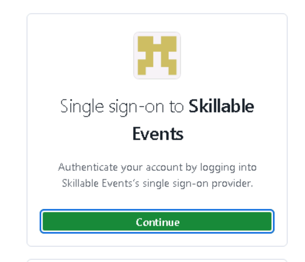
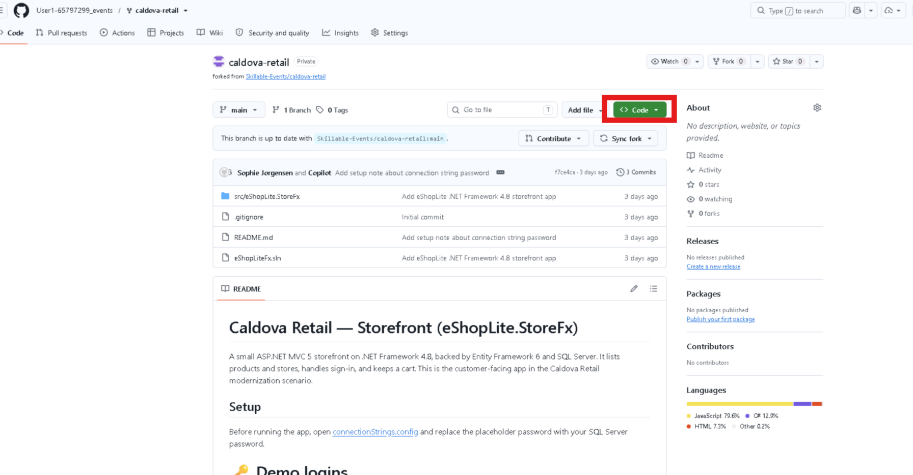
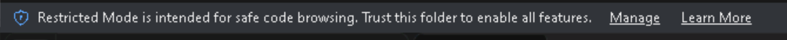
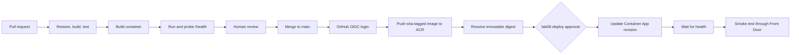

# 🚀 Lab 06: Deploy Code with GitHub Actions

Lab 04 examined the design of a secure Azure platform, and the instructor-preprovisioned environment supplies that platform for this lab. Lab 05 migrated the `eshop` database, and the Container App still runs a placeholder image. In this challenge, you will create a CI/CD workflow that validates the modernized retail application, builds a container, pushes an immutable image to the existing Azure Container Registry, and releases a new Azure Container Apps revision.

This lab takes approximately **60-75 minutes**.

## 🎯 Objectives

By the end of this lab, you will be able to:

- separate pull-request validation from deployment
- create a repeatable multi-stage .NET container build
- test a container before publishing it
- authenticate GitHub Actions to Azure with OIDC
- push an immutable image to ACR without registry passwords
- deploy an image by digest rather than by a mutable tag
- update an existing Container App without recreating its infrastructure
- verify revision health and roll back safely

## ✅ Prerequisites

- completed the planning, Bicep generation, validation, and review walkthrough in [Lab 04](../../day-1/04-deploy-to-azure/README.md)
- access to the instructor-preprovisioned Lab 04 platform
- completed [Lab 05](../05-modernize-data/README.md), including the managed-identity database user
- Azure access to read the Lab 04 deployment and configure federated credentials
- GitHub `ADMIN` permission on the repository
- your own fork of the modernized retail app (cloned in [Setup](#-setup) below)
- GitHub Actions enabled for the repository

The known-good application is under:

```text
src/eShopLite.StoreFx
```

That is the Module 3 end state: the storefront on .NET 10, rendered with Blazor, and already Azure ready. If you modernized the root application in place, use its corresponding solution and project paths instead.

## 🛠️ Setup

> This lab configures GitHub OIDC on your repository and runs a CI/CD workflow from it, so you need a repository you own with admin rights. Run this module against **your own fork** rather than the workshop repository.

**1. Sign in to the workshop repository.** Open a new tab in Microsoft Edge and type this link in your browser +++https://github.com/Skillable-Events/caldova-retail-modernized+++

1. On the Skillable Events single sign-on page, select **Continue**.

   

   > 💡 If the sign-in keeps returning to the same page or shows an error, wait a few minutes and try again; this is a transient error. If it takes you to the Skillable GH Enterprise main page [Skillable-Events GH](https://github.com/enterprises/Skillable-Events) search for "caldova-retail-modernized" in the search bar and access the repository that way.

2. In the **Sign in** box, enter the **Username** listed under **Azure portal** on the **Resources** tab of your lab instructions, then select **Next**.
3. Enter the **Password** from the same **Azure portal** section. If you are asked for a **Temporary Access Pass**, enter the **TAP** value instead. If it prompts you to stay signed in, hit **Yes**.

**2. Fork and clone the repository.**

1. On the repository page, select **Fork**, then **Create fork** with the defaults left alone.

   

   

2. In your new fork, select **Code**, then copy the **HTTPS** URL. It should look something like `https://github.com/User1-12345678_events/caldova-retail-modernized.git`.

   

   

3. Open PowerShell from your applications and clone your fork, pasting the URL you copied into it (run this from the default location -- C:\Users\Admin):

   ```powershell
   git clone <your-fork-url>
   ```

   If you are asked to sign in, choose **Sign in with your browser**, approve the authorization (select **"Authorize git-ecosystem"**), then return to PowerShell. The clone starts once you are signed in.
   > 💡 If you face any errors here, the sign in may not have persisted. If that is the case, re-type in the original repo link, +++https://github.com/Skillable-Events/caldova-retail-modernized+++, follow the sign in, click the button to stay signed in, and then run the Powershell command again.

**3. Open the storefront folder in VS Code.** Run this command in PowerShell to open the application in VSCode:

```powershell
cd caldova-retail-modernized
code .
```

If `code` is not recognized, start VS Code from your applications and use **File → Open Folder…**, then pick the `caldova-retail-modernized` folder. If VSCode asks you to sign into GitHub again, authorize access there as well.

If VS Code opens the folder in **Restricted Mode**, select **Manage** in the banner at the top of the window, then select **Trust**. Once the page shows **In a Trusted Folder**, close that tab.




You are in the right place when the Explorer shows `eShopLiteFx.sln` next to a `src` folder.

> 📂 **Where to run commands:** Every PowerShell command in this lab assumes your current folder is the cloned `caldova-retail-modernized` folder. The simplest option is the VS Code integrated terminal (**Terminal → New Terminal**), which already opens in that folder. If you use a standalone PowerShell window instead, run `cd caldova-retail-modernized` first. Throughout this lab, blocks marked **💻 Run this in the terminal** are commands you run yourself, while blocks marked **🤖 Paste this into Copilot Chat** are prompts you send to Copilot — not terminal commands.

## 🔑 Bootstrap GitHub OIDC

The Azure platform is already provisioned, but its GitHub federation cannot be
copied generically between repositories. An OIDC federated credential includes
the repository and GitHub environment in its subject, so this setup must be
completed for the repository that will run the Lab 06 workflow.

The preprovisioned platform includes separate build and deployment identities.
Bootstrap your repository 

> 💻 **Run this in the terminal.**

```powershell
az login
gh auth login

$subscriptionId = az account show --query id --output tsv
.\assets\scripts\Initialize-Lab06RepositoryFromResourceGroups.ps1 `
  -SubscriptionId $subscriptionId `
  -AllowDeploymentWithoutRequiredReviewer `
  -DeploymentBranch 'main'
```

The script:

1. examines successful deployments in the preprovisioned resource groups and
   matches bootstrap, primary, secondary, and global deployments by their Bicep
   output contracts
2. validates the existing identities, target resources, and scoped role
   assignments without creating or changing them
3. reads GitHub's effective OIDC subject prefix, including immutable owner and
   repository IDs when enabled, then binds the build identity to `lab06` and
   the deployment identity to `lab06-deploy` with environment-scoped
   federated credentials
4. creates both GitHub environments, restricts `lab06-deploy` to `main`, and
   allows deployment without a required reviewer
5. publishes and verifies the non-secret variables required by the workflow

The script selects the newest matching deployment in each resource group and
verifies that all four deployments have the same `prefix` and `suffix`
parameters before changing GitHub. If deployment history requires an older
record, pass one or more of
`-BootstrapDeploymentName`, `-PrimaryDeploymentName`,
`-SecondaryDeploymentName`, and `-GlobalDeploymentName`.

Each resource group is discovered independently from its
`rg-caldova-lab04-bootstrap-`, `rg-caldova-lab04-primary-`,
`rg-caldova-lab04-secondary-`, or `rg-caldova-lab04-global-` prefix. If more
than one resource group matches a prefix, supply the corresponding
`-BootstrapResourceGroup`, `-PrimaryResourceGroup`, `-SecondaryResourceGroup`,
or `-GlobalResourceGroup` override.

This keeps the `main` branch restriction but does not add a manual approval
gate. The script emits a warning when it configures the environment without a
required reviewer.

To test discovery and print the selected deployments and reconstructed values
without changing Azure resources or GitHub, run:

> 💻 **Run this in the terminal.**

```powershell
.\assets\scripts\Test-Lab06ResourceGroupDeploymentValues.ps1 `
  -SubscriptionId $subscriptionId
```

The probe emits JSON and accepts the same four optional deployment-name
overrides.

## 🧭 Delivery Flow



## 🔐 Identity and RBAC

The preprovisioned Lab 04 environment includes **separate code build and
code-deployment identities**. Do not reuse the infrastructure identity.

| Principal | Role | Scope | Purpose |
| --- | --- | --- | --- |
| Lab 06 build identity (`lab06`) | `AcrPush` | ACR | Push and inspect image manifests |
| Lab 06 deployment identity (`lab06-deploy`) | `Container Apps Contributor` | Retail Container App | Create a revision by updating only the image |
| Lab 06 deployment identity (`lab06-deploy`) | `Reader` | Front Door profile | Resolve the existing endpoint for the post-deployment smoke test |
| Retail Container App system identity | `AcrPull` | ACR | Pull the released image at runtime |
| Retail user-assigned runtime identity | `Key Vault Secrets User` | Lab Key Vault | Resolve future Key Vault-backed ACA secret references |
| Retail user-assigned runtime identity | Contained database user | `eshop` database | Read and write migrated application data without a password |

The workflow receives a short-lived Azure token only after GitHub presents an OIDC token whose repository and environment claims match the federated credential. No Azure client secret or ACR password is stored in GitHub.

The bootstrap publishes the non-secret environment variables from the Lab 04
deployment outputs:

| Variable | Purpose |
| --- | --- |
| `AZURE_CLIENT_ID`, `AZURE_TENANT_ID`, `AZURE_SUBSCRIPTION_ID` | OIDC sign-in context; `AZURE_CLIENT_ID` identifies the build identity in `lab06` and the deployment identity in `lab06-deploy` |
| `LAB06_CONTAINER_REGISTRY_NAME` | Existing Lab 04 registry |
| `LAB06_CONTAINER_APP_NAME` | Existing retail Container App |
| `LAB06_RUNTIME_IDENTITY_RESOURCE_ID`, `LAB06_RUNTIME_IDENTITY_CLIENT_ID` | Bicep-owned runtime identity verification; neither value is a credential |
| `LAB04_PRIMARY_RESOURCE_GROUP`, `LAB04_SECONDARY_RESOURCE_GROUP` | Registry, SQL, and application lookup scopes |
| `LAB04_GLOBAL_RESOURCE_GROUP`, `LAB04_PREFIX`, `LAB04_SUFFIX` | Existing Front Door endpoint lookup |

These are GitHub variables, not secrets. Each identity's federated credential
and resource-scoped role assignments are the authorization boundary.

## Challenge 1: Create the Container Contract

The application has no Dockerfile. Generate one rather than copying a template, because the container has to satisfy two things at once: how the application starts, and what the preprovisioned Lab 04 platform expects to run.

Open GitHub Copilot in **Agent** mode. In Copilot Chat, open the mode dropdown (near the message box) and choose **Agent**. Agent mode can read the files in this repository and create or edit files for you, which is why it is the right mode for generating the Dockerfile.

> 🤖 **Paste this into Copilot Chat.**

```text
Scan this application and the infrastructure deployed in Lab 04, then create a Dockerfile
and a .dockerignore for the retail app.

Read the application first: target framework, project layout, entry point, the health
endpoints it exposes, and every setting it reads from configuration.

Then read infra/complete to see what the platform expects: the ingress port, the
container registry, and how the Container App authenticates to Azure.

Requirements:
- multi-stage build, using the SDK image only for restore and publish and the ASP.NET
  runtime image for the final stage
- run as a non-root user
- listen on the port the Container Apps ingress targets
- no secrets, connection strings, or credentials baked into the image; anything the app
  needs at runtime arrives as an environment variable or through managed identity
- a .dockerignore that excludes source-control metadata, build output, and local secret files

Tell me about any place where the application and the infrastructure disagree.
```

Check the result against the contract before you build it:

- `mcr.microsoft.com/dotnet/sdk:10.0` only for restore and publish
- `mcr.microsoft.com/dotnet/aspnet:10.0` for the smaller runtime image
- a non-root runtime user
- port `8080` for platform ingress, and `/health` for pipeline and release probes
- a build context that excludes source-control metadata, build output, and local secret files

> 💡 The credentials question is the interesting one. The app needs a database
> connection at runtime, but the image must not contain it. Lab 04 Bicep owns
> the passwordless connection-string environment variable and runtime identity;
> Lab 05 grants that identity access after migrating `eshop`. GitHub Actions
> changes only the image. If Copilot bakes configuration into the image or
> rewrites environment variables during release, that is the failure to catch.

Build the application before building its image:

> 💻 **Run this in the terminal.**

```powershell
dotnet restore .\eShopLiteFx.sln
dotnet build .\eShopLiteFx.sln `
  --configuration Release `
  --no-restore
```

Then build and test the container locally:

> 💻 **Run this in the terminal.**

```powershell
$context = '.\'
$dockerfile = Join-Path $context 'src\eShopLite.StoreFx\Dockerfile'
$image = 'caldova-retail:lab06-local'

docker build --file $dockerfile --tag $image $context
docker run --detach --rm `
  --name caldova-retail-lab06 `
  --publish 8080:8080 `
  --env 'ConnectionStrings__StoreDbContext=Server=localhost;Database=eShop;User ID=test;Password=NotUsed1!;Encrypt=True;TrustServerCertificate=True' `
  $image

Invoke-WebRequest http://localhost:8080/health
docker stop caldova-retail-lab06
```

The dummy connection string permits startup but is never used by the health endpoint. It is only for a local container smoke test.

## Challenge 2: Design the Workflow

Open GitHub Copilot in **Plan** mode. In Copilot Chat, open the mode dropdown and choose **Plan**. Plan mode proposes an approach and writes a plan for you to review, but it does **not** change any files yet. You will review that plan before Copilot builds anything.

> 🤖 **Paste this into Copilot Chat.**

```text
Plan a GitHub Actions workflow for the modernized retail app in this repository.

Requirements:
- On pull requests that change the retail app, Dockerfile, or workflow: restore, build,
  test, build the container, run it locally, and verify /health. Do not authenticate to
  Azure and do not push or deploy.
- On pushes to main: repeat validation, authenticate with Azure Login and OIDC, sign in
  to the existing Lab 04 ACR, push one image tagged sha-<full commit SHA>, resolve its
  manifest digest, and deploy registry/repository@digest.
- Use the dedicated Lab 06 identity and the protected lab06-deploy environment.
- Update only the existing retail Container App. Do not deploy or modify infrastructure.
- Verify ACR pull uses the Container App system identity.
- Verify Bicep already configured `ConnectionStrings__StoreDbContext`,
  `AZURE_CLIENT_ID`, and `ASPNETCORE_ENVIRONMENT`; do not set or replace them.
- Preserve the existing replica and autoscale settings.
- Wait for the new revision to become healthy and smoke test through Front Door.
- Add concurrency so an older deployment cannot overtake a newer commit.
- Add an explicit rollback procedure.
- Pin supported major versions of third-party actions.
- Never use latest as an image tag and never print tokens or credentials.

List required GitHub variables, permissions, jobs, job dependencies, and failure
conditions. Stop after the plan.
```

Review the plan. Reject it if:

- a pull-request job receives `id-token: write`
- the workflow uses an Azure client secret or ACR admin credentials
- build and deployment happen in one unreviewed job
- the image uses `latest`
- the Container App receives a SQL password
- the workflow changes replica limits or infrastructure
- deployment happens before the image is tested

If the plan has any of these problems, tell Copilot what is wrong and ask it to revise the plan. Repeat until the plan is clean.

### Implement the plan

When the plan looks right, switch the mode dropdown back to **Agent** and have Copilot build the workflow from the plan:

> 🤖 **Paste this into Copilot Chat.**

```text
Implement the approved plan. Create the workflow file at
.github/workflows/lab06-retail-cicd.yml exactly as planned.

Use the GitHub variables listed in this lab, the lab06 and lab06-deploy
environments, and OIDC federated credentials. Do not use client secrets or
registry passwords.

Only create the workflow file. Do not push a branch, open a pull request, run
the workflow, or deploy anything.
```

Agent mode re-reads your repository and writes `.github/workflows/lab06-retail-cicd.yml`. Approve its file edits as it goes, and let it finish before you continue.

Copilot generated the **entire** workflow from the plan — the pull-request validation job, the build-and-push job, and the deployment job. In the next three challenges you will **review that generated workflow one job at a time** before you run it. Do not hand-edit the file yet; read it first. If a job does not match the criteria in a challenge, ask Copilot to fix that part instead of editing the YAML yourself.

## Challenge 3: Review Pull-Request Validation

Open the generated file:

```text
.github/workflows/lab06-retail-cicd.yml
```

Confirm it starts with minimal top-level permissions:

```yaml
permissions:
  contents: read
```

Confirm it has `pull_request` and `push` path filters for the retail app and workflow. The validation job should:

1. check out the commit
2. set up .NET 10
3. restore, build, and run available tests
4. build the Docker image with a local tag
5. start the container with a nonproduction dummy connection string
6. poll `/health`
7. stop the container even when the probe fails

This job must **not** include Azure login. Forked pull requests must be able to validate without Azure access. If Azure login appears here, ask Copilot to move it to the deployment jobs.

## Challenge 4: Review Build and Push

Confirm that, for pushes to `main`, a job uses the `lab06` GitHub environment and only these job permissions:

```yaml
permissions:
  contents: read
  id-token: write
```

Confirm this job authenticates with `azure/login`, then signs in and pushes with:

```bash
az acr login --name "$ACR_NAME"
docker push "$IMAGE_REFERENCE"
```

Confirm the tag is:

```text
sha-${GITHUB_SHA}
```

Confirm the job resolves the digest from ACR and passes the digest-qualified image reference to the deployment job. A digest makes the approved artifact immutable even if someone later creates another tag.

## Challenge 5: Review the Deployment

Confirm a separate job uses the protected `lab06-deploy` environment and that it:

1. authenticates through the `lab06-deploy` federated credential
2. verifies the target app and registry match Lab 04
3. verifies the system identity, user-assigned runtime identity, and required
   Bicep-owned environment-variable names
4. updates the image by digest
5. preserves the existing environment variables, secrets, replica count, and
   autoscale configuration
6. waits for the new revision to report healthy
7. tests the public Front Door endpoint

The Bicep-owned passwordless connection string has this shape:

```text
Server=tcp:<server>,1433;Initial Catalog=eshop;User Id=<runtime-identity-client-id>;Authentication=Active Directory Managed Identity;Encrypt=True;TrustServerCertificate=False;Connection Timeout=30;
```

It identifies endpoints and authentication mode but contains no credential. If any deployment step is missing or wrong, ask Copilot to correct that job and review it again.

## Challenge 6: Review and Run

Before opening the pull request:

> 💻 **Run this in the terminal.**

```powershell
git diff -- .\.github\workflows\lab06-retail-cicd.yml
git status --short
```

Verify:

- [ ] PR validation has no Azure permissions.
- [ ] Deployment is limited to `main`.
- [ ] `id-token: write` exists only on Azure jobs.
- [ ] the image tag contains the complete commit SHA.
- [ ] the deployed reference contains an ACR digest.
- [ ] no registry or SQL password is used.
- [ ] the deploy job uses `lab06-deploy`.
- [ ] concurrency prevents overlapping production deployments.
- [ ] the app is updated rather than recreated.

Push a branch and open a pull request. From the repository root:

> 💻 **Run this in the terminal.**

```powershell
git switch -c lab06-cicd
git add .\.github\workflows\lab06-retail-cicd.yml
git commit -m "Add Lab 06 retail CI/CD workflow"
git push -u origin lab06-cicd
gh pr create --fill
```

Confirm validation succeeds on the pull request, review the changes, and merge. Approve `lab06-deploy` only after verifying that the image digest belongs to the merged commit.

## ✅ Verify the Release

In the workflow summary and Azure portal, verify:

- a new image manifest exists in ACR with the `sha-<commit>` tag
- the Container App revision references the same manifest digest
- the revision is healthy
- minimum replicas and autoscaling remain unchanged
- `/health` succeeds through Front Door
- catalog and sign-in paths can reach the migrated database
- the previous revision remains visible for rollback evidence

## ↩️ Rollback

Find the previous healthy revision and its image digest:

> 💻 **Run this in the terminal.**

```powershell
az containerapp revision list `
  --name '<container-app-name>' `
  --resource-group '<application-resource-group>' `
  --output table
```

Re-run the workflow using a revert commit, or update the app to the previously approved digest. Do not “fix” a failed release by moving the old image to the `latest` tag.

Document:

- failed commit SHA
- failed digest
- previous healthy digest
- evidence that the rollback became healthy
- follow-up issue or corrective change

## 🛟 Known-Good Workflow

If your workflow does not validate and lab time is running short:

1. preserve your workflow and failure logs
2. compare it with [the completed workflow](../../../assets/solutions/lab06/lab06-retail-cicd.yml)
3. copy the completed workflow into `.github/workflows/lab06-retail-cicd.yml`
4. review every permission, environment, variable, and Azure command before committing
5. explain the defect in your original workflow during the debrief

## 🧹 Cleanup

This lab adds images and revisions but no new Azure service.

To reduce registry storage, delete only known obsolete tags after confirming that no active or rollback revision references their digest. Do not delete the Lab 04 resource groups until all remaining labs are complete.

---

[← Previous: Modernize Data](../05-modernize-data/README.md) | [Next: Modernize with the CLI →](../../day-3/07-modernize-with-cli/README.md)