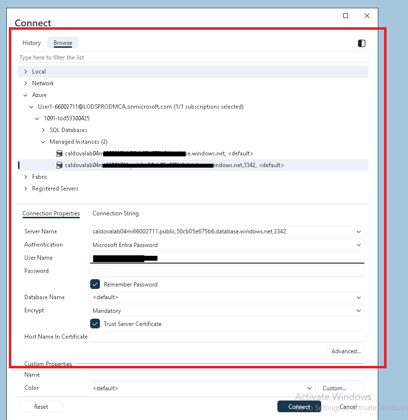

# 🧠 Lab 08: AI-Powered Database in Azure

Now that the database is migrated to Azure, let us use the power of AI for some easy applications out of the database. In this exercise, you will connect Azure AI to the SQL Managed Instance and create an advertisement for one of the product using AI.

## Connect Azure SQL Managed Instance to Microsoft Foundry

This guide discovers an existing Azure SQL Managed Instance and connects it to a model deployed in Microsoft Foundry (formerly Azure AI Foundry). The SQL managed instance uses its existing system-assigned managed identity, so no API key is stored in SQL.

All Azure control-plane commands use Azure CLI. Run them from PowerShell. The database configuration and model call are T-SQL because Azure CLI doesn't execute queries inside Azure SQL Managed Instance.


## 1. Connect to the SQL Managed Instance and find the product 
Launch SSMS and connect to the SQL Managed instance.  You can browse for Azure SQL MI as shown here.
Remember to use the public endpoint on port 3342 and use Entra with password option.



Now lookup a particular product. In eshop database, run this query

```sql
select * from dbo.Product where ID = 9 ;
```
You will come back to this at the end of this lab. Now we need to create some AI resources. Ypu can view the product image - it is a camping tent.

[](./images/AI_Data_Product_9.png)


## 2. Discover the SQL managed instance and set the lab values

Go to Azure portal and find out the name of the resource group that hosts your SQL MI.

Enter the name of the resource group that contains the SQL managed instance:

```powershell
$resourceGroup = Read-Host "Enter the SQL managed instance resource group"
```

Get the SQL managed instance and its identity from that resource group. This guide expects the resource group to contain exactly one SQL managed instance:

```powershell
$managedInstanceDetails = @(
    az sql mi list `
        -g $resourceGroup `
        --query "[].{SQLMI:name, IdentityType:identity.type, ManagedIdentity:identity.principalId}" `
        --output json |
        ConvertFrom-Json
)

if ($managedInstanceDetails.Count -ne 1)
{
    throw "Expected exactly one SQL managed instance in resource group '$resourceGroup', but found $($managedInstanceDetails.Count)."
}

$managedInstanceDetails | Format-Table -AutoSize
$managedInstance = $managedInstanceDetails[0].SQLMI
```

You will use the managed instance region for Foundry when the selected model is available there:

```powershell
$location = az sql mi show `
    -g $resourceGroup `
    -n $managedInstance `
    --query location `
    --output tsv

$location
```


## Important corrections and assumptions

- All Foundry and OpenAI resources created by this guide use the same resource group as the SQL managed instance.
- `sp_invoke_external_rest_endpoint` requires the SQL Managed Instance **SQL Server 2025** or **Always-up-to-date** update policy. Changing from SQL Server 2022 permanently upgrades the internal database format.
- The documented Azure CLI value is `SqlServer2025`. `AlwaysUpToDate` also supports this feature but can't later be changed back to a version-aligned policy.
- The OpenAI-compatible v1 endpoint is `https://<foundry-resource>.openai.azure.com/openai/v1/responses`. It doesn't use an `api-version` query parameter.
- The `model` property in the request must contain the **deployment name**, not merely the underlying model name.
- The v1 API uses the `https://ai.azure.com` token audience. In a database scoped credential, use `{"resourceid":"https://ai.azure.com"}`. The `/.default` suffix used by SDK token scopes isn't included in this credential value.
- The SQL managed identity needs the **Cognitive Services OpenAI User** role on the Foundry resource.
- The credential name must match the request URL's scheme and fully qualified domain name.
- This lab assumes that the Foundry public data endpoint is enabled and that the SQL managed instance subnet can reach `*.openai.azure.com` over outbound HTTPS port 443. Enabling the SQL managed instance public data endpoint isn't required.
- The sample query assumes the target database contains `dbo.Product` with the columns `ID`, `Name`, and `Description`, and that product ID `9` exists.

## 3. Enable the required SQL MI update policy (if needed)

First inspect the current database format:

```powershell
az sql mi show `
    -g $resourceGroup `
    -n $managedInstance `
    --query databaseFormat `
    --output tsv
```

- If the result is `SQLServer2025` or `AlwaysUpToDate`, don't run the update command.
Go to Step 4 instead.
- If the result is `SQLServer2022`, run the following command.

> **Important:** Moving from SQL Server 2022 to SQL Server 2025 permanently upgrades the internal database format. If this managed instance participates in a failover group, its partner must use a compatible update policy. Confirm backup, restore, and Managed Instance link requirements before continuing.

```powershell
az sql mi update `
    -g $resourceGroup `
    -n $managedInstance `
    --database-format SqlServer2025 `
    --gpv2 true `
    --yes `
    --output table
```

The update is a long-running operation. After it finishes, verify the result:

```powershell
az sql mi show `
    -g $resourceGroup `
    -n $managedInstance `
    --query "{State:state, DatabaseFormat:databaseFormat}" `
    --output table
```

Don't continue until the state is ready and `DatabaseFormat` is `SQLServer2025` or `AlwaysUpToDate`.

## 4. Register the Foundry resource provider and check model availability

```powershell
az provider register `
    --namespace Microsoft.CognitiveServices
```

*It may take a few minutes to get it registered. Wait until the provider state is `Registered`.*

```powershell
az provider show `
    --namespace Microsoft.CognitiveServices `
    --query registrationState `
    --output tsv
```

List the versions and SKUs of the example model available in the selected region:

```powershell
$modelName = "gpt-5-mini"
$modelSkuName = "GlobalStandard"
$modelCapacity = 10


$modelJson = az cognitiveservices model list `
    --location $location `
    --query "[?model.name=='$modelName'].{Name:model.name, Version:model.version, Format:model.format, SKUs:model.skus[].name}" `
    --output json `
    --only-show-errors

if ($LASTEXITCODE -ne 0) {
    throw "Failed to retrieve the model catalog for location '$location'."
}

$availableModels = @($modelJson | ConvertFrom-Json)

if ($availableModels.Count -eq 0) {
    throw "Model '$modelName' is not available in '$location'."
}

$availableModels |
    Select-Object Name, Version, Format,
        @{Name = "SKUs"; Expression = { $_.SKUs -join ", " }} |
    Format-Table -AutoSize

$selectedModel = $availableModels |
    Where-Object { $_.SKUs -contains $modelSkuName } |
    Select-Object -First 1

if (-not $selectedModel) {
    throw "Model '$modelName' does not support SKU '$modelSkuName' in '$location'."
}

Write-Host "Model validation succeeded:`n  Model:    $($selectedModel.Name)`n  Version:  $($selectedModel.Version)`n  Format:   $($selectedModel.Format)`n  SKU:      $modelSkuName`n  Capacity: $modelCapacity"
```

Select the newest OpenAI model version that supports the standard deployment SKU:

```powershell
$selectedModel = $availableModels |
    Where-Object { $_.Format -eq "OpenAI" -and $_.SKUs -contains $modelSkuName } |
    Sort-Object Version -Descending |
    Select-Object -First 1

if (-not $selectedModel)
{
    throw "Model '$modelName' with format 'OpenAI' and SKU '$modelSkuName' isn't available in '$location'."
}

$modelVersion = $selectedModel.Version
$modelFormat = $selectedModel.Format

$selectedModel | Format-List Name, Version, Format, SKUs
```

If no matching model is available, don't run the deployment command. Set `$location` to a region where the model and SKU are offered, rerun the model availability and selection blocks, and then continue.

## 5. Create the Foundry resource and project in the MI resource group

All Foundry and OpenAI resources in the remaining steps use `$resourceGroup`. Set the deployment name:

```powershell
$modelDeployment = $modelName
```

If the model isn't offered in that region, set `$location` to another Foundry-supported Azure region. The Foundry resources will still be created in the SQL managed instance resource group stored in `$resourceGroup`.
Create a Foundry resource of kind `AIServices`. The custom domain supplies the `<foundry-resource>.openai.azure.com` endpoint used later.

```powershell
# Must be globally unique. Use lowercase letters, numbers, and hyphens.
$foundryResource = Read-Host "Enter a globally unique Foundry resource name"

az cognitiveservices account create `
    -n $foundryResource `
    -g $resourceGroup `
    --kind AIServices `
    --sku S0 `
    --location $location `
    --custom-domain $foundryResource `
    --assign-identity `
    --allow-project-management true `
    --output table
```

If creation fails because `$foundryResource` or its custom domain is already in use, run the prompt again, enter a different globally unique name, and rerun the `az cognitiveservices account create` command:

Verify the foundry resource created:

```powershell
az cognitiveservices account show `
    -n $foundryResource `
    -g $resourceGroup `
    --query "{Name:name, Kind:kind, Location:location, ProvisioningState:properties.provisioningState, CustomDomain:properties.customSubDomainName, PublicNetworkAccess:properties.publicNetworkAccess}" `
    --output table
```

The expected provisioning state is `Succeeded`. This lab also expects `PublicNetworkAccess` to be `Enabled`.

Create a Foundry project under the same Foundry resource:

```powershell
# The project name doesn't need to be globally unique; it must only be unique within this Foundry resource.
$foundryProject = Read-Host "Enter a foundry project name - anything unique inside this foundry resource" 

az cognitiveservices account project create `
    -n $foundryResource `
    -g $resourceGroup `
    --project-name $foundryProject `
    --location $location `
    --output table
```

Verify the project and list its endpoints:

```powershell
az cognitiveservices account project show `
    -n $foundryResource `
    -g $resourceGroup `
    --project-name $foundryProject `
    --query "{Project:name, ProvisioningState:properties.provisioningState, Endpoints:properties.endpoints}" `
    --output json
```

Use the value named `AI Foundry API` when a later Foundry project workflow asks for the project endpoint. The project organizes Foundry assets, but the SQL call in this guide goes directly to the resource's OpenAI-compatible model endpoint.

## 6. Deploy the model

```powershell
az cognitiveservices account deployment create `
    -n $foundryResource `
    -g $resourceGroup `
    --deployment-name $modelDeployment `
    --model-name $modelName `
    --model-version $modelVersion `
    --model-format $modelFormat `
    --sku-name $modelSkuName `
    --sku-capacity $modelCapacity `
    --output table
```

Verify that the deployment is ready:

```powershell
az cognitiveservices account deployment show `
    -n $foundryResource `
    -g $resourceGroup `
    --deployment-name $modelDeployment `
    --query "{Deployment:name, ProvisioningState:properties.provisioningState, Model:properties.model.name, Version:properties.model.version, Format:properties.model.format}" `
    --output table
```

Don't continue until `ProvisioningState` is `Succeeded`.

## 7. Grant the SQL MI identity permission to invoke the model

Read the current SQL MI principal ID and the Foundry resource ID:

```powershell
$miPrincipalId = az sql mi show `
    -g $resourceGroup `
    -n $managedInstance `
    --query identity.principalId `
    --output tsv

$foundryResourceId = az cognitiveservices account show `
    -n $foundryResource `
    -g $resourceGroup `
    --query id `
    --output tsv

$openAiUserRoleId = az role definition list `
    -n "Cognitive Services OpenAI User" `
    --query "[0].name" `
    --output tsv

az sql mi show `
    -g $resourceGroup `
    -n $managedInstance `
    --query "{IdentityType:identity.type, ManagedIdentity:identity.principalId}" `
    --output table
```

Grant **Cognitive Services OpenAI User** at the Foundry resource scope:

```powershell
az role assignment create `
    --assignee-object-id $miPrincipalId `
    --assignee-principal-type ServicePrincipal `
    --role $openAiUserRoleId `
    --scope $foundryResourceId `
    --output table
```

The preceding `az role definition list` command populates `$openAiUserRoleId`. If Azure CLI reports `argument --role: expected one argument`, rerun that lookup command in the current PowerShell session before creating the assignment.

Verify the assignment:

```powershell
az role assignment list `
    --scope $foundryResourceId `
    --include-inherited `
    --query "[?principalId=='$miPrincipalId' && roleDefinitionName=='Cognitive Services OpenAI User'].{Role:roleDefinitionName, PrincipalId:principalId, Scope:scope}" `
    --output table
```

Azure role assignments can take several minutes to propagate.

## 8. Enable external REST calls on SQL MI

Connect to the SQL managed using SSMS.

 

instance selected in `$managedInstance` as a login with `ALTER SETTINGS`, such as a member of `sysadmin`, and run this in `master` database:

```sql
USE [master];

EXEC sys.sp_configure 'external rest endpoint enabled', 
RECONFIGURE WITH OVERRIDE;

EXEC sys.sp_configure 'external rest endpoint enabled';
```

The final result should show `run_value` equal to `1`.

## 9. Create the database master key and scoped credential

Connect to the database containing `dbo.Product`. Replace `<target-database>` and `<foundry-resource>`.

Don't put the real database master key password in this Markdown file or source control. Store it in your approved password manager or secret store.
Replace your `database master` password <u>(minimum 16 characters)</u> and `foundry-resource` with yours.

```sql
USE [eshop];

IF NOT EXISTS
(
    SELECT 1
    FROM sys.symmetric_keys
    WHERE [name] = N'##MS_DatabaseMasterKey##'
)
BEGIN
    CREATE MASTER KEY ENCRYPTION BY PASSWORD =
        '<strong-unique-database-master-key-password>';
END;

IF EXISTS
(
    SELECT 1
    FROM sys.database_scoped_credentials
    WHERE [name] = N'https://<foundry-resource>.openai.azure.com'
)
BEGIN
    ALTER DATABASE SCOPED CREDENTIAL
        [https://<foundry-resource>.openai.azure.com]
    WITH
        IDENTITY = 'Managed Identity',
        SECRET = '{"resourceid":"https://ai.azure.com"}';
END
ELSE
BEGIN
    CREATE DATABASE SCOPED CREDENTIAL
        [https://<foundry-resource>.openai.azure.com]
    WITH
        IDENTITY = 'Managed Identity',
        SECRET = '{"resourceid":"https://ai.azure.com"}';
END;
```

The `SECRET` value above isn't an API key. It tells SQL MI which audience to request when it obtains a Microsoft Entra token for its managed identity.

## 10. Invoke the Foundry Responses API from T-SQL Generate Advertisement for a product

### Run the following query in SSMS. 


Replace `<foundry-resource>` with <b>$foundryResource</b> and `<model-deployment-name>` with <b>$modelDeployment</b> from the Azure CLI steps.

```sql
USE [eshop];

SET NOCOUNT ON;

DECLARE @response nvarchar(max);
DECLARE @returnCode int;
DECLARE @adCopySource nvarchar(max);
DECLARE @modelDeployment nvarchar(128) =
    N'<model-deployment-name>';

SELECT @adCopySource =
    CONCAT([Name], N': ', [Description])
FROM dbo.Product
WHERE ID = 9;

IF @adCopySource IS NULL
    THROW 50000, 'Product ID 9 was not found in dbo.Product.', 1;

DECLARE @input nvarchar(max) =
    CONCAT(
        N'Generate approximately 2,000 characters of compelling ad copy for "',
        @adCopySource,
        N'". Return only the ad copy.'
    );

DECLARE @payload nvarchar(max) =
    JSON_OBJECT(
        'model': @modelDeployment,
        'input': @input,
        'max_output_tokens': 2500
    );

EXEC @returnCode = sys.sp_invoke_external_rest_endpoint
    @url =
        N'https://<foundry-resource>.openai.azure.com/openai/v1/responses',
    @method = N'POST',
    @credential =
        [https://<foundry-resource>.openai.azure.com],
    @payload = @payload,
    @timeout = 120,
    @retry_count = 2,
    @response = @response OUTPUT;

IF @returnCode <> 0
BEGIN
    SELECT
        @returnCode AS ReturnCode,
        @response AS FullResponse;

    THROW 50001, 'The Foundry REST request failed. Inspect FullResponse.', 1;
END;

DECLARE @modelResponse nvarchar(max);

SELECT TOP (1)
    @modelResponse = contentItem.[text]
FROM OPENJSON(@response, '$.result.output')
WITH
(
    [type] nvarchar(50) '$.type',
    [content] nvarchar(max) '$.content' AS JSON
) AS outputItem
CROSS APPLY OPENJSON(outputItem.[content])
WITH
(
    [type] nvarchar(50) '$.type',
    [text] nvarchar(max) '$.text'
) AS contentItem
WHERE outputItem.[type] = N'message'
  AND contentItem.[type] = N'output_text';

IF @modelResponse IS NULL
    THROW 50002, 'The request succeeded, but no output_text item was found. Inspect FullResponse.', 1;

SELECT @modelResponse AS AdCopy;
```

Copy the AdCopy column full text and paste it into a text file.

`sp_invoke_external_rest_endpoint` wraps the service response under `$.result`. The `OPENJSON` extraction skips the preceding `reasoning` item, finds the `message` item containing `output_text`, and returns only its `text` value as `AdCopy`.


## 11. Verify the Adverstisement with Application

In SSMS, run a query to see the product for which you created AI generated ad.

```sql
select * from dbo.Product where ID = 9 ;
```

In the retail application pull up the product page. See the product picture to match the ad campaign.

[](./images/AI_Data_Product_9.png)

Your ad campaign text can be different from this example below.

Imagine your next weekend escape: the smell of pine, the sound of a crackling fire, and a shelter that feels like a home away from home. The Camping Tent is built for those moments—the effortless, protective, comfortable centerpiece of every camping trip. Whether you’re chasing sunrises on a mountain ridge or settling in for a starry night by the lake, this tent makes every outdoor stay easy, cozy, and memorable.  Designed for simple setup, the intuitive pole system and color-coded seams mean you’ll be pitched and ready in minutes—less time wrestling with gear, more time exploring. Crafted from durable, water-resistant fabric and a robust rainfly, the tent keeps you dry when weather turns, while taped seams and a reinforced floor protect against damp ground and unexpected showers. Strong, flexible poles and secure guy lines give solid stability in breezy conditions so you can sleep soundly even when the wind picks up.  Inside, thoughtful details turn practicality into comfort. The roomy interior fits sleeping pads or an air mattress with room for gear, and multiple mesh windows and vents promote airflow to reduce condensation and keep the air fresh. Interior storage pockets and gear lofts organize flashlights, phones, and small essentials so everything stays within reach. A wide, zippered door makes entry easy and doubles as an awning for a shaded doorway.  Lightweight and compact when packed, this tent travels easily in the included carry bag—ideal for car campers and backpackers alike. Built to last from rugged materials and dependable hardware, it’s a tent you’ll reach for season after season.  From spontaneous weekend trips to planned backcountry adventures, the Camping Tent is designed to enhance every outdoor experience: quick to set up, solid in storms, comfortable at night, and easy to carry. Make your next camping trip the best one yet—bring a tent that’s as ready for the wild as you are. Ready to go? Pack up adventure and step into the great outdoors with confidence.

## Troubleshooting

| Symptom | Check |
| --- | --- |
| `sp_invoke_external_rest_endpoint` isn't available | Confirm the MI update completed and `databaseFormat` is `SQLServer2025` or `AlwaysUpToDate`. |
| `401 Unauthorized` | Confirm the credential uses `{"resourceid":"https://ai.azure.com"}` exactly and allow time for RBAC propagation. |
| `403 Forbidden` | Confirm the SQL MI principal ID has **Cognitive Services OpenAI User** on the Foundry resource itself. |
| `404` or model not found | Use the deployment name, not the model name, in the payload's `model` property. |
| Credential URL mismatch | Confirm the credential is named exactly `https://<foundry-resource>.openai.azure.com` and the request uses the same host. |
| Connection or DNS failure | Confirm outbound HTTPS 443 from the MI subnet to `*.openai.azure.com`, including NSG, route table, firewall, and DNS configuration. |
| `Product ID 9 was not found` | Use an existing product ID or load the expected sample data. |
| Empty `ModelResponse` with a successful call | Inspect `FullResponse`; the response shape might differ for the selected model or API behavior. |
| Throttling or quota errors | Check the deployment SKU, capacity, regional quota, and the response's retry information. |

## References

- [SQL MI update policy](https://learn.microsoft.com/azure/azure-sql/managed-instance/update-policy)
- [`sp_invoke_external_rest_endpoint`](https://learn.microsoft.com/sql/relational-databases/system-stored-procedures/sp-invoke-external-rest-endpoint-transact-sql)
- [Set up Microsoft Foundry resources with Azure CLI](https://learn.microsoft.com/azure/foundry/tutorials/quickstart-create-foundry-resources)
- [Deploy Foundry models with Azure CLI](https://learn.microsoft.com/azure/foundry/foundry-models/how-to/create-model-deployments)
- [Azure OpenAI-compatible v1 API](https://learn.microsoft.com/azure/foundry/openai/api-version-lifecycle)
- [Azure CLI: `az cognitiveservices account deployment`](https://learn.microsoft.com/cli/azure/cognitiveservices/account/deployment)
