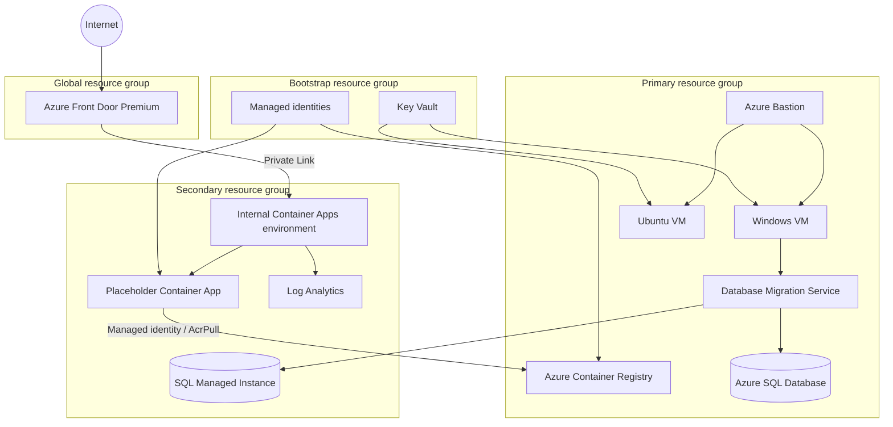

# Bootcamp Azure deployment

This folder is a standalone export of the Lab 04 Azure foundation. It supports:

- Azure Developer CLI (`azd`) provisioning
- direct subscription-scoped Bicep deployment through PowerShell
- Azure SQL Database or Azure SQL Managed Instance
- optional GitHub Actions OIDC provisioning
- exact-match Front Door Private Link approval and endpoint verification

The package contains infrastructure only. Application image build and release
are separate concerns.

## Deployment components

| Boundary | Components |
| --- | --- |
| Bootstrap | Resource group, RBAC-enabled Key Vault, VM secrets, separate code build/deploy managed identities |
| Primary | Database VNet, Windows and Ubuntu VMs without public IPs, Bastion, Azure Container Registry, Database Migration Service, optional Azure SQL Database |
| Secondary | Database and application VNets, peering, Log Analytics, internal zone-redundant Container Apps environment, placeholder Container App, and default SQL Managed Instance |
| Global | Front Door Premium, endpoint, route, and Private Link origin |
| Automation | AZD hook, direct-deployment script, optional GitHub OIDC identities/environments/workflow, cleanup script |

## Architecture



Exactly one database target is created:

- `sqlMi` is the default compatibility path. It requests Freemium first.
- `azureSql` is the explicit lower-cost alternative.

Do not change database mode in place. Incremental ARM deployment does not
delete resources omitted by a changed Bicep condition. Use a new environment or
remove the old environment first.

## Multi-subscription naming

Every deployment derives one stable eight-character suffix from:

- the Azure subscription resource ID
- the AZD/direct deployment environment name
- the configured resource prefix

The suffix is generated with Bicep `uniqueString()` and is deterministic. A
rerun with the same subscription, environment, and prefix targets the same
resources. Changing any seed value produces a different suffix.

The shared suffix is applied to globally unique names, including Key Vault,
Azure Container Registry, Azure SQL logical server, SQL Managed Instance, and
the Front Door endpoint. It is also used on scoped resources and resource
groups so parallel environments are easy to distinguish.

The prefix must be 3-18 lowercase alphanumeric characters with optional single
internal hyphens. It must begin and end with an alphanumeric character. Both
the AZD hook and direct deployment script enforce this contract.

Do not replace the suffix with runtime randomness such as `Get-Random`; doing
so would create different names on every deployment and break idempotent
updates.

## Files

| Path | Purpose |
| --- | --- |
| [`azure.yaml`](./azure.yaml) | AZD project definition |
| [`infra/main.bicep`](./infra/main.bicep) | Subscription-scoped Bicep entry point |
| [`infra/main.parameters.json`](./infra/main.parameters.json) | AZD parameter mapping |
| [`infra/hooks/preprovision.ps1`](./infra/hooks/preprovision.ps1) | AZD validation, identity discovery, and secure VM credential handling |
| [`infra/Deploy-Lab04.ps1`](./infra/Deploy-Lab04.ps1) | Direct validation, what-if, deployment, Private Link approval, and smoke test |
| [`infra/DEPLOYMENT.md`](./infra/DEPLOYMENT.md) | Detailed direct-deployment and troubleshooting guide |
| [`assets/scripts/Configure-Lab04GitHub.ps1`](./assets/scripts/Configure-Lab04GitHub.ps1) | Optional GitHub OIDC, identities, RBAC, environments, and variables |
| [`assets/scripts/Remove-Lab04Environment.ps1`](./assets/scripts/Remove-Lab04Environment.ps1) | Exact-name resource-group cleanup |
| [`.github/workflows/lab04-deploy.yml`](./.github/workflows/lab04-deploy.yml) | Protected AZD provisioning workflow |

## Prerequisites

- PowerShell 7 or later
- Azure CLI
- Azure Developer CLI for the AZD path
- an Azure subscription where you can create subscription deployments,
  resource groups, role assignments, and a custom role
- Microsoft Graph access to resolve the signed-in Entra user or an explicitly
  supplied Entra administrator user principal name
- regional capacity and quota for VMs, DMS, zone-redundant Container Apps, and
  the selected database service

Authenticate:

```powershell
az login
azd auth login
```

## Deploy with AZD

From the repository root:

```powershell
azd env new lab04
azd up
```

The pre-provision hook:

1. selects the Azure subscription and regions
2. uses the signed-in Entra user as the SQL administrator
3. creates or recovers a compliant VM password in the local AZD environment
4. defaults to SQL Managed Instance with the Freemium pricing model
5. accepts `LAB04_SQL_MI_PRICING_MODEL=Regular` when the instructor determines
   that the subscription or region cannot use Freemium

### Manage deployment locations

The Bicep entry point defines `centralus` as the default for the primary,
secondary, and application locations. No location configuration is required to
use those defaults; the pre-provision hook mirrors them into the AZD
environment before deployment.

To deploy to different supported regions, set one or more location values
before running `azd up`:

```powershell
azd env set LAB04_PRIMARY_LOCATION centralus
azd env set LAB04_SECONDARY_LOCATION eastus2
azd env set LAB04_APPLICATION_LOCATION centralus
azd up
```

The values map to the Bicep `primaryLocation`, `secondaryLocation`, and
`applicationLocation` parameters, respectively. AZD environment values persist
for subsequent deployments of that environment.

Confirm VM, DMS, SQL MI or Azure SQL, and zone-redundant Container Apps
availability and quota before selecting different regions. Do not change
locations in place for an environment that already contains regional
resources. Use a new AZD environment or remove the existing deployment first.

The signed-in deployment user is the default and requires no SQL administrator
input. To select a different Entra user, set the optional override before
deployment:

```powershell
azd env set LAB04_SQL_ADMIN_LOGIN_OVERRIDE '<user-principal-name>'
azd up
```

The hook resolves the effective login and object ID on every run. It stores
those resolved values as `LAB04_SQL_ADMIN_LOGIN` and
`LAB04_SQL_ADMIN_OBJECT_ID` for the Bicep parameter mapping; they are outputs,
not administrator-selection inputs.

The Bicep entry point also defaults `sqlEntraAdminLogin` and
`sqlEntraAdminObjectId` from `deployer()`, so an interactive user invoking
`infra/main.bicep` directly does not need to supply either parameter. Service
principals and managed identities usually have no user principal name and must
provide both values explicitly. Any override must provide a matching login and
object ID.

To select the paid General Purpose fallback before instructor provisioning:

```powershell
azd env set LAB04_SQL_MI_PRICING_MODEL Regular
azd up
```

Freemium provides 4 vCores, 64 GB of storage, and 720 vCore-hours per month for
12 months on one eligible instance per subscription. The paid `Regular` model
uses the same General Purpose v2 lab shape but incurs normal Azure charges.

AZD local state under `.azure/<environment>` can contain generated VM
credentials and must not be committed or shared.

## Enable participant SQL MI access

Infrastructure is deployed before participants begin the lab. SQL MI keeps its
VNet-local endpoint and also exposes the public endpoint on TCP 3342, but the
deployment does not allow arbitrary internet traffic.

An instructor must grant each participant **Network Contributor** on only the
SQL MI network security group. If the participant needs automatic endpoint
discovery, also grant **Reader** on the SQL MI resource; otherwise provide the
`LAB04_SQL_MI_PUBLIC_ENDPOINT` deployment output.

After `az login`, the participant runs:

```powershell
.\assets\scripts\Enable-Lab04SqlMiPublicAccess.ps1 `
  -SubscriptionId '<subscription-id>'
```

The script asks before using `api.ipify.org`, validates the returned public
IPv4 address, and idempotently creates or updates one TCP 3342 rule for that
participant's Entra object ID and `/32`. Multiple participants therefore do not
overwrite each other's rules. Participants can avoid external discovery and
supply the address:

```powershell
.\assets\scripts\Enable-Lab04SqlMiPublicAccess.ps1 `
  -SubscriptionId '<subscription-id>' `
  -IpAddress '<public-ipv4>' `
  -ResourceGroupName '<secondary-resource-group>' `
  -NetworkSecurityGroupName '<sqlmi-nsg-name>' `
  -PublicEndpoint '<sqlmi-public-hostname>,3342' `
  -RuleName 'AllowSqlMi-<instructor-provided-unique-value>'
```

Rerun the script whenever the participant's public IP changes. Connect from
SSMS with a Microsoft Entra authentication method; SQL authentication remains
disabled. Use `-RuleName` only when tenant policy prevents
`az ad signed-in-user show`; keep the same unique value on every rerun.

## Deploy Bicep directly

The direct script supports validation, what-if, and deployment:

```powershell
$subscriptionId = '<subscription-id>'

.\infra\Deploy-Lab04.ps1 `
  -SubscriptionId $subscriptionId `
  -EnvironmentName 'lab04-direct' `
  -Action Validate

.\infra\Deploy-Lab04.ps1 `
  -SubscriptionId $subscriptionId `
  -EnvironmentName 'lab04-direct' `
  -Action WhatIf

.\infra\Deploy-Lab04.ps1 `
  -SubscriptionId $subscriptionId `
  -EnvironmentName 'lab04-direct' `
  -Action Deploy
```

`Deploy` uses `--confirm-with-what-if`, approves only the deterministic Front
Door Private Link request, and waits for the public Front Door endpoint to
respond successfully.

See the [direct deployment guide](./infra/DEPLOYMENT.md) for region parameters,
SQL MI selection, password rules, the optional Entra administrator user
principal name, reruns, and diagnostics.

## Optional GitHub OIDC

First deploy locally with AZD or the direct script. Then run the setup utility
from a Git repository where the authenticated GitHub account has `ADMIN`
permission.

Run these commands from the bootcamp deployment directory:

```powershell
Set-Location (Join-Path (git rev-parse --show-toplevel) 'skillable\day_2\bootcamp_deployment')
```

For AZD:

```powershell
.\assets\scripts\Configure-Lab04GitHub.ps1 `
  -SubscriptionId '<subscription-id>' `
  -AzdEnvironment 'lab04' `
  -Repository 'owner/repository' `
  -RequiredReviewer '<github-user-login>' `
  -DeploymentBranch 'main'
```

For direct Bicep:

```powershell
.\assets\scripts\Configure-Lab04GitHub.ps1 `
  -SubscriptionId '<subscription-id>' `
  -DeploymentName 'lab04-direct-deploy' `
  -Repository 'owner/repository' `
  -RequiredReviewer '<github-user-login>' `
  -DeploymentBranch 'main'
```

AZD and direct ARM outputs are stored separately. Always use
`-DeploymentName <EnvironmentName>-deploy` after `Deploy-Lab04.ps1`.
If the direct deployment used its optional `-DeploymentName` override, pass
that exact name to `Configure-Lab04GitHub.ps1` instead.

If PowerShell reports that `DeploymentName` is not a recognized parameter,
confirm that the command resolves to this checkout and exposes the current
`Arm` parameter set:

```powershell
$oidcScript = Get-Command .\assets\scripts\Configure-Lab04GitHub.ps1
$oidcScript.Source
$oidcScript.ParameterSets |
  Select-Object Name, @{ Name = 'Parameters'; Expression = { $_.Parameters.Name -join ', ' } }
```

The `Arm` row must include `DeploymentName`. If it does not, update the
checkout or remove the stale script copy being invoked; changing the Azure
deployment name will not fix a PowerShell parameter-binding error.

The setup creates separate identities for:

- infrastructure preview
- infrastructure deployment
- application image build/push
- application deployment

It also creates `lab04`, `lab04-deploy`, `lab06`, and `lab06-deploy` GitHub
environments, configures deployment protection, publishes non-secret
variables, and creates environment-scoped federated credentials.

Required reviewers depend on the repository's GitHub plan. The setup fails
instead of silently omitting the protection rule.

## Security posture and lab exceptions

This is a training deployment, not a complete production landing zone.

### Intentionally private

- VMs have no public IP addresses and are accessed through Bastion.
- Azure SQL disables public database access. SQL MI retains private VNet
  connectivity and enables its public data endpoint for the migration lab.
- The Container Apps environment is internal.
- Front Door reaches Container Apps through Private Link.
- Key Vault uses Azure RBAC.
- Managed identities and OIDC avoid stored Azure client secrets.

### Intentionally public or simplified

- Front Door is the public application entry point.
- Bastion exposes its managed public endpoint.
- ACR Basic retains public network access for GitHub-hosted runners, but its
  admin account is disabled and access uses scoped RBAC.
- SQL MI public TCP 3342 remains blocked until a participant script adds one
  validated public IPv4 `/32` rule to the NSG.
- The lab does not provide enterprise hub-spoke networking, Firewall,
  DDoS Network Protection, centralized Private DNS, policy assignments, SIEM
  integration, or full multi-region disaster recovery.
- Direct deployment can automatically approve one exact Front Door Private
  Link request. Production environments often preserve a separate approval
  boundary.

For production, deploy inside an
[Azure Landing Zone](https://learn.microsoft.com/azure/cloud-adoption-framework/ready/landing-zone/)
and evaluate the
[Azure Well-Architected Framework](https://learn.microsoft.com/azure/well-architected/)
security, reliability, cost, operational excellence, and performance guidance.

## Validation

Build the subscription entry point:

```powershell
az bicep build --file .\infra\main.bicep --stdout | Out-Null
```

Validate the GitHub OIDC, workflow, PowerShell, and Bicep parameter contracts:

```powershell
.\tests\Validate-Lab04OidcContracts.ps1
```

Parse the PowerShell scripts:

```powershell
Get-ChildItem . -Filter *.ps1 -Recurse | ForEach-Object {
  $tokens = $null
  $errors = $null
  [void][System.Management.Automation.Language.Parser]::ParseFile(
    $_.FullName,
    [ref]$tokens,
    [ref]$errors
  )
  if ($errors.Count) {
    throw "$($_.FullName): $($errors -join '; ')"
  }
}
```

## Cleanup

For an AZD environment:

```powershell
azd down --purge
```

For exact resource-group cleanup:

```powershell
.\assets\scripts\Remove-Lab04Environment.ps1 `
  -SubscriptionId '<subscription-id>' `
  -Prefix 'caldova-lab04' `
  -Suffix '<eight-character-suffix>' `
  -Confirm
```

Review the four exact resource-group names before confirming deletion.
